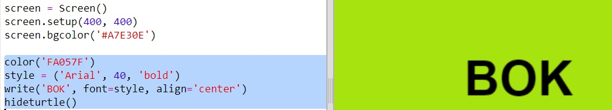
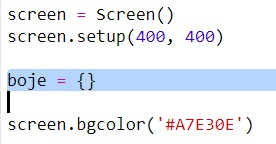
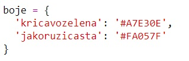
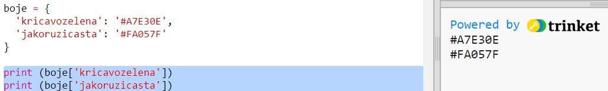
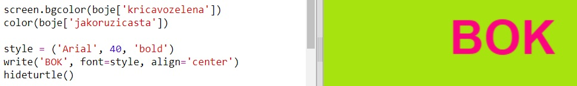
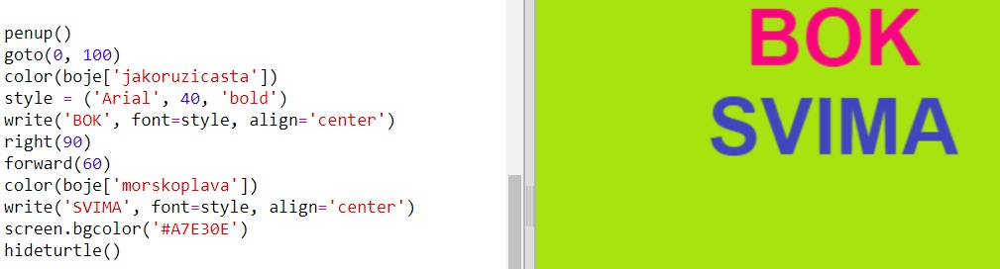

---
title: Šarene kreacije
level: Python 1
language: hr-HR
stylesheet: python
embeds: "*.png"
materials: ["project-resources/new/*.*", "volunteer-resources/colourful-creations-finished/*.*"]
...

# Uvod { .intro}

U ovom projektu napravit ćeš rječnik boja koji pretvara teško pamtljive kôdove za boje u jednostavna imena.

  <iframe src="https://trinket.io/embed/python/41a99e668b?outputOnly=true&start=result" width="600" height="500" frameborder="0" marginwidth="0" marginheight="0" allowfullscreen>
  </iframe>
  

# Korak 1: Korištenje hex kôdova boja { .activity}

## Zadatci { .check}

Python turtle sadrži unaprijed definirane boje poput 'red' (crvene) i 'white' (bijele), ali možeš se koristiti i hex kôdovima boja (s njima si se možda već upoznao tijekom HTML i CSS tečaja.)

+ Otvori prazan Python predložak u Trinketu: <a href="http://jumpto.cc/python-new" target="_blank">jumpto.cc/python-new</a>. Ako čitaš ovo online, možeš koristiti i ugrađenu verziju ovog trinketa koja se nalazi ispod.

<iframe src="https://trinket.io/embed/python/33e5c3b81b?start=result" width="100%" height="600" frameborder="0" marginwidth="0" marginheight="0" allowfullscreen></iframe>

+ Dodaj sljedeći kôd za pokretanje Python turtle okruženja za rad:

    

    Primijeti da si koristio ime boje: 'white' (bijela).

+ Turtle sadrži listu imena boja koje možeš koristiti, ali ponekad želiš odabrati vlastite boje. Turtle ti dopušta korištenje hex kôdova boja.

  Otvori <a href="http://jumpto.cc/colour-picker" target="_blank">jumpto.cc/colour-picker</a> i odaberi boju koja ti se sviđa. Pronađi njen hex kôd koji počinje znakom '#', kao na primjer '#A7E30E'.

+ Označi hex kôd, zajedno sa znakom ljestvi, kako bi ga mogao kopirati. Zatim klikni na kôd desnom tipkom miša i odaberi Copy (Kopiraj). Kôd možeš kopirati i tako da ga označiš, a zatim pritisneš tipke Ctrl i C.

+ Sada izmijeni liniju kôda u kojoj je podešena boja ekrana tako da koristiš svoju boju. Na primjer:

   

   Da bi zalijepio svoj hex kôd u trinket koristi desnu tipku miša i opciju Paste (Zalijepi) ili kombinaciju tipki Ctrl i V.

+ Odaberi novi hex kôd za boju i upotrijebi ga da obojaš tekst:

   

   Ne moraš koristiti font slova 'Arial'. Isprobaj, primjerice, fontove 'Verdana', 'Times' ili 'Courier'.

   '40' označava veličinu slova. Možeš pokušati i to izmijeniti.

+ Isprobaj različite boje dok ne pronađeš dvije koje ti se sviđaju.

## Spremi projekt {.save}

# Korak 2: Rječnik boja { .activity}

## Zadatci { .check}

Korištenje hex kôdova boja je vrlo jednostavno, ali ih je teško zapamtiti.

Kao što vjerojatno već znaš, u rječniku možeš pronaći riječ i vidjeti njeno značenje. U Pythonu je rječnik još jednostavniji - omogućava ti da pogledaš vrijednost bilo kojeg 'ključa' koji se u njemu nalazi.

Napravimo rječnik koji će povezivati jednostavna imena boja (ključeve) sa njihovim hex kôdovima (vrijednostima).

+ Sadržaj rječnika pišemo unutar vitičastih zagrada.

  Napravi prazan rječnik i nazovi ga `boje`:

   

+ Odaberi zanimljiva imena za svoje boje i izmijeni liniju kôda gdje piše `boje = {} ` kako bi dodao svoje boje u rječnik.

  Pogledaj primjer rječnika boja:

   

   Znak dvotočja `:` odvaja ključ (naziv boje) od vrijednosti (hex kôd). Između svakog ključ:vrijednost para u rječniku mora biti zarez `,`.

+ Sada ne moraš pamtiti hex kôdove, već ih jednostavno možeš potražiti u rječniku.

  Prilagodi sljedeći kôd tako da program koristi tvoje nazive za boje:

  

  Ključ pišemo unutar uglatih zagrada '[]' i nakon naziva rječnika.

+ Sada možeš izmijeniti svoj kôd tako da pretražuje boje u rječniku:

  

+ Testiraj kôd kako bi bio siguran da se tvoj tekst još uvijek prikazuje kako treba.

## Spremi projekt {.save}

## Izazov: Još boja! {.challenge}

Možeš li dodati još boja u svoj rječnik i isprobati ih? Koristi <a href="http://jumpto.cc/colour-picker" target="_blank">jumpto.cc/colour-picker</a> za pronalaženje još boja.

Ne zaboravi svojim bojama dati super nazive.

Ispod se nalazi primjer kôda da se podsjetiš kako koristiti Python turtle:

## Spremi projekt {.save}

## Izazov: Izradi poster

Dizajneri za određene teme, poput pustinje ili svemira, često osmisle 'paletu' boja koje dobro izgledaju zajedno.

Možeš li napraviti novi projekt u Pythonu sa rječnikom u kojem će se nalaziti paleta boja za specifičnu temu. Možeš koristiti boje jeseni, šume, mora, Božića, sladoleda, svog omiljenog sportskog tima ili pak odabrati bilo koju temu koju želiš.

Napravi poster koristeći svoj rječnik boja.

Možeš koristiti i druge poznate naredbe koje sadrži turtle, poput `forward`, `right`, `left`, `penup` i `pendown`.

Možda možeš svom posteru dodati i obrub?

Još neke korisne turtle naredbe:

+ `circle(50)` crta kružnicu polumjera 50.
+ `dot(100)` crta ispunjeni krug promjera 100.

Na primjer:

## Spremi projekt {.save}
