---
title: Gdje je svemirska postaja?
level: Python 2
language: hr-HR
stylesheet: python
embeds: "*.png"
materials: ["project-resources/iss/*.*", "volunteer-resources/iss-finished/*.*"]
...

# Uvod { .intro}

U ovom projektu koristit ćeš web uslugu kako bi saznao gdje se trenutno nalazi Međunarodna svemirska postaja (ISS) i ucrtao njenu lokaciju na kartu.

<div class="trinket">
  <iframe src="https://trinket.io/embed/python/b95851338c?outputOnly=true&start=result" width="600" height="500" frameborder="0" marginwidth="0" marginheight="0" allowfullscreen>
  </iframe>
  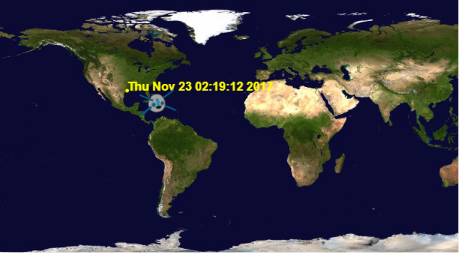
</div>

# Korak 1: Tko je u svemiru? { .activity}

Koristit ćeš web uslugu koja uživo pruža informacije o svemiru. Saznajmo prvo tko se trenutno nalazi u svemiru.

## Zadatci { .check}

+ Web usluga ima svoju adresu (url) baš kao i web stranica, ali umjesto prikazivanja HTML-a, prikazuje podatke.

Otvori <a href="http://api.open-notify.org/astros.json" target="_blank">http://api.open-notify.org/astros.json</a> u internet pregledniku.

Trebao bi vidjeti nešto poput ovoga:

```
{
  "message": "success",
  "number": 3,
  "people": [
    {
      "craft": "ISS",
      "name": "Yuri Malenchenko"
    },
    {
      "craft": "ISS",
      "name": "Timothy Kopra"
    },
    {
      "craft": "ISS",
      "name": "Timothy Peake"
    }
  ]
}
```

Podatci se prikazuju uživo pa ćeš vidjeti drugačiji rezultat. Format se zove JSON.

+ Pozovimo web uslugu u Pythonu kako bi vidjeli rezultate.

  Otvori ovaj trinket: <a href="http://jumpto.cc/iss-go" target="_blank">jumpto.cc/iss-go</a>. Ako čitaš ovo online, možeš koristiti i ugrađenu verziju ovog trinketa koja se nalazi ispod.

<div class="trinket">
  <iframe src="https://trinket.io/embed/python/649a766f84?start=result" width="100%" height="600" frameborder="0" marginwidth="0" marginheight="0" allowfullscreen></iframe>
</div>

+ Module `urllib.request` i `json` smo već uvezli za tebe.

  Dodaj sljedeći kôd u `main.py` kako bi web adresu koju smo upravo koristili pohranio u varijablu:

  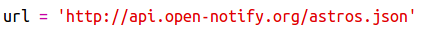

+ Pozovimo sada web uslugu:

  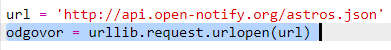


+ Zatim moraš učitati JSON odgovor u Pythonovu strukturu podataka:

  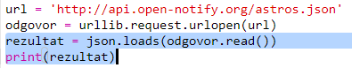


Trebao bi vidjeti nešto poput ovog:

```
{'message': 'success', 'number': 3, 'people': [{'craft': 'ISS', 'name': 'Yuri Malenchenko'}, {'craft': 'ISS', 'name': 'Timothy Kopra'}, {'craft': 'ISS', 'name': 'Timothy Peake'}]}
```

Ovo je Pythonov rječnik koji sadrži 3 ključa: poruku (message), broj (number) i osobe (people).

Vrijednost poruke (message) je ‘success’ što znači da je zahtjev bio uspješan. Odlično.

Imaj na umu da ćeš vidjeti različite rezultate, ovisno o tome tko je trenutno u svemiru!

+ Ispišimo sada informacije u obliku koji će biti jednostavnije pročitati.

  Za početak pronađimo broj osoba u svemiru i ispišimo ga:

  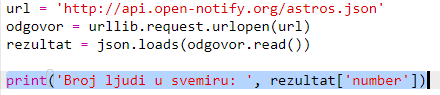

  `rezultat['number']` će u rječnik rezultata ispisati vrijednost povezanu sa ključem ‘number’ (broj). U primjeru je to `3`.

+ Vrijednost povezana sa ključem ‘people’ je popis rječnika! Spremimo tu vrijednost u varijablu kako bi ju mogao koristiti:

  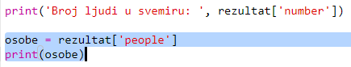


Trebao bi vidjeti nešto poput ovog:
```
[{'craft': 'ISS', 'name': 'Yuri Malenchenko'}, {'craft': 'ISS', 'name': 'Timothy Kopra'}, {'craft': 'ISS', 'name': 'Timothy Peake'}]
```

+ Sada moraš ispisati liniju za svakog astronauta.

  U Pythonu za to možeš koristiti petlju. Svakim prolazom petlje, `p` će se spremiti u rječnik za različitog astronauta.

  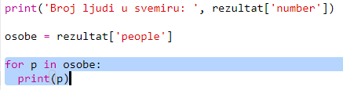

+ Zatim možeš pogledati vrijednosti za ‘name’ i ‘craft’.

  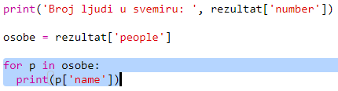

  Trebao bi vidjeti nešto poput ovog:

  ```
  Broj ljudi u svemiru:  3
  Yuri Malenchenko
  Timothy Kopra
  Timothy Peake
  ```

  Koristiš podatke koji se dobivaju uživo pa će tvoji rezultati ovisiti o broju ljudi koji su trenutno u svemiru.

## Spremi projekt {.save}

## Izazov: Prikaži gdje je letjelica {.challenge}

Web uslugom se, uz ime astronauta, može vidjeti i u kojem se objektu taj astronaut nalazi (kao, primjerice, ISS).

Izmijeni svoj kôd tako da ispisuje i objekt u kojem je astronaut.

Primjerice:

```
Broj ljudi u svemiru:  3
Yuri Malenchenko in ISS
Timothy Kopra in ISS
Timothy Peake in ISS
```

## Spremi projekt {.save}

# Korak 2: Gdje se nalazi Međunarodna svemirska postaja? { .activity}

Međunarodna svemirska postaja nalazi se u Zemljinoj putanji. Napravi krug oko Zemlja otprilike svakih sat i 30 minuta, a prosječna brzina joj je 7.66 km po sekundi. Brza je!

Pokušajmo pomoću još jedne web usluge saznati gdje se nalazi Međunarodna svemirska postaja.

## Zadatci { .check}

+ Prvo otvori url web usluge u novoj kartici svog internet preglednika: <a href="http://api.open-notify.org/iss-now.json" target="_blank">http://api.open-notify.org/iss-now.json</a>

  Trebao bi vidjeti nešto poput ovog:

  ```
  {
  "iss_position": {
    "latitude": 8.54938193505081,
    "longitude": 73.16560793639105
  },
  "message": "success",
  "timestamp": 1461931913
  }
  ```

  Rezultat sadrži koordinate mjesta na Zemlji iznad kojeg se trenutno nalazi Međunarodna svemirska postaja.

  Geografska dužina kreće se u pravcu istoka ili zapada, od -180 do 180 stupnjeva. 0 je Početni meridijan koji prolazi kroz Greenwich u Londonu, u Velikoj Britaniji.

  Geografska širina kreće se u pravcu sjevera ili juga, od 90 do -90 stupnjeva. 0 je Ekvator.

+ Sada u Pythonu moraš pozvati istu web uslugu. Dodaj sljedeći kôd na kraju programa kako bi dobio trenutnu lokaciju Međunarodne svemirske postaje:

  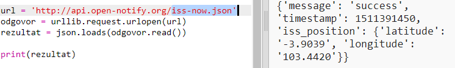


+ Definirat ćemo varijable za spremanje geografske dužine i širine, a zatim ih ispisati:

  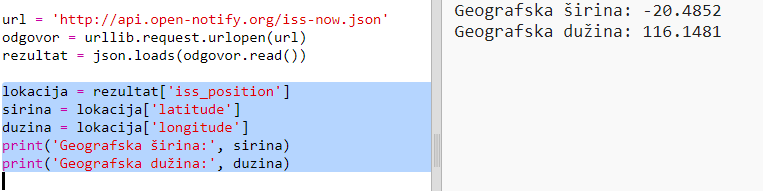

+ Bilo bi korisnije kada bi prikazali lokaciju na karti.

  Prvo moramo uvesti turtle biblioteku za slikovni prikaz podataka.

  

+ Učitajmo mapu svijeta kao pozadinsku sliku. Jedna je već uključena u tvoj trinket.

  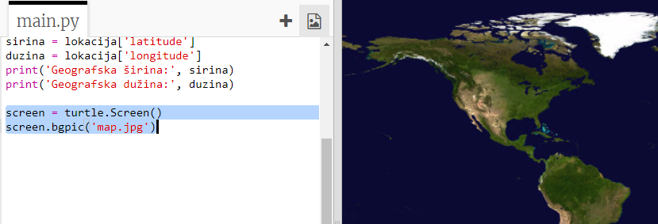

  NASA je omogućila ovu divnu mapu i dala dopuštenje za njeno korištenje.

  Mapa je centrirana na koordinatama (0, 0), a to je upravo ono što ti treba.

+ Moraš podesiti veličinu ekrana na 720x360 tako da odgovara veličini slike.

  Dodaj `screen.setup(720, 360)`:

  

+ Želiš omogućiti 'kornjači' da se pomiče određenim geografskim dužinama i širinama. Da bi ti bilo lakše, podesi ekran tako da odgovara koordinatama koje koristimo:

  

  Sada će koordinate odgovarati geografskoj dužini i širini koordinata koje dobijemo sa web usluge.

+ Napravimo 'kornjaču' za Međunarodnu svemirsku postaju.

  

  Tvoj projekt sadrži slike 'iss.png' i 'iss2.png'. Isprobaj ih obje i odluči koja ti se više sviđa.

+ Međunarodna svemirska postaja nalazi se u središtu mape. Pomaknimo ju na točnu lokaciju na mapi:

  

  Primijeti da se širina obično prikazuje prva, ali mi moramo prvo upisati dužinu kada crtamo (x,y) koordinate.

+ Pokreni i testiraj program.
Međunarodna svemirska postaja trebala bi se pomaknuti na svoju trenutnu lokaciju iznad Zemlje.
Pričekaj nekoliko sekundi, a zatim opet pokreni program da vidiš gdje se Međunarodna svemirska postaja pomaknula.

  

# Korak 3: Kada će Međunarodna svemirska postaja biti iznad nas? { .activity}

Postoji i web usluga preko koje možeš saznati kada će Međunarodna svemirska postaja biti na određenoj lokaciji.
Saznajmo kada će Međunarodna svemirska postaja biti iznad Svemirskog centra u Houstonu, u SAD-u. Geografska širina Centra je 29.5502, a dužina 95.097.

## Zadatci { .check}

+ Ucrtajmo prvo točku na mapi na sljedećim koordinatama:

  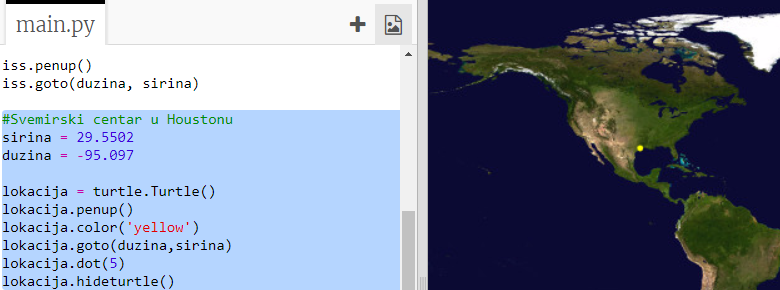

+ Saznajmo sada datum i vrijeme kada će se Međunarodna svemirska postaja nalaziti iznad Svemirskog centra.

  Kao i prije, web usluzi možemo pristupiti unošenjem url-a u adresnu traku web preglednika: <a href="http://api.open-notify.org/iss-pass.json" target="_blank">http://api.open-notify.org/iss-pass.json</a>

  Trebao bi dobiti poruku o grešci:

  

+ Za pristup podatcima preko ove web usluge moramo uključiti geografsku dužinu i širinu u url koji koristimo.

  Ti podatci dodaju se nakon znaka `?` i odvajaju se znakom `&`.

  Url-u dodaj `lat` i `lon` podatke kao što je prikazano ovdje: <a href="http://api.open-notify.org/iss-pass.json?lat=29.55&lon=95.1"target="_blank">http://api.open-notify.org/iss-pass.json?lat=29.55&lon=95.1</a>

  

  U odgovoru se nalazi nekoliko razdoblja kada će Međunarodna svemirska postaja biti iznad Svemirskog centra, ali mi ćemo se usredotočiti samo na prvi termin. Vrijeme je zapisano u standardnom obliku, ali moći ćeš ga u Pythonu pretvoriti u oblik koji se lako čita.

+  Pozovimo sada web uslugu u Pythonu. Dodaj sljedeći kôd na kraju svog programa:

  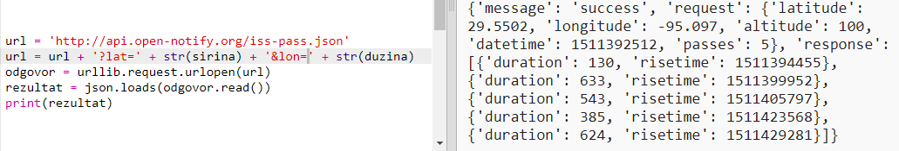

+ Upotrijebimo sada prvi termin koji smo dobili u odgovoru sa web usluge.

Dodaj sljedeći kôd:

  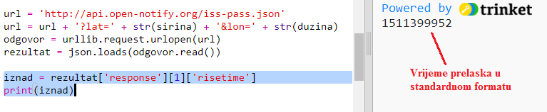


+ Vrijeme je zapisano kao vremenska oznaka pa ćemo koristiti Pythonov modul za vrijeme kako bi ga ispisali u čitljivijem formatu i pretvorili u lokalno vrijeme. Neka 'kornjača' upiše vrijeme pokraj točke na mapi.

+ Dodaj liniju `import time` na početku programa:

  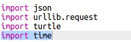

+ Funkcija `time.ctime()` pretvorit će vrijeme u čitljiviji format koji možeš zapisati sa 'kornjačom'.

  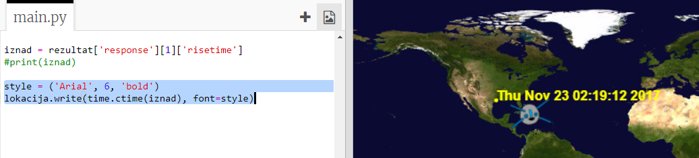

  (Možeš ukloniti ili komentirati `print` liniju.)

## Spremi projekt {.save}

## Izazov: Pronađi još razdoblja kada će Međunarodna svemirska postaja prelaziti iznad nekog mjesta {.challenge}

Možeš koristiti internet stranicu poput <a href="http://www.latlong.net/" target="_blank">http://www.latlong.net/</a> za pronalaženje geografske širine i dužine mjesta koja te zanimaju.

Možeš li pronaći i ucrtati razdoblja kada će Međunarodna svemirska postaja biti iznad još nekih mjesta?

+ Trebaš promijeniti geografsku širinu i dužinu u url-u web usluge.
+ Trebaš ucrtati lokaciju i rezultat na mapi.


## Spremi projekt {.save}
