---
title: Moderna umjetnost
level: Python 2
language: hr-HR
stylesheet: python
embeds: "*.png"
materials: ["project-resources/modern-art/*.*", "volunteer-resources/modern-art-finished/*.*"]
...

# Uvod { .intro}

U ovom projektu naučit ćeš pomoću računala napraviti modernu umjetnost. Pomoću funkcija napisat ćeš kôd koji ćeš moći koristiti kad god budeš htio.

  <iframe src="https://trinket.io/embed/python/47bbc2fc2b?outputOnly=true&start=result" width="600" height="500" frameborder="0" marginwidth="0" marginheight="0" allowfullscreen>
  </iframe>
  

# Korak 1: Nasumične boje { .activity}

## Zadatci { .check}

+ Otvori ovaj trinket: <a href="http://jumpto.cc/modern-go" target="_blank">jumpto.cc/modern-go</a>. Ako čitaš ovo online, možeš koristiti i ugrađenu verziju ovog trinketa koja se nalazi ispod.

<iframe src="https://trinket.io/embed/python/3549b126c4?start=result" width="100%" height="600" frameborder="0" marginwidth="0" marginheight="0" allowfullscreen></iframe>

+ Možeš podesiti boju kornjače tako da odabereš koliko želiš crvene, zelene i plave boje od 0 do 255.

    Dodaj sljedeći kôd kako bi tvoja kornjača bila ljubičasta:

    

    Ljubičasta se dobije miješanjem crvene i plave boje.

+ Pokušaj odabrati neke druge brojeve kako bi dobio drugačije boje.

    Zapamti da svaki broj može biti između 0 i 255.

+ Kako bi bilo da nasumično odaberemo boju?

    Izmijeni svoj kôd tako da za vrijednosti crvene, zelene i plave boje odabire nasumični broj između 0 i 255:

    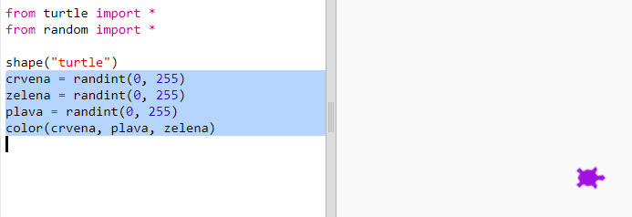

+ Klikni na ‘Run’ nekoliko puta da dobiješ kornjače različitih boja.

+ Zabavno je, ali i teško za zapamtiti i unositi svaki put kada želiš da se boja kornjače nasumično odredi. Također je i teško za čitati.

    U Pythonu možemo upisati `def` i definirati funkciju koju možemo pozvati svaki put kada želimo nasumično odabrati boju kornjače.

    Već si pozivao funkcije, poput `color()` i `randint()` koje su bile unaprijed definirane.

    Iskoristimo def kako bi u funkciju stavili dio kôda koji nasumično određuje boju:

    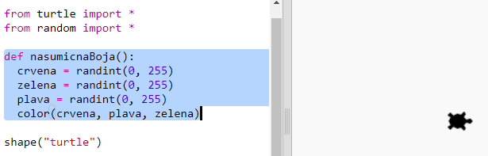

  Ne zaboravi uvući kôd unutar funkcije. Funkcije se obično pišu na početku programa, nakon naredbi import.

+ Ako sada klikneš na ‘Run’ nećeš dobiti nasumično obojenu kornjaču. To je zato što si definirao svoju funkciju, ali nisi ju pozvao.

+ Dodaj sljedeću liniju kôda za pozivanje svoje nove funkcije:

    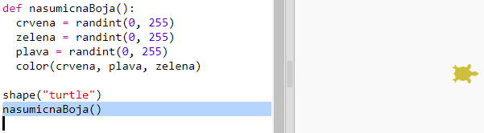

    Primijeti da je novi kôd puno lakši za razumijeti jer je komplicirani dio unutar funkcije. Lako je zaključiti što funkcija `nasumicnaBoja()` radi.

# Korak 2: Nasumična pozicija { .activity}

## Zadatci { .check}

Definirajmo još jednu funkciju koja će pomicati kornjaču na nasumičnu poziciju na ekranu. Sredina ekrana ima koordinate (0,0) pa ćemo kornjače smjestiti oko centra u prostor u obliku kvadrata.

+ Dodaj funkciju `nasumicnaPozicija()`:

    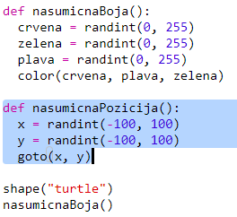

+ Isprobaj svoju novu funkciju tako da prvo pozoveš nju, a zatim funkciju `stamp()`. Možeš ju pozvati više puta:

    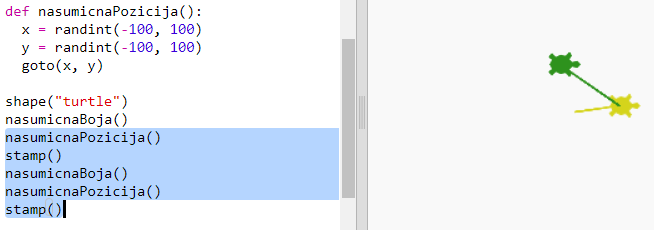

+ Uuups, kornjača crta dok se pomiče. Podignimo olovku na početku i spustimo ju na kraju tako da kornjača ne crta dok se pomiče:

    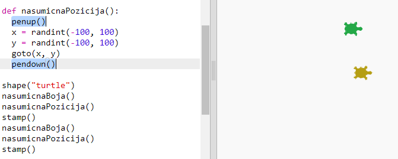

    Primjećuješ li da si morao 'popraviti' kôd samo na jednom mjestu? To je još jedna prednost funkcija.

+ Testiraj sada svoj kôd nekoliko puta.

## Spremi projekt {.save}

## Izazov: Kornjačina umjetnost {.challenge}
Možeš li definirati funkciju `nasumicanSmjer()` kojom će kornjača pokazivati u nasumičnom smjeru i koja će učiniti da sljedeći kôd radi?

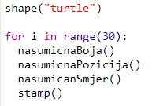

Pomoć:

- `setheading(<broj>)` će promijeniti smjer u kojem je kornjača okrenuta.

- `<broj>` mora biti između 1 i 360 (broj stupnjeva unutar kruga).

- Možeš koristiti `randint(1, 360)` za odabir broja između 1 i 360.

## Spremi projekt {.save}

# Korak 3: Kreiraj modernu umjetnost s pravokutnicima { .activity}

## Zadatci { .check}

Kreirajmo sada modernu umjetnost crtajući puno pravokutnika različitih veličina i boja.

+ Prvo dodaj sljedeći kôd na kraj svog programa, nakon kôda koji si zapisao dok si rješavao Izazov. Tako ćeš očistiti ekran od crteža koje je napravila tvoja kornjača i usmjerit ćeš kornjaču u njenom uobičajenom smjeru:

    

+ Kôd zbog kojeg je tvoja kornjača crtala po ekranu možeš staviti u komentar tako da na početak svake linije dodaš `#`. Tako se taj dio kôda neće pokretati dok budeš radio na crtanju pravokutnika. (Kasnije možeš maknuti znak # i pokazati sve što si napravio/la.)

    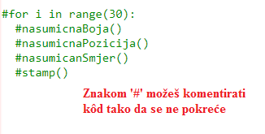

+ Dodajmo sada funkciju koja će na nasumičnim pozicijama crtati pravokutnike nasumičnih veličina i boja!

    Dodaj funkciju `crtajPravokutnik()` nakon svojih ostalih funkcija:

    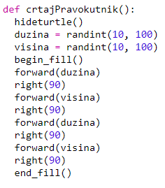

    Pogledaj u `snippets.py` za pomoć sa kôdom ako želiš uštedjeti nešto vremena na tipkanju.

+ Dodaj sljedeći kôd na kraj programa `main.py` kako bi pozvao svoju novu funkciju:

    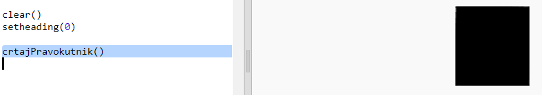

    Pokreni program nekoliko puta da vidiš kako se mijenjaju visina i širina.

+ Pravokutnik je uvijek iste boje i nalazi se na istom mjestu.

    Sada moraš kornjaču obojati nasumičnom bojom, a zatim ju pomaknuti na nasumičnu poziciju. Hej, nisi li već definirao funkcije koje to rade? Odlično. Jednostavno ih pozovi na početku funkcije crtajPravokutnik:

    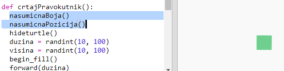

    Opa, to je bilo brzo, a i puno je jednostavnije za pročitati.

+ Pozovimo sada funkciju `crtajPravokutnik()` unutar petlje za kreiranje fora moderne umjetnosti:

    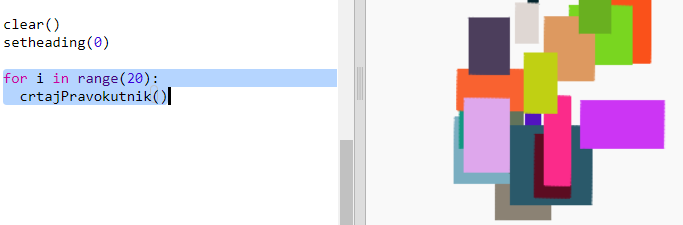

+ Uh, ovo je bilo malo sporo, zar ne? Srećom, možeš malo ubrzati kornjaču.

    Pronađi liniju kôda gdje si postavio oblik na 'turtle' i dodaj označeni kôd:

    

    Korištenje `speed(0)` funkcije je najbrže, ali možeš koristiti i brojeve od 1 (sporo) do 10 (brzo). Isprobavaj dok ne pronađeš brzinu koja ti odgovara.

## Izazov: Još moderne umjetnosti { .challenge}
Možeš li napisati funkciju koja crta neki oblik i poziva tvoje `nasumicnaBoja()` i/ili `nasumicnaPozicija()` funkcije?

Možeš pozvati svoju funkciju unutar `for` petlje kao što si napravio kada smo kreirali modernu umjetnost s pravokutnicima.

Ideje:

- Kornjače imaju funkciju koja se zove dot i koja kao početnu vrijednost uzima polumjer (udaljenost od sredine do ruba kružnice). Primjerice, turtle.dot(10). Možeš definirati funkciju `crtajKruznicu()` koja crta kružnicu s nasumičnom vrijednosti polumjera.

    

- Primjer kôda za crtanje zvijezda s kornjačama potraži u `snippets.py`.

    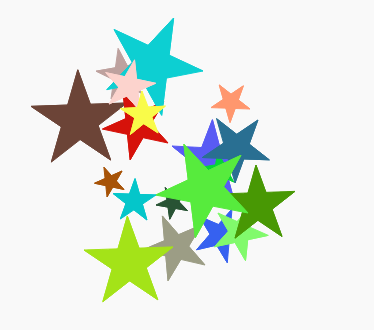

## Spremi projekt {.save}
