---
title: Popularni ljubimci
level: Python 2
language: hr-HR
stylesheet: python
embeds: "*.png"
materials: ["project-resources/new/*.*", "volunteer-resources/popular-pets-finished/*.*"]
...

# Uvod { .intro}

U ovom projektu kreirat ćeš tortne i stupčaste grafikone od podataka koje sakupiš od članova svog Code Cluba.

  <iframe src="https://trinket.io/embed/python/70d24d92b8?outputOnly=true&start=result" width="600" height="500" frameborder="0" marginwidth="0" marginheight="0" allowfullscreen>
  </iframe>
  

# Korak 1: Izrada tortnog grafikona { .activity}

Tortni grafikoni su veoma koristan način prikazivanja podataka. Napravimo anketu o omiljenim ljubimcima u tvom Code Clubu i prikažimo podatke u obliku tortnog grafikona.

## Zadatci { .check}

+ Zamoli volontera kluba da ti pomogne s anketom. Rezultate možeš zabilježiti na računalu spojenom na projektor ili na ploči tako da ih svi mogu vidjeti.

  Napiši popis ljubimaca i pobrini se da je omiljeni ljubimac svih članova uključen.

  Zatim neka svi glasuju za svog omiljenog ljubimca dizanjem ruke u zrak. Svatko može glasovati samo jednom!

  Primjerice:

  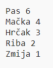

+ Otvori prazan Python predložak u Trinketu: <a href="http://jumpto.cc/python-new" target="_blank">jumpto.cc/python-new</a>. Ako čitaš ovo online, možeš koristiti i ugrađenu verziju ovog trinketa koja se nalazi ispod.

<iframe src="https://trinket.io/embed/python/33e5c3b81b?start=result" width="100%" height="600" frameborder="0" marginwidth="0" marginheight="0" allowfullscreen></iframe>

+ Prikažimo rezultate tvoje ankete pomoću tortnog grafikona. Za neke teže dijelove koristit ćemo PyGal biblioteku.

  Prvo uvezi Pygal biblioteku:

  

+ Napravimo sada tortni grafikon i prikažimo ga:

  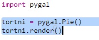

  Ne brini, izgledat će puno bolje kada dodaš podatke!

+ Dodajmo podatke za jednog od ljubimaca. Koristi podatke koje si sakupio.

  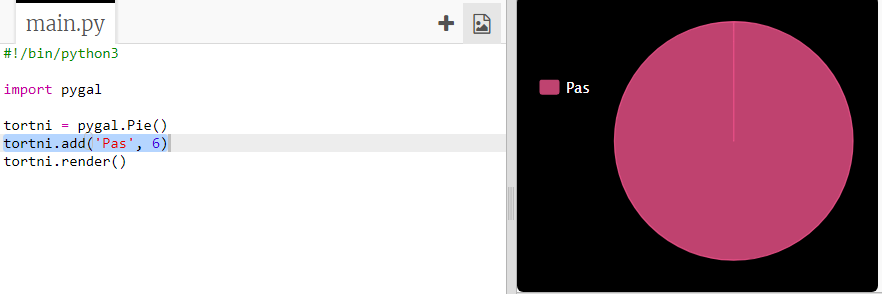

  S obzirom da smo unijeli samo jedan podatak, on zauzima cijeli tortni grafikon.

+ Sada dodaj ostale podatke na isti način.

  Primjerice:

  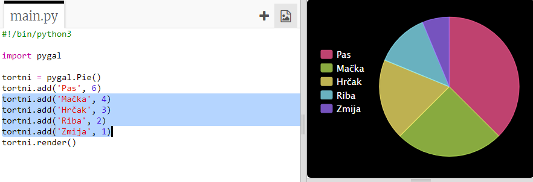

+ I za kraj, dodaj naslov svom grafikonu:

  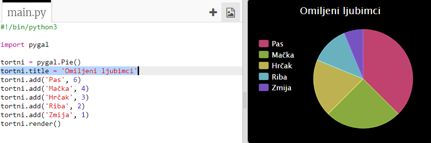

## Spremi projekt {.save}

## Izazov: Napravi vlastiti stupčasti grafikon {.challenge}

Stupčasti grafikoni rade se na sličan način. Jednostavno koristi `stupcasti = pygal.Bar()` za kreiranje novog stupčastog grafikona, a zatim unesi i prikaži podatke na isti način kao i prije.

Sakupi podatke od članova svog Code Cluba za kreiranje grafikona.

Pazi da odabereš temu koja će svima biti poznata!

Evo nekoliko ideja:

+ Koji je tvoj omiljeni sport?
+ Koji je tvoj omiljeni okus sladoleda?
+ Kako putuješ u školu?
+ U kojem mjesecu si rođen/a?
+ Igraš li Minecraft? (da/ne)

Nemoj postavljati pitanja u kojima se traže osobni podatci, poput adrese. Potraži pomoć voditelja svog kluba ako nisi siguran koja pitanja postaviti.

Primjeri:

# Korak 2: Čitanje podataka iz datoteke { .activity}

Korisno je spremiti podatke u datoteku, umjesto da ih upisuješ unutar svog kôda.

## Zadatci { .check}

+ Dodaj novu datoteku svom projektu i nazovi ju `ljubimci.txt`:

  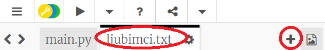

+ Sada upiši podatke u datoteku. Možeš koristiti podatke o omiljenim ljubimcima koje si sakupio ili podatke iz primjera.

  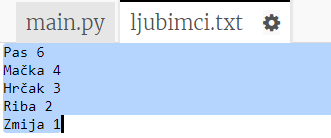

+ Prijeđi u `main.py` i komentiraj linije kôda kojima se prikazuju grafikoni (tako da se ne prikažu):

  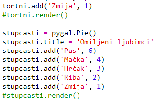

+ Ispišimo sada podatke iz datoteke.

  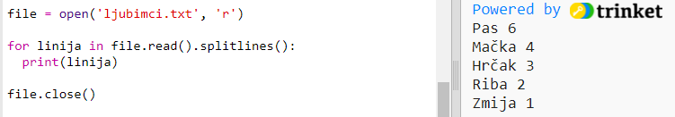

  For petlja prolazit će kroz sve linije u datoteci. Funkcija `splitlines()` uklanja znak za novi red sa kraja linije.

+ Svaka linija mora biti podijeljena na naziv i vrijednost:

  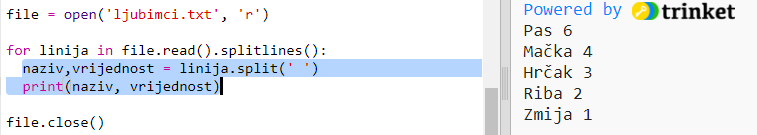

  Ovako će se linija podijeliti ondje gdje je razmak pa nemoj uključiti razmake u nazivima. (Kasnije možeš dodati opciju kojom će razmaci biti uključeni u nazivima.)

+ Možda ćeš dobiti obavijest o ovakvoj grešci:

  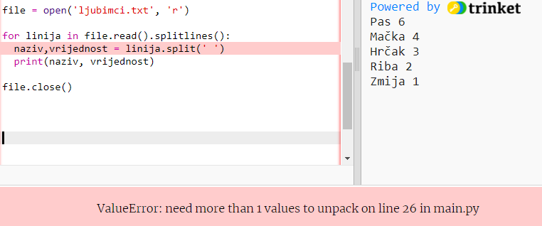

  Ovo se događa ako na kraju svoje datoteke imaš prazan red.

  Grešku možeš popraviti tako da program ispisuje naziv i vrijednost samo ako linija nije prazna.

  Da bi to napravio, uvuci kôd unutar `for` petlje i iznad njega dodaj `if linija:`:

  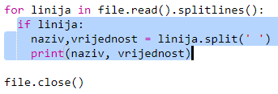

+ Sada kada sve radi, možeš maknuti liniju `print(naziv, vrijednost)`.
+ Dodajmo sada naziv i vrijednost novom tortnom grafikonu i prikažimo ga:

  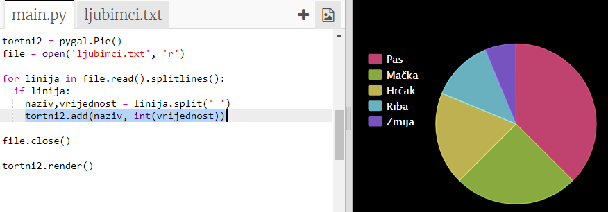

  Primijeti da naredba `add` radi samo s brojčanim vrijednostima pa zato dodajemo naredbu `int(vrijednost)` koja će promijeniti vrijednost iz stringa u integer.

  Ako želiš korisiti decimalne brojeve, poput 3.5, koristit ćeš naredbu `float(vrijednost)` umjesto `int(vrijednost)`.

## Spremi projekt {.save}

## Izazov: Napravi novi grafikon od podataka iz datoteke {.challenge}

Možeš li napraviti novi stupčasti ili tortni grafikon koristeći podatke iz datoteke? Moraš napraviti novu .txt datoteku.

Savjet: Ako želiš omogućiti razmake u nazivima, koristi `linija.split(': ')` i dodaj znak dvotočja u svojim podatcima. Primjerice, 'Red Admiral: 6'.

## Izazov: Napravi još grafikona! {.challenge}

Možeš li napraviti tortni i stupčasti grafikon koristeći podatke iz iste datoteke? Možeš koristiti već prikupljene podatke ili prikupiti nove.

## Spremi projekt {.save}
