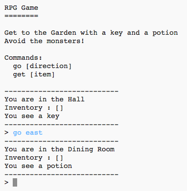

---
title: RPG
level: Python 2
language: hr-HR
stylesheet: python
embeds: "*.png"
materials: ["project-resources/rpg/*.*", "volunteer-resources/rpg-finished/*.*"]
...

# Uvod:  { .intro}

U ovom projektu dizajnirat ćeš i napraviti vlastitu RPG igru labirinta. Cilj igre je skupiti sve objekte i pobjeći iz kuće, izbjegavajući pri tome sva čudovišta!

  <iframe src="https://trinket.io/embed/python/d06adeb527?outputOnly=true&start=result" width="600" height="500" frameborder="0" marginwidth="0" marginheight="0" allowfullscreen>
  </iframe>
  

# Korak 1: Dodavanje novih prostorija { .activity}

## Zadatci { .check}

+ Dio kôda za ovu igru smo ti već pripremili. Otvori ovaj trinket: <a href="http://jumpto.cc/rpg-go" target="_blank">jumpto.cc/rpg-go</a>. Ako čitaš ovo online, možeš koristiti i ugrađenu verziju ovog trinketa koja se nalazi ispod.

<iframe src="https://trinket.io/embed/python/09fa4faae7?start=result" width="100%" height="600" frameborder="0" marginwidth="0" marginheight="0" allowfullscreen></iframe>

+ Ovo je vrlo jednostavna RPG igra koja se sastoji od 2 prostorije. Ispod se nalazi nacrt igre:

  

  Upiši `go south` za pomicanje iz hodnika ('hall') u kuhinju ('kitchen'), a zatim `go north` za ponovno vraćanje u hodnik!

  

+ Što se dogodi kada uneseš smjer u kojem ne možeš ići? Upiši `go west` dok si u hodniku i dobit ćeš simpatičnu poruku o grešci.

  

+ Pronađi varijablu `rooms` i vidjet ćeš da je nacrt kôdiran u obliku rječnika prostorija:

  

  Zapravo, ovaj rječnik povezuje broj prostorije sa još jednim rječnikom u kojem se nalaze podatci o toj prostoriji.

  Primjerice, u kôdu iznad prostorija 1 je hodnik. Hodnik je povezan sa prostorijom 2 (kuhinja) na jugu. Prostorija 2 (kuhinja) je također povezana sa prostorijom 1 (hodnik) na sjeveru.

+ Dodajmo istočno od hodnika blagovaonicu.

  

  Moraš dodati treću prostoriju koju ćeš nazvati `dining room` (blagovaonica). Također ju moraš povezati sa prostorijom 1 (hodnik) na zapadu i dodati podatke prostoriji hodnik u rječniku kako bi se mogao pomicati u blagovaonicu na istoku.

  

+ Isprobaj igru sad kad si dodao blagovaonicu:

  

  Ako se ne možeš pomicati u blagovaonicu i iz nje, provjeri jesi li dodao cijeli kôd koji se nalazi iznad (uključujući i dodatne zareze u linijama).

## Spremi projekt {.save}

## Izazov: Dodaj nove prostorije { .challenge}

Možeš li dodati još prostorija svojoj igri? Možeš, na primjer, dodati dnevni boravak južno od blagovaonice. Ne zaboravi dodati i vrata do/iz neke od ostalih prostorija!

## Spremi projekt {.save}

# Korak 2: Dodaj predmete za sakupljanje { .activity }

U prostorije ćemo postaviti predmete koje će igrač sakupljati dok se bude kretao labirintom.

## Zadatci { .check}

+ Dodavanje predmeta u prostoriju je lako - jednostavno ga dodaj u rječnik prostorije u kojoj želiš da se pojavi. Pokušajmo staviti ključ u hodnik.

  

  Ne zaboravi staviti zarez nakon linije iznad novog unosa ili program neće raditi!

+ Pokreneš li sada igru vidjet ćeš ključ u hodniku kojeg možeš čak i pokupiti (upisivanjem `get key`). Tako ćeš ga dodati u svoj inventar!

    

## Spremi projekt {.save}

## Izazov: Dodaj nove predmete { .challenge}

Dodaj neki predmet u neke od prostorija u svojoj igri. Možeš dodati bilo koji predmet za koji smatraš da bi bio koristan za bijeg iz kuće, primjerice štit ili čarobni napitak!

## Spremi projekt {.save}

# Korak 3: Dodavanje neprijatelja { .activity }

Ova igra je prejednostavna! Dodajmo u neke od prostorija neprijatelje koje će igrač izbjegavati.

## Zadatci { .check}

+ Dodavanje neprijatelja u prostoriju je jednostavno kao i dodavanje bilo kojeg drugog predmeta. Dodajmo gladno čudovište u kuhinju:

  

+ Također se želiš pobrinuti da se igra završi ako igrač uđe u prostoriju u kojoj se nalazi čudovište. To možeš napraviti dodavanjem sljedećeg kôda na kraju svoje igre:

  

  Ovaj kôd provjerava postoji li nekakav predmet u prostoriji i ako postoji je li taj predmet čudovište. Primijeti da je kôd uvučen pa je na istoj razini kao i kôd iznad njega. To znači da će igra provjeravati postoji li čudovište u prostoriji svaki put kada igrač uđe u novu prostoriju.

+ Testiraj svoj kôd tako da uđeš u kuhinju, u kojoj se sada nalazi čudovište.

  

## Spremi projekt {.save}

## Izazov: Dodaj još čudovišta { .challenge}

Dodaj još čudovišta u svoju igru kako bi otežao igraču bijeg iz kuće!

## Spremi projekt {.save}

# Korak 4: Pobjeda u igri { .activity }

Dajmo tvom igraču nekakvu misiju koju mora izvršiti kako bi pobijedio u igri.

## Zadatci { .check}

+ U ovoj će igri igrač pobijediti ako dođe do vrta i pobjegne iz kuće. Također sa sobom mora imati ključ i čarobni napitak. Ispod se nalazi nacrt igre.

  

+ Prvo moraš dodati vrt južno od blagovaonice. Ne zaboravi dodati i vrata kako bi ga povezao sa drugim prostorijama u kući.

  

+ Dodaj čarobni napitak u blagovaonicu (ili neku drugu prostoriju u kući).

  

+ Dodaj sljedeći kôd kako bi omogućio igraču da bude pobjednik ako dođe do vrta sa ključem i čarobnim napitkom:

  

  Pobrini se da je kôd uvučen, odnosno u razini sa kôdom iznad njega. Ovaj kôd ispisat će poruku `Pobjegao si iz kuce...POBIJEDIO SI!` ako se igrač nalazi u prostoriji 4 (vrt) i sa sobom ima ključ i čarobni napitak.

  Ako tvoja kuća ima više od 4 prostorije, možda ćeš, u kôdu iznad, morati upisati drugačiji broj prostorije koja označava vrt.

+ Testiraj svoju igru i provjeri može li igrač pobijediti!

  

+ Konačno, dodajmo upute za igru kako bi igrač znao što treba raditi. Izmijeni funkciju `showInstructions()` tako da sadrži više informacija.

  

  Dodaj upute koje govore igraču koje predmete treba sakupiti i što treba izbjegavati!

+ Testiraj igru i tvoje nove upute bi se trebale prikazati.

  

## Spremi projekt {.save}

## Izazov: Osmisli vlastitu igru { .challenge}

Primijeni naučeno i osmisli vlastitu igru. Dodaj puno prostorija, čudovišta i predmeta za sakupljanje. Ne zaboravi izmijeniti kôd tako da igrač pobijedi kada dođe u određenu prostoriju i sakupi određene predmete. Napravi skicu kuće prije nego počneš pisati kôd - moglo bi ti olakšati posao!

Upisivanjem `go up` i `go down` možeš čak dodati i stepenice svom nacrtu ili još jedan kat kuće.

## Spremi projekt {.save}
