---
title: Borbe robota
level: Python 2
language: hr-HR
stylesheet: python
embeds: "*.png"
materials: ["project-resources/robo-trumps/*.*", "volunteer-resources/robo-trumps-finished/*.*"]
...

# Uvod { .intro}

U ovom projektu učitavat ćeš podatke iz datoteke i kreirati karte za igru robotima. Zatim ćeš s prijateljem moći igrati Borbe robota.

  <iframe src="https://trinket.io/embed/python/9ccc368bd5?outputOnly=true&start=result" width="600" height="500" frameborder="0" marginwidth="0" marginheight="0" allowfullscreen>
  </iframe>
  

# Korak 1: Učitaj podatke o robotu iz datoteke { .activity}

Često je korisno moći učitati podatke iz datoteke. Na taj način ne trebaš mijenjati svoj kôd već možeš izmijeniti podatke unutar datoteke.

## Zadatci { .check}

+ Otvori ovaj trinket: <a href="http://jumpto.cc/trumps-go" target="_blank">jumpto.cc/trumps-go</a>. Ako čitaš ovo online, možeš koristiti i ugrađenu verziju ovog trinketa koja se nalazi ispod.

<iframe src="https://trinket.io/embed/python/e32251230a?start=result" width="100%" height="600" frameborder="0" marginwidth="0" marginheight="0" allowfullscreen></iframe>

+ U tvom početnom projektu nalazi se datoteka `cards.txt` koja sadrži podatke o robotima.

  Klikni na `cards.txt` za pregled podataka:

  

  Svaka linija sadrži podatke o jednom robotu. Podatci unutar linija odvojeni su zarezima.

  Svaka linija sadrži sljedeće podatke:

  ime, razinu inteligencije, izdrživost baterije, naziv slikovne datoteke

+ Učitajmo podatke iz datoteke kako bi ih mogli koristiti.

  Prvo otvori datoteku `cards.txt` u svom programu:

  

+ Sada možeš učitati podatke iz datoteke:

  

+ Uvijek zatvori datoteku nakon što si završio s njenim korištenjem:

  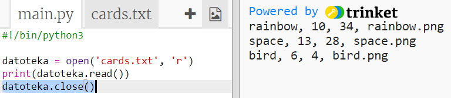

+ Time smo ispisali podatke kao jedan string. Rastavimo ga na pojedinačne dijelove podataka.

  Prvo možeš ispisati podatke u obliku liste koja se sastoji od linija:

  

  Pažljivo pogledaj ispis. U listi se nalaze tri elementa, a svaki je element jedna linija iz datoteke.

+ Sada možeš petljom proći kroz svaku liniju posebno.

  

+ Umjesto ispisivanja linija, pohrani ih u varijable:

  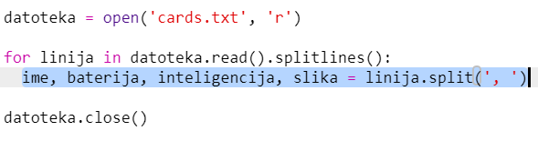

+ Želiš da ti ovi podatci budu i kasnije dostupni za pronalaženje vrijednosti određenog robota. Koristit ćemo ime robota kao ključ u rječniku.

  Kreiraj rječnik naziva `roboti`:

  

+ Dodajmo sada unos za svakog robota u rječnik roboti.

  Ime robota je ključ, a lista podataka za tog robota je vrijednost.

  Dodaj označeni kôd:

  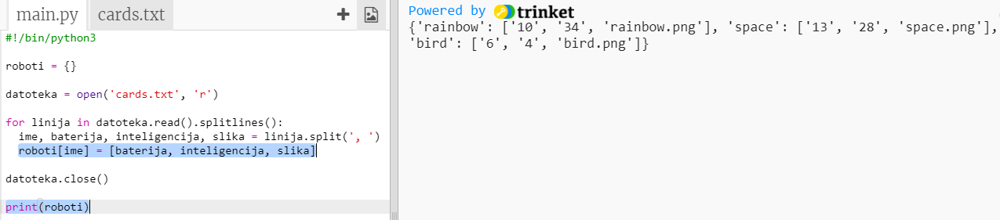

  Možeš maknuti naredbu `print roboti` nakon testiranja kôda.

# Korak 2: Prikaži podatke { .activity}

Sada možeš prikazati podatke o robotima na zanimljiviji način.

Prikažimo kartu robota sa slikom i podatcima o njegovoj inteligenciji i korisnosti.

Kada to napraviš moći ćeš prikazati robote na ovaj način:

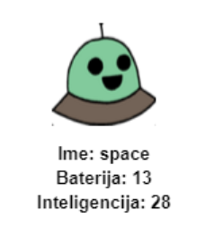

## Zadatci { .check}

+ Pitaj korisnika da odabere robota:

  

+ Ako se robot nalazi u rječniku, potraži njegove podatke:

  

  Testiraj kôd unošenjem imena robota.

+ Ako robot ne postoji, prikaži poruku o grešci:

  

 Testiraj kôd unošenjem imena robota koji se ne nalazi u rječniku.

+ Sada ćeš koristiti Python turtle za prikazivanje podataka robota.

  Uvezi turtle biblioteku na početku svog kôda i podesi ekran i turtle:

  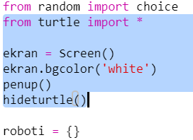

+ Zatim dodaj kôd kojim će turtle ispisati ime robota:

  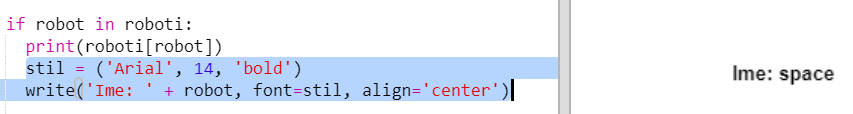

+ Izmjenjuj varijablu `stil` dok ne budeš zadovoljan sa izgledom teksta.

  Umjesto stila `Arial` možeš iskušati stilove: `Courier`, `Times` ili `Verdana`.

  Promijeni `14` u neki drugi broj za izmjenu veličine fonta.

  Možeš promijeniti `bold` u `normal` ili `italic`.

+ Umjesto ispisivanja karakteristika robota, pohrani ih u varijablu.

  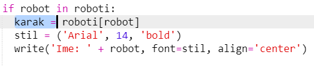

+ Sada možeš karakteristikama robota pristupati kao elementima liste:

  + `karak[0]` označava inteligenciju
  + `karak[1]` označava bateriju
  + `karak[2]` označava naziv slikovne datoteke

  Dodaj kôd koji će prikazivati karakteristike inteligencije i baterije:

  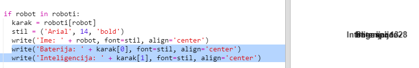

+ Oh ne! Karakteristike se ispisuju jedna preko druge. Moramo dodati kôd kojim će se turtle pomaknuti:

   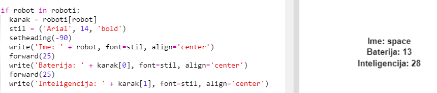

+ Konačno, dodajmo sliku robota za upotpunjavanje prikaza.

  Moraš dodati liniju za prepoznavanje slike pri učitavanju podataka iz datoteke `cards.txt`:

  

+ Dodaj i kôd za postavljanje slike:

  

+ Testiraj kôd unošenjem jednog robota pa drugog i vidjet ćeš da se prikazuju jedan na drugome!

  Moraš očistiti ekran prije prikazivanja robota:

  

## Spremi projekt {.save}

## Izazov: Dodaj još robota {.challenge}

Možeš li u datoteku `cards.txt` dodati podatke za još robota?

Klikni na gumb za prikaz slika kako bi vidio koje slike robota su ti dostupne.

Ti odlučuješ koliko baterije i inteligencije će imati.

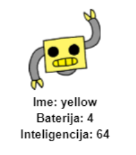

## Spremi projekt {.save}

## Izazov: Dodaj još karakteristika robotima {.challenge}

Možeš li smisliti još karakteristika koje ćeš dodati robotima? Možeš dodati ‘brzinu’ ili ‘korisnost’ ili smisliti nešto drugo.

Trebaš učiniti sljedeće:

+ Dodati podatke u datoteku za svaku novu karakteristiku
+ Dodati novu karakterstiku dijelu kôda koji učitava podatke
+ Ispisati novu karakteristiku pri prikazivanju karte robota

Možeš dodati i boju i prikazati karakteristike svakog robota u drugoj boji.

Pomoć: Koristi `color('red')` za promjenu turtle teksta u crvenu prije pisanja.

Primjer:

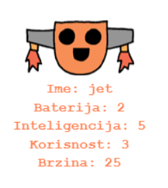

## Spremi projekt {.save}

# Korak 3: Prikaži nasumičnog robota { .activity}

Dodajmo kôd kojim ćeš dobiti nasumično odabranog robota kada upišeš Random umjesto njegovog imena.

## Zadatci { .check}

+ Prvo moraš uvesti choice funkciju iz modula random:

  

+ Možeš koristiti `choice` za odabir nasumičnog imena robota iz liste ključeva u rječniku roboti.

  

U Pythonu 3 moraš koristiti `list` za pretvaranje rezultata `ključeva` (keys) u listu.

Savjet: Pripazi na zagrade!

## Spremi projekt {.save}

## Izazov: Zaigraj Borbe robota sa prijateljem {.challenge}

Podijeli svoj projekt sa prijateljem i zaigrajte Borbe robota. Oboje koristite isti projekt da bude pošteno! Prvi igrač poziva nasumično odabranog robota, a zatim bira kategoriju. Tada i drugi igrač poziva nasumično odabranog robota, a zatim provjeravate tko ima najviši rezultat u odabarnoj kategoriji. Nakon toga se mijenjate.

Igra najbolje funkcionira ako oboje igrate sa istim špilom karata. Podijeli link svog trinket projekta sa prijateljem kako bi oboje mogli koristiti isti špil.

## Spremi projekt {.save}
