---
title: Kamen, škare i papir
level: Python 1
language: hr-HR
stylesheet: python
embeds: "*.png"
materials: ["project-resources/rock-paper-scissors/*.*", "volunteer-resources/rock-paper-scissors-finished/*.*"]
...

# Uvod { .intro}

U ovom projektu napravit ćeš igru Kamen, škare i papir i igrati ju protiv računala.  

Pravila: Ti i računalo birate kamen, škare ili papir. Pobjednik se određuje prema ovim pravilima:

+ Kamen tupi škare
+ Papir pokriva kamen
+ Škare režu papir

<div class="trinket">
  <iframe src="https://trinket.io/embed/python/e1e1d873be?outputOnly=true&start=result" width="600" height="500" frameborder="0" marginwidth="0" marginheight="0" allowfullscreen>
  </iframe>
  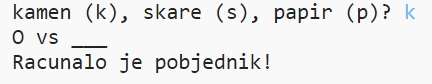
</div>

# Korak 1: Igrač je prvi na redu { .activity}

Za početak, neka igrač odabere kamen, škare ili papir.

## Zadatci { .check}

+ Otvori ovaj trinket: <a href="http://jumpto.cc/rps-go" target="_blank">jumpto.cc/rps-go</a>. Ako čitaš ovo online, možeš koristiti i ugrađenu verziju ovog trinketa koja se nalazi ispod.

<div class="trinket">
<iframe src="https://trinket.io/embed/python/de918c4f5d?start=result" width="100%" height="600" frameborder="0" marginwidth="0" marginheight="0" allowfullscreen></iframe>
</div>

+ Projekt već sadrži kôd za uvoz funkcije koju ćeš koristiti u ovom projektu.

  

  Kasnije ćeš koristiti funkciju `randint` za generiranje nasumičnih brojeva.

+ Prvo neka igrač upiše slovo 'k', 's' ili 'p' kako bi odabrao kamen, škare ili papir.

  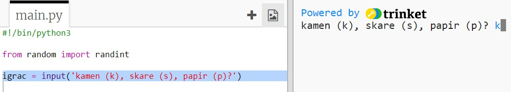

+ Sada ispiši ono što je igrač odabrao:

  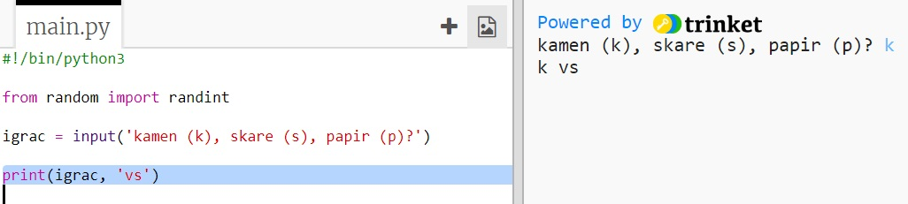

+ Testiraj svoj kôd klikom na `Run`. Klikni na prozor trinketa i unesi svoj odabir.


# Korak 2: Računalo je na redu { .activity}

Sada je red na računalu. Možeš koristiti funkciju `randint` kako bi generirao nasumični broj koji će odlučiti hoće li računalo odabrati kamen, škare ili papir.

## Zadatci { .check}  


+ Koristi funkciju `randint` kako bi generirao nasumični broj koji će odlučiti hoće li računalo odabrati kamen, škare ili papir.

  

+ Pokreni program nekoliko puta (svaki put ćeš morati unijeti 'k', 's' ili 'p'.)

  Vidjet ćeš da je varijabla 'odabir' nasumično podešena na 1, 2 ili 3.

+ Neka je:

  + 1 = kamen (k)
  + 2 = papir (p)
  + 3 = škare (s)

  Koristi naredbu `if` za provjeru je li odabran broj `1` (`==` se koristi kada želimo provjeriti jesu li dvije stvari jednake).

  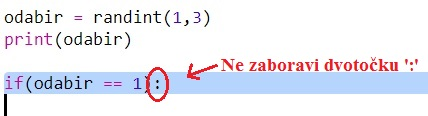

+ Python koristi __uvlačenje__ (pomicanje kôda udesno) kako bi označio koji dio kôda se nalazi unutar naredbe `if`. Za uvlačenje možeš koristiti dva razmaka (dva puta pritisni razmaknicu) ili pritisnuti __tipku tabulatora__ (obično se nalazi iznad tipke CAPSLOCK za velika slova).

  Varijabli `racunalo` pridruži vrijednost 'k' i postavi ju unutar naredbe `if` koristeći uvlačenje:

  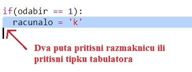

+ Možeš napraviti dodatnu provjeru koristeći naredbu `elif` (skraćeno od _else if_):

  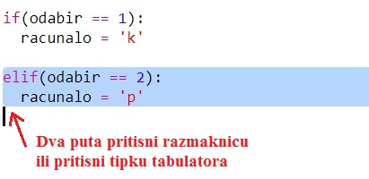

  Ovaj uvjet će se provjeravati samo ako prvi uvjet ne bude istinit (ako računalo nije odabralo `1`).

+ Konačno, ako računalo nije odabralo ni `1` ni `2`, onda je zasigurno odabralo `3`.

  U ovom slučaju možemo jednostavno koristiti naredbu `else` koja znači 'onda'.

  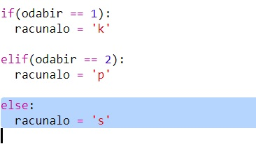

+ Umjesto ispisivanja nasumičnog broja kojeg je računalo odabralo, možeš ispisati slovo koje ono označava.

   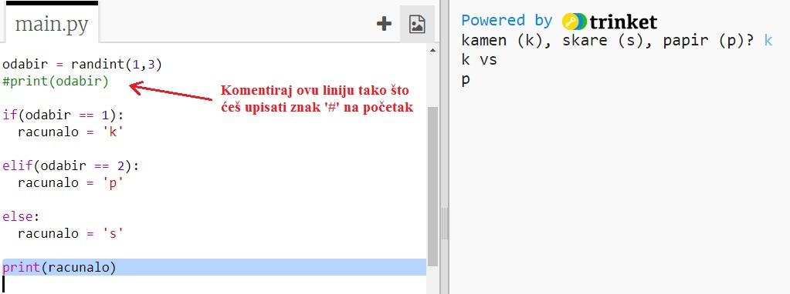

   Izbriši liniju kôda `print(odabir)` ili na početak linije dodaj znak ljestvi `#`. Tako će računalo zanemariti tu liniju.

+ Testiraj svoj kôd klikom na Run i unesi svoj odabir.

+ Hmm, odabir računala ispisuje se u novom redu. Možeš to promijeniti dodavanjem naredbe `end=' '` nakon `vs`. Tako će Python znati da mora završiti sa razmakom, a ne novim redom.

   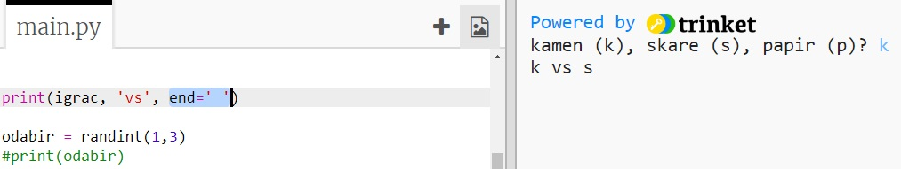

   Ako dodaš znak ljestvi '#' na početku linije, Python neće pokretati tu liniju.

   Nakon što isprobaš svoj novi kôd, liniju možeš obrisati.

+ Odigraj igru nekoliko puta klikom na Run i unošenjem svog odabira.

  Za sada ćeš morati sam odrediti tko je pobjednik, ali uskoro ćeš dodati Python kôd koji će to raditi umjesto tebe.   

## Spremi projekt {.save}


# Korak 3: Provjeri rezultat { .activity}

Dodajmo sada kôd kojim ćemo saznati tko je pobjednik.

## Zadatci { .check}

+ Da bi saznao tko je pobjedio moraš usporediti varijable `igrac` i `racunalo`.

  Ako su varijable jednake, onda je rezultat neriješen:

  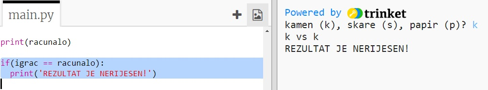

+ Isprobaj program igrajući igru nekoliko puta dok ne dobiješ neriješen rezultat.

  Klikni na `Run` kako bi započeo novu igru.

+ Pogledajmo sada sve slučajeve kada je igrač odabrao 'k' (kamen), a računalo nije.

  Ako je računalo odabralo 's' (škare), onda je igrač pobjednik (kamen pobjeđuje škare).

  Ako je računalo odabralo 'p' (papir), onda je računalo pobjednik (papir pobjeđuje kamen).

  Možemo provjeriti što su odabrali igrač *i* računalo koristeći `and`.

  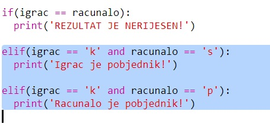

+ Pogledajmo sada slučajeve kada je igrač odabrao 'p' (papir), a računalo nije:

  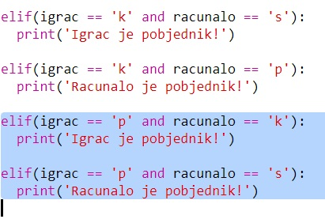

+ Konačno, možeš li dodati kôd kojim ćeš provjeriti tko je pobjednik ako je igrač odabrao 's' (škare), a računalo kamen ili papir?

+ Pokreni igru i isprobaj kôd.

  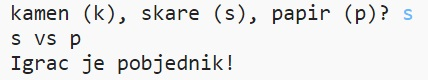

  Klikni na `Run` da započneš novu igru.

## Spremi projekt {.save}

## Izazov: ASCII umjetnost {.challenge}

Možeš li, umjesto slova k, s i p koja predstavljaju kamen, škare i papir, koristiti ASCII umjetnost?

Na primjer:


Gdje je:
```
kamen: O
papir: ___
škare: >8
```

+ Umjesto naredbe `print racunalo` moraš dodati novu liniju kôda unutar naredbe `if` za svaku opciju kako bi se ispisao odgovarajući ASCII simbol.

Pomoć:

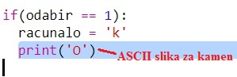

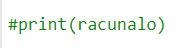

+ Umjesto naredbe `print igrac` moraš dodati novu if naredbu koja će provjeravati što je igrač odabrao i na temelju toga ispisati odgovarajući ASCII simbol:

Pomoć:

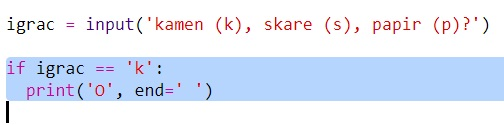

Ne zaboravi da dodavanjem `end=' '` na kraju `print` naredbe, naredba završava razmakom, a ne novim redom.

## Spremi projekt {.save}


## Izazov: Napravi novu igru {.challenge}

Možeš li napraviti vlastitu igru sličnu igri Kamen, škare i papir, ali sa drugačijim objektima?

Klikni na gumb 'Duplicate' kako bi napravio kopiju svog Kamen, škare i papir projekta. Izmijeni kopiju i napravi vlastitu igru.

U ovom primjeru koristi se Vatra, drvo i voda:

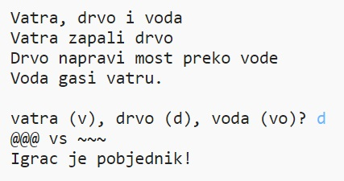

## Spremi projekt {.save}
