---
title: Tajne poruke
level: Python 1
language: hr-HR
stylesheet: python
embeds: "*.png"
materials: ["project-resources/new/*.*", "volunteer-resources/secret-messages-finished/*.*", "volunteer-resources/friendship-calculator-finished/*.*"]
...

#Uvod:  { .intro}
U ovom projektu naučit ćeš kako napraviti vlastiti program za šifriranje te poslati tajne poruke prijatelju i primiti tajne poruke prijatelja.

  <iframe src="https://trinket.io/embed/python/402256078c?outputOnly=true&start=result" width="600" height="500" frameborder="0" marginwidth="0" marginheight="0" allowfullscreen>
  </iframe>
  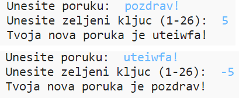

#Korak 1: Cezarova šifra { .activity}

Šifra je vrsta tajnog kôda gdje se slova međusobno zamjenjuju tako da nitko ne može pročitati tvoju poruku.

Koristit ćeš jedan od najstarijih načina šifriranja, __Cezarovu šifru__, koji je nazvan po Juliju Cezaru.

Prije nego započnemo sa kodiranjem, pokušajmo sakriti riječ koristeći Cezarovu šifru.

## Zadatci { .check}

+ Skrivanje riječi naziva se __enkripcija__.

	Započnimo sa šifriranjem slova 'a'. Nacrtat ćemo englesku abecedu u krugu kako bi sakrio slovo:

	

+ Da bi od običnog slova napravio tajno šifrirano slovo, moraš imati tajni ključ. Koristit ćemo broj 3 kao tajni ključ (ali možeš koristiti bilo koji broj).

	Za __enkripciju__ slova 'a', pomakni se za 3 slova unaprijed, u smjeru kazaljke na satu. Tako ćeš dobiti slovo 'd':

	

+ Iskoristi naučeno i šifriraj riječ. Primjerice, kada šifriramo riječ 'hello' dobit ćemo 'khoor'. Pokušaj!

	+ h + 3 = __k__
	+ e + 3 = __h__
	+ l + 3 = __o__
	+ l + 3 = __o__
	+ o + 3 = __r__

+ Vraćanje teksta u početni oblik naziva se __dekripcija__. Za dešifriranje riječi jednostavno oduzmi tajni ključ od slova umjesto da ga dodaš:

	+ k - 3 = __h__
	+ h - 3 = __e__
	+ o - 3 = __l__
	+ o - 3 = __l__
	+ r - 3 = __o__

## Izazov: Isprobaj Cezarovu šifru { .challenge}
Možeš li poslati tajnu riječ prijatelju? Prvo se morate dogovoriti što će biti tajni ključ.

Možete razmijeniti i cijele rečenice!

#Korak 2: Šifriranje slova { .activity}

Napišimo program u Pythonu koji će šifrirati znakove.

## Zadatci { .check}

+ Otvori prazan Python predložak u Trinketu: <a href="http://jumpto.cc/python-new" target="_blank">jumpto.cc/python-new</a>. Ako čitaš ovo online, možeš koristiti i ugrađenu verziju ovog trinketa koja se nalazi ispod.

<iframe src="https://trinket.io/embed/python/33e5c3b81b?start=result" width="100%" height="600" frameborder="0" marginwidth="0" marginheight="0" allowfullscreen></iframe>

+ Umjesto crtanja abecede u krugu, definirajmo ju kao varijablu `abeceda`.

	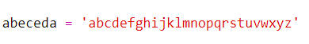

+ Svako slovo abecede ima svoju poziciju, počevši od 0. Dakle, slovo 'a' je na nultoj poziciji abecede, a 'c' na poziciji 2.

	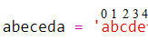

+ Za ispis slova koje se nalazi u varijabli `abeceda`, upiši poziciju tog slova unutar uglatih zagrada.

	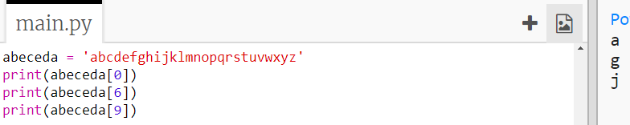

	Možeš izbrisati `print` naredbe nakon što si testirao kôd.

+ Zatim moraš spremiti tajni `ključ` u varijablu.

	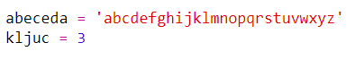

+ Sada pitaj korisnika da unese jedno slovo (odnosno `znak`) koje će se šifrirati.

	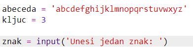

+ Pronađi `poziciju` tog `znaka`.

	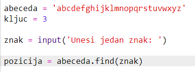

+ Ispiši spremljenu `poziciju` kako bi ju testirao. Primjerice, testiraj je li znak 'e' na poziciji 4 u abecedi.

	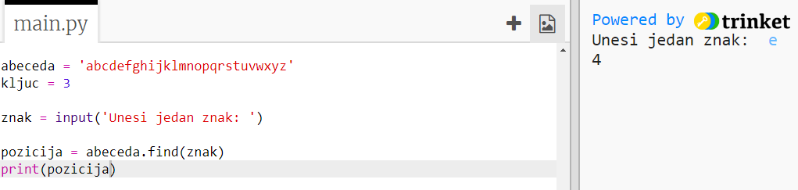

+ Dodaj `ključ` `poziciji` za šifriranje `znaka`.  

	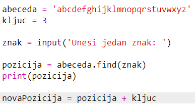

+ Testiraj svoj novi kôd. S obzirom da je tvoj `ključ` broj 3, `poziciji` bi se trebao dodati broj 3, a zatim se spremiti u varijablu `novaPozicija`.

	Primjerice, slovo 'e' je na poziciji 4. Kako bi se slovo šifriralo, poziciji se dodaje `ključ` (3) i naposljetku dobije 7.

	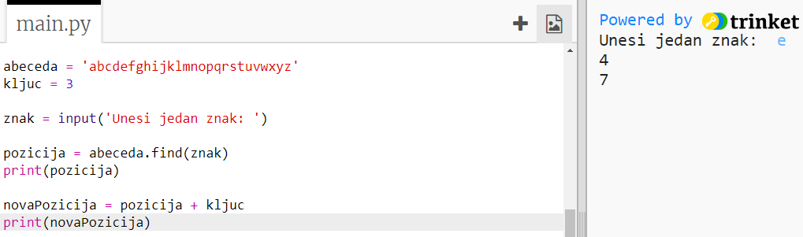

+ Što se dogodi kada pokušaš šifrirati slovo 'y'?

	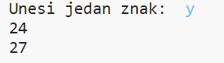

	Primjećuješ li da je `novaPozicija` 27, a u engleskoj abecedi nema 27 slova!

+ Ako upišeš `%` nova pozicija će se, nakon što dođe do pozicije 26, vratiti na poziciju 0.

	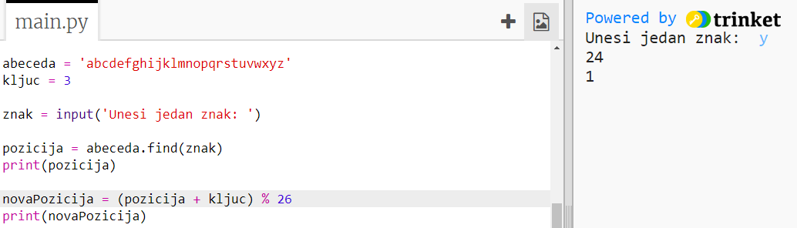

+ Konačno, sada ćeš ispisati slovo koje se nalazi na novoj poziciji.

	Primjerice, kada dodamo ključ slovu 'e' dobit ćemo 7, a slovo koje se nalazi na poziciji 7 u abecedi je 'h'.

	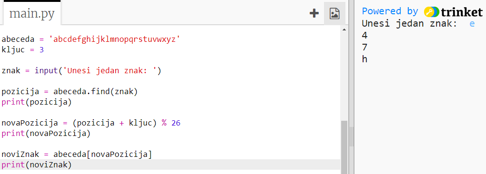

+ Isprobaj svoj kôd. Možeš i ukloniti neke od print naredbi i ispisati samo novi znak na kraju.

	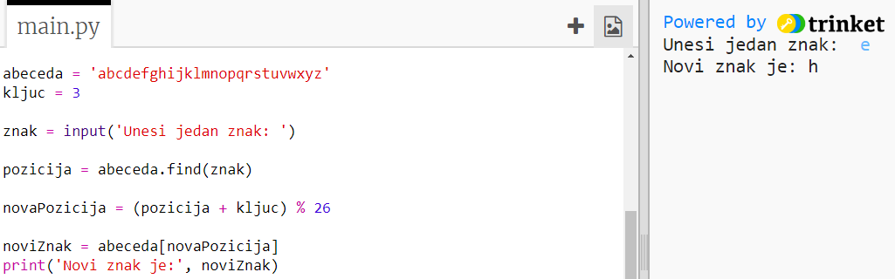

## Spremi projekt {.save}

## Izazov: Promjenjivi ključevi { .challenge}
Izmijeni svoj program tako da omogućava korisniku unošenje proizvoljnog ključa. Korisnikov unos spremi u varijablu `ključ`.

Ne zaboravi koristiti funkciju `int()` za pretvaranje unosa u cijeli broj.

Možeš koristiti i negativni ključ za dešifriranje poruke!

## Spremi projekt {.save}

#Korak 2: Šifriranje poruka { .activity}

Podesimo program da šifrira cijele poruke, umjesto da šifrira i dešifrira jedan po jedan znak!

## Zadatci { .check}

+ Prvo provjeri izgleda li tvoj kôd ovako:

	

+ Definiraj varijablu u koju ćeš spremiti svoju novu šifriranu poruku.

	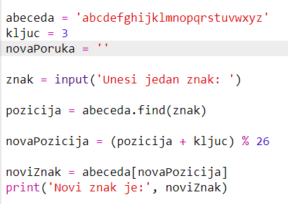

+ Izmijeni kôd tako da sprema korisnikovu poruku, a ne samo jedan znak.

	

+ Svom kôdu dodaj `for` petlju, a zatim uvuci ostatak kôda kako bi se ponavljao za svaki znak poruke.

	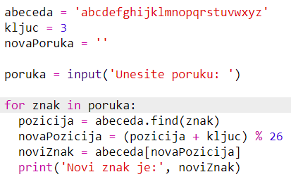

+ Testiraj kôd. Svaki znak poruke trebao bi se šifrirati i ispisivati jedan po jedan.

	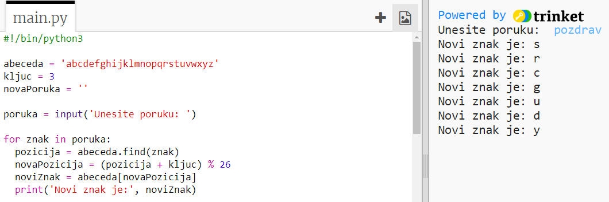

+ Dodajmo svaki šifrirani znak u varijablu `novaPoruka`.

	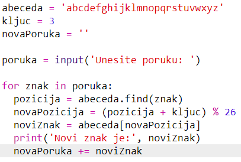

+ Naredbom `print` možeš ispisati varijablu `novaPoruka` dok se šifrira.

	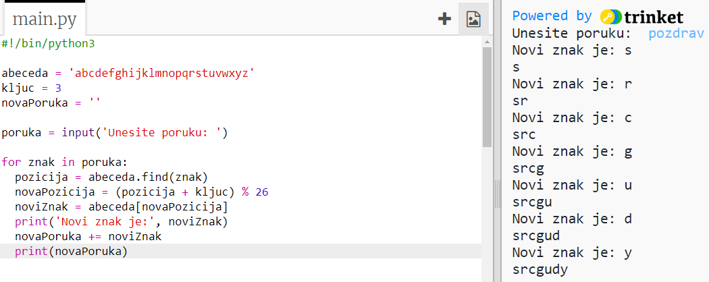

+ Izbrišeš li prazna mjesta prije naredbe `print` šifrirana poruka će se ispisati samo jednom na kraju. Možeš izbrisati i dio kôda koji ispisuje pozicije znakova.

	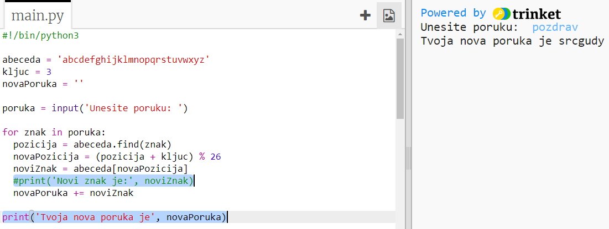

## Spremi projekt {.save}

#Korak 3: Dodatni znakovi { .activity}

Neki se znakovi ne nalaze u abecedi, zbog čega se javljaju greške.

## Zadatci { .check}

+ Isprobaj kako radi tvoj kôd kada koristiš neke znakove koji se ne nalaze u abecedi.

	Primjerice, možeš napisati poruku `hej bok!!`.

	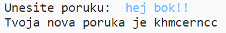

	Primijeti da su razmak i znak uskličnika `!` šifrirani kao slovo 'c'!

+ Da bi ovo popravio, program mora prevoditi znak samo ako se nalazi u abecedi. To ćeš napraviti dodavanjem `if` naredbe u kôd i uvlačenjem ostatka kôda.

	

+ Testiraj kôd koristeći istu poruku kao prije. Što se ovaj put događa?

	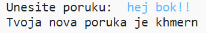

	Sada tvoj kôd preskače svaki znak koji nije u abecedi.

+ Najbolje bi bilo kada tvoj kôd ne bi šifrirao ništa što nije u abecedi, nego jednostavno koristio originalni znak.

	Kôdu dodaj `else` naredbu koja će dodati originalni znak šifriranoj poruci.

	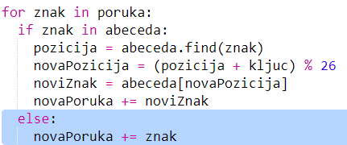

+ Testiraj kôd. Svi znakovi abecede trebali bi biti šifrirani, dok su svi ostali znakovi u originalnom obliku!

	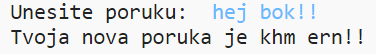

## Spremi projekt {.save}

## Izazov: Šifriranje i dešifriranje poruka { .challenge}
Šifriraj nekoliko poruka te ih, zajedno sa tajnim ključem, daj prijatelju. Neka ih tvoj prijatelj pokuša dešifrirati koristeći svoj program!

Možeš napraviti i kopiju projekta te napraviti poseban program za dešifrirnje poruka.

## Spremi projekt {.save}

## Izazov: Kalkulator prijateljstva { .challenge}
Napiši program koji će, računanjem bodova prijateljstva, pokazivati koliko dobro si dvije osobe odgovaraju.

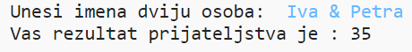

Program neka prođe kroz svaki znak koji se nalazi u imenima dvaju osoba. Kada pronađe slovo koje nosi određen broj bodova, neka te bodove doda u varijablu `rezultat`.

Odredi kakva će biti pravila za davanje bodova. Primjerice, možeš davati bodove za samoglasnike ili za znakove koji se nalaze u riječi "prijatelj":

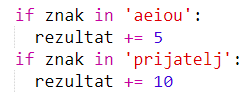

Korisnicima možeš prikazati i posebnu poruku na osnovi njihovog rezultata.

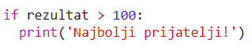

## Spremi projekt {.save}
