---
title: Odaberi tim
level: Python 1
language: hr-HR
stylesheet: python
embeds: "*.png"
materials: ["project-resources/new/*.*", "volunteer-resources/team-chooser-finished/*.*"]
...

#Uvod:  { .intro}
U ovom projektu ćeš naučiti kako kreirati dva nasumična tima koristeći imena igrača sa datog popisa.

  <iframe src="https://trinket.io/embed/python/a699c44ce6?outputOnly=true&start=result" width="600" height="500" frameborder="0" marginwidth="0" marginheight="0" allowfullscreen>
  </iframe>
  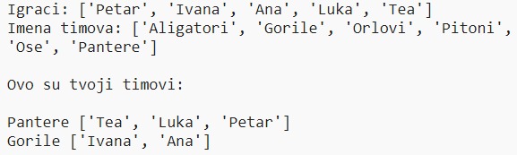

#Korak 1: Igrači { .activity}

Započnimo sa kreiranjem popisa igrača koji će biti u timovima.

## Zadatci { .check}

+ Otvori prazan Python predložak u Trinketu: <a href="http://jumpto.cc/python-new" target="_blank">jumpto.cc/python-new</a>. Ako čitaš ovo online, možeš koristiti i ugrađenu verziju ovog trinketa koja se nalazi ispod.

<iframe src="https://trinket.io/embed/python/33e5c3b81b?start=result" width="100%" height="600" frameborder="0" marginwidth="0" marginheight="0" allowfullscreen></iframe>

+ __Listu__ igrača možeš spremiti u varijablu. Lista se mora nalaziti unutar uglatih zagrada `[ ]`, a elemente liste potrebno je odvojiti zarezom.

	Započni s dodavanjem liste igrača u svoj program.

	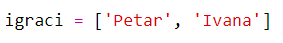

+ Dodaj sljedeći kôd kako bi ispisao varijablu `igraci`:

	

+ Do elementa u listi možeš doći upisivanjem njegove pozicije unutar uglatih zagrada nakon imena varijable.

	Prvi element liste ima __poziciju 0__, što je drugačije nego u Scratchu gdje prvi element ima poziciju 1.

	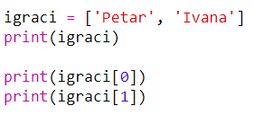

## Spremi projekt {.save}

## Izazov: Dodavanje igrača { .challenge}
Možeš li dodati još igrača svojoj listi? Možeš dodati koliko god igrača želiš, ali pripazi da ih bude __paran__ broj.

Ako želiš, možeš promijeniti i imena prvih dvaju igrača.

Možeš li dodati kôd koji će ispisati __samo jednog__ novog igrača?

## Spremi projekt {.save}

#Korak 2: Nasumični igrači { .activity}

Odaberimo sada nasumično igrače timova!

## Zadatci { .check}

+ Kako bi nasumično odabrao igrača iz svoje liste `igraci`, prvo moraš uvesti `choice` dio iz modula `random`.

	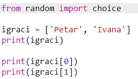

+ Koristi `choice` da bi dobio nasumičnog igrača. (Možeš i obrisati kôd koji ispisuje pojedinačne igrače.)

	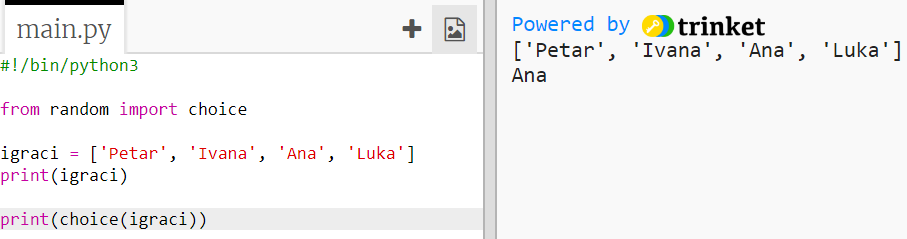

+ Isprobaj svoj `choice` kôd nekoliko puta i vidjet ćeš da je svaki put odabran drugi igrač.

+ Možeš kreirati novu varijablu imena `igracA` u koju ćeš spremati nasumičnog igrača.

	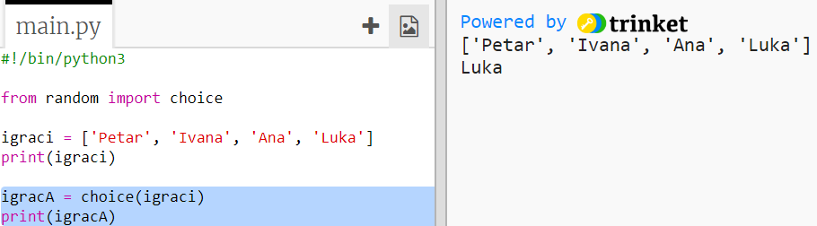

+ Za spremanje svih igrača iz tima A, moraš napraviti novu listu. Za početak, ova lista mora biti prazna.

	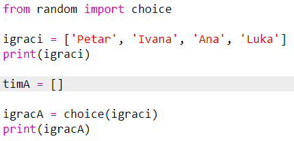

+ Sada možeš dodati nasumično odabranog igrača u `timA`. Da bi to napravio koristi `timA.append` (__append__ znači dodati na kraj).

	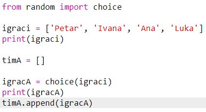

+ Kôd možeš testirati dodavanjem naredbe `print` koja će ispisati igrače koji su dodani u listu `timA`.

	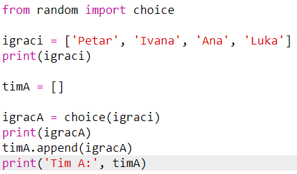

+ Sada si izabrao igrača i možeš ga maknuti sa liste `igraci`.

	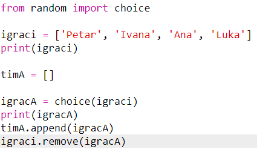

+  Dodaj još jednu naredbu `print` da bi vidio koji su ti `igraci` preostali.

	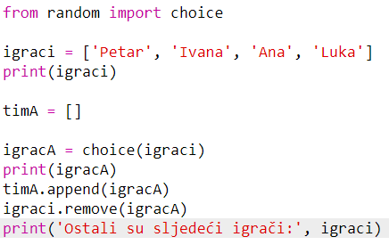

	U primjeru iznad, Ivana je odabrana za `timA` i zato je više nema na listi `igraci`.

## Spremi projekt {.save}

## Izazov: Odaberi igrače za tim B { .challenge}
Možeš li dodati kôd kojim ćeš nasumično odabrati igrače za tim B? Trebaš učiniti sljedeće:

+ Kreiraj novu listu imena `timB`
+ Odaberi nasumičnog igrača za tim B (imena `igracB`)
+ Naredbom `append` dodaj odabranog igrača listi `timB`
+ Naredbom `remove` ukloni odabranog igrača sa liste `igraci`

Kôd za listu `timB` biti će __veoma__ sličan kôdu koji si već napisao za listu `timA`!

## Spremi projekt {.save}

#Korak 3: Odabir više igrača { .activity}

Sada se moraš pobrinuti da je svaki igrač u nekom timu.

## Zadatci { .check}

+ Označi dio kôda kojim se odabiru igrači za tim A i tim B i pritisni tipku tabulatora kako bi uvukao taj dio kôda.

	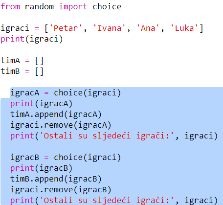

+ Dodaj __while__ petlju kako bi program birao igrače sve dok duljina liste `igraci` ne bude jednaka 0.

	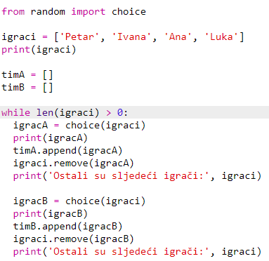

+ Pokreni kôd i testiraj ga. Igrači bi se trebali dodavati timu A i timu B sve dok više ne ostane nijedan igrač.

	

+ Izreži kôd koji ispisuje listu `timA` i zalijepi ga __nakon__ `while` petlje (pazi da ne bude uvučen).

	Tako će se `timA` ispisati samo jednom, nakon što svi igrači tima budu odabarani.

	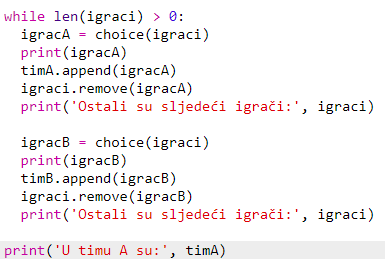

+ Na isti način možeš formirati i `timB`. Također, možeš obrisati ostale naredbe za ispis jer su ti one samo služile da testiraš kôd.

	Ovako bi tvoj kôd trebao izgledati:

	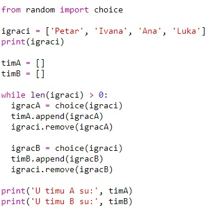

+ Još jednom testiraj kôd i vidjet ćeš listu igrača i finalnu postavu svakog tima.

	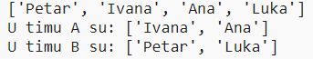

## Spremi projekt {.save}

#Korak 4: Datoteke { .activity}

Svoju listu igrača možeš spremiti u datoteku.

## Zadatci { .check}

+ Klikni na ikonu + i kreiraj novu datoteku koju ćeš nazvati `igraci.txt`.

	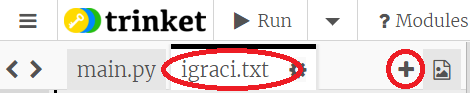

+ Dodaj svoje igrače u datoteku koji si napravio. Nemoj ostaviti praznu liniju nakon posljednjeg igrača.

	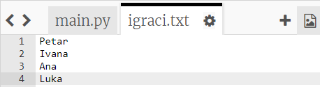

+ Izmijeni listu `igraci` tako da bude prazna.

	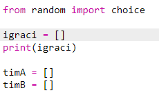

+ Otvori datoteku `igraci.txt` (slovo `'r'` označava da je datoteku moguće samo čitati).

	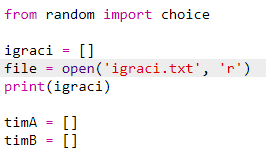

+ Učitaj igrače iz datoteke i dodaj ih svojoj listi `igraci`. (Naredba `splitlines` u kôdu označava da je svaka linija u datoteci novi podatak u listi `igraci`).

	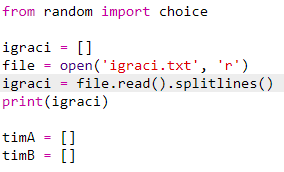

+ Pokušaj testirati kôd - trebao bi raditi kao i prije. Ipak, sada je puno lakše dodati igrače u datoteku `igraci.txt`.

## Spremi projekt {.save}

#Korak 5: Neparan broj igrača { .activity}

Poboljšajmo program tako da može raditi i sa neparnim brojem igrača.

## Zadatci { .check}

+ Dodaj još jedno ime u svoju datoteku `igraci.txt` kako bi lista imala neparan broj igrača.

	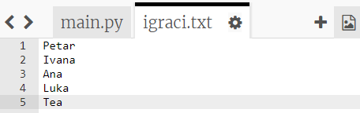

+ Ako testiraš kôd, dobiti ćeš poruku o grešci.

	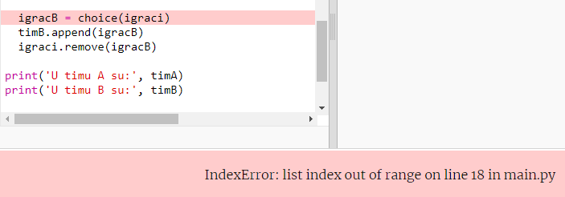

+ Greška se javlja jer tvoj program prvo bira po jednog igrača za tim A, a zatim za tim B. S obzirom da je broj igrača sada neparan, kada se odabere igrač za tim A nema više igrača koje bi se moglo birati za tim B.

	Ovu grešku možeš popraviti ako kažeš programu da naredbom `break` izađe iz `while` petlje kada je lista `igraci` prazna.

	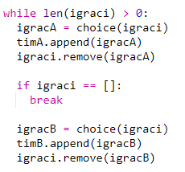

+ Testiraj kôd opet i vidjeti ćeš da program sada radi sa neparnim brojem igrača.

	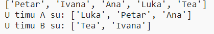

## Spremi projekt {.save}

## Izazov: Nasumična imena timova { .challenge}
Možeš li svojim timovima dati nasumična imena?

Napravi listu koju ćeš nazvati `imenaTimova`. Ova lista sadržavat će moguća imena tvojih timova.

Zatim možeš odabrati (i prikazati) nasumično odabrano ime za svaki tim.

## Spremi projekt {.save}

## Izazov: Spremanje imena timova { .challenge}
Možeš li spremiti listu sa imenima timova u datoteku?

## Spremi projekt {.save}

## Izazov: Više timova { .challenge}
Možeš li poboljšati svoj program tako da dijeli igrače u 3 tima, a ne 2?

## Spremi projekt {.save}
