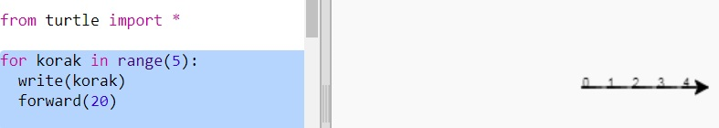
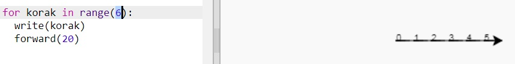
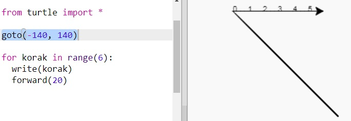
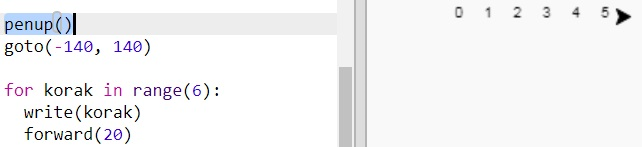
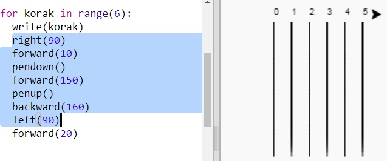
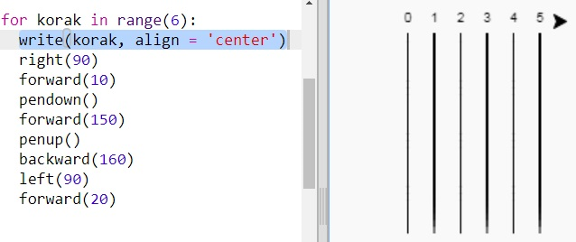
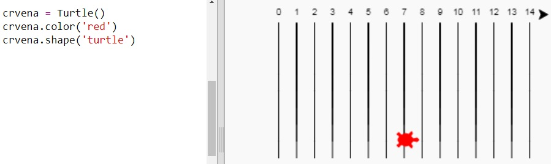
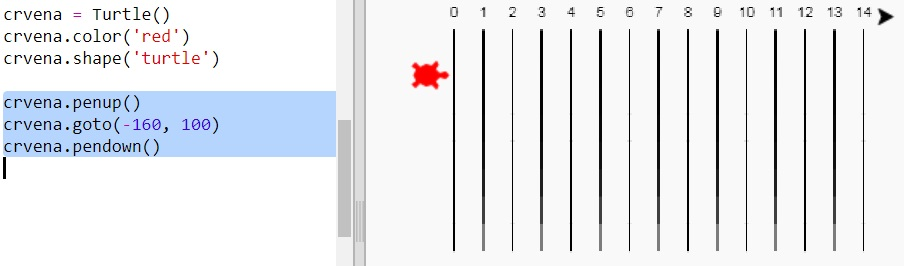
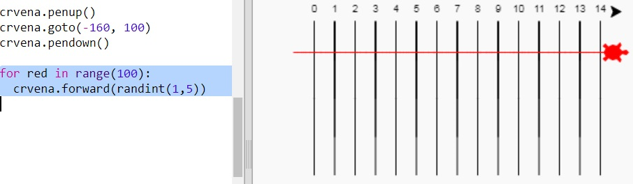
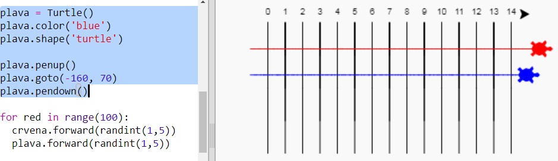

---
title: Utrka kornjača
level: Python 1
language: hr-HR
stylesheet: python
embeds: "*.png"
materials: ["project-resources/new/*.*", "volunteer-resources/turtle-race-finished/*.*"]
...

# Uvod { .intro}

U ovom projektu koristit ćeš petlje kako bi napravio utrku kornjača i nacrtao trkalište.

  <iframe src="https://trinket.io/embed/python/9339862606?outputOnly=true&start=result" width="600" height="500" frameborder="0" marginwidth="0" marginheight="0" allowfullscreen>
  </iframe>
  

# Korak 1: Trkalište { .activity}

Napravit ćeš igru u kojoj se utrkuju kornjače, ali prvo im treba trkalište.

## Zadatci { .check}

+ Otvori prazan Python predložak u Trinketu: <a href="http://jumpto.cc/python-new" target="_blank">jumpto.cc/python-new</a>. Ako čitaš ovo online, možeš koristiti i ugrađenu verziju ovog trinketa koja se nalazi ispod.

<iframe src="https://trinket.io/embed/python/33e5c3b81b?start=result" width="100%" height="600" frameborder="0" marginwidth="0" marginheight="0" allowfullscreen></iframe>

+ Kako bi nacrtao liniju sa 'kornjačom', dodaj sljedeći kôd:

  

+ Nacrtajmo sada s 'kornjačom' oznake trkališta za utrku.

  Naredba `write` ispisuje tekst na ekran.

  Pokušaj:

  

+ Sada moraš upisati brojeve između uglatih zagrada kako bi napravio oznake:

  

+ Primjećuješ li da se tvoj kôd poprilično ponavlja? Mijenjaju se jedino brojevi koje treba ispisati.

  U Pythonu postoji bolji način da ovo napraviš. Možeš koristiti `for` petlju.

  Izmijeni svoj kôd sa `for` petljom:

  

+ Hmm, program ispisuje samo brojeve do 4. U Pythonu, `range(5)` znači da će program ispisati 5 brojeva, od 0 do 4. Ako želiš da ispiše i broj 5, moraš koristiti `range(6)`:

  

+ Sada možemo nacrtati neke oznake trkališta. 'Kornjača' kreće od koordinata (0,0) koje se nalaze na sredini ekrana.

  Pomakni 'kornjaču' u gornji lijevi kut:

  

+ Ah, prvo ćeš morati podignuti olovku!

  

+ Umjesto da nacrtamo trkalište pomoću horizontalnih linija, nacrtajmo ga pomoću vertikalnih:

  

+ Izgledat će urednije ako centriraš brojeve:

  

+ Također, možeš ubrzati 'kornjaču' kako bi crtala brže:

  

## Spremi projekt {.save}

## Izazov: Dodaj još linija {.challenge}

Možeš li izmijeniti kôd tako da linije idu preko cijelog ekrana?

Možeš koristiti `speed(0)` ako želiš ubrzati 'kornjaču'.

# Korak 2: Kornjače za utrku { .activity}

A sada zabavni dio. Dodajmo nekoliko kornjača koje će se utrkivati. Bilo bi prilično dosadno kada bi kornjače svaki put radile istu stvar pa će se zato u svakom krugu pomicati za nasumični broj koraka. Pobjednik je ona kornjača koja se najdalje pomakne u 100 krugova.

## Zadatci { .check}

+ Kada koristiš naredbe poput `forward(20)`, pomičeš samo jednu kornjaču. Ali, možeš napraviti više kornjača. Dodaj sljedeći kôd na kraju svog programa:

  

  Prva linija kôda stvara kornjaču koja se zove 'crvena'. Ostale linije određuju boju i oblik kornjače. Sada stvarno izgleda kao kornjača!

+ Pošaljimo kornjaču na startnu liniju:

  

+ Sada moraš napraviti utrku pomičući se nasumičan broj koraka po stazi. Koristi funkciju `randint` iz Pythonove `random` biblioteke. Dodaj `import` liniju na početak programa:

  

+ Funkcija `randint` vraća nasumičan integer (cijeli broj) koji se nalazi između odabranih vrijednosti. Kornjača će se pomaknuti 1, 2, 3, 4 ili 5 koraka unaprijed u svakom krugu.

  

+ Za utrku nam nije dovoljna samo jedna kornjača! Dodajmo još jednu:

  

  Primijeti da se kôd za pomicanje plave kornjače mora nalaziti unutar iste `for` petlje kao i kôd za pomicanje crvene kornjače. Tako će se obje kornjače pomicati u svakom krugu.

## Spremi projekt {.save}

## Izazov: Vrijeme je za utrku! {.challenge}

Sada si spreman za utrku. Odaberi kornjaču i njenog protivnika i pogledajmo tko će pobjediti.

Možeš li dodati još kornjača kako bi se mogao utrkivati sa više prijatelja?

Uključene su sljedeće boje: 'orange', 'purple', 'violet', 'tomato', 'turquoise', 'magenta' and 'brown' - ili možeš otići na <a href="http://jumpto.cc/colour-picker">jumpto.cc/colour-picker</a> i odabrati boju koju želiš!

## Spremi projekt {.save}

## Izazov: Napravi zaokret {.challenge}

Možeš li koristiti petlju `for red in range():` kako bi svaka kornjača napravila zaokret od 360 stupnjeva nakon što dođe do startne linije? Pobrini se da su kornjače okrenute u pravom smjeru na početku utrke!

`crvena.right(36)` okrenuti će crvenu kornjaču za 36 stupnjeva udesno.

**Pomoć:** Puni krug iznosi 360 stupnjeva. Kornjača se može okrenuti 10 stupnjeva udesno 36 puta. Ili 5 stupnjeva u lijevo 72 puta. Ili ...

## Izazov: Isprekidane linije {.challenge}

Možeš li, uz pomoć petlje, napraviti isprekidane linije trkališta umjesto punih crta?

**Pomoć:** Pronađi kôd kojim se crtaju ravne crte. Pokušaj koristiti naredbe: `for`, `forward()`, `penup()` i `pendown()`

## Spremi projekt {.save}
