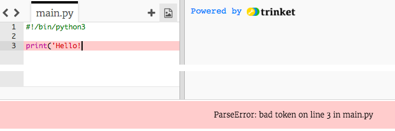
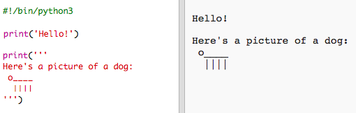
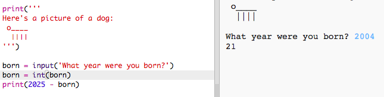

#Introduzione:  { .intro}

In questo progetto, imparerai a scrivere un programma in Python che parla di te.
 

  <iframe src="https://trinket.io/embed/python/a1f663ae0d?outputOnly=true&start=result" width="600" height="500" frameborder="0" marginwidth="0" marginheight="0" allowfullscreen>
  </iframe>
  

#Passo 1: Diciamo Ciao! { .activity}

Cominciamo a scrivere del testo.

## Lista di controllo delle attività { .check}

+ Apri il modello vuoto di Python Trinket: <a href="http://jumpto.cc/python-new" target="_blank">jumpto.cc/python-new</a>. 

+ Nella finestra che appare scrivi:

    

    La riga "#!/bin/python3" dice a Trinket che stiamo usando Python 3 (l'ultima versione).

+ Premi "run" e dovresti vedere che il comando "print()" stampa (o visualizza) tutto il testo contenuto tra le virgolette (").

    

+ Se ha fatto un qualche sbaglio, apparirà invece un messaggio di errore che ti dice cosa c'è di sbagliato. 

    Prova! Cancella le virgolette di chiusura " o la chiusura di parentesi ) (o tutte e due) e prova a vedere cosa succede.

    

+ Rimetti le virgolette o la parentesi e fai clic su "run" per controllare che il tuo progetto funziona di nuovo.

## Salva il progetto {.save}

__Non è obbligatorio avere un account su Trinket per salvare i progetti!__ 

Se non hai un account su Trinket, fai clic prima sulla freccia in giù e poi su "Link". In questo modo potrai salvare un link che potrai aprire più tardi. Dovrai eseguire questa procedura ogni volta che farai qualche cambiamento perché cambierà anche il link!

Se hai un account di Trinket, puoi cliccare "Remix" per salvare la tua copia personale del Trinket.

## Sfida: A cosa stai pensando? { .challenge}
Modifica il codice riportato sopra per stampare qualcosa di più interessante su di te!

## Salva il progetto {.save}

#Passo 2: Disegni ASCII { .activity}

Proviamo a stampare qualcosa di più interessante che semplice testo. Stampiamo invece dei disegni ASCII! I disegni ASCII sono immagini create __usando caratteri di testo__.

## Lista di controllo delle attività { .check}

+ Aggiungiamo un disegno al programma: un bellissimo cane!

    

+ Se fai clic su "run" vedrai che c'è un "baco" nel tuo nuovo codice.

    

    Questo è perché il testo contiene una virgoletta, che Python pensa che significa la fine del testo!

     

+ Per correggere questo problema, basta aggiungere una barra rovesciata "\" prima dell'apostrofo nella parola "here's". Questo indica a Python che l'apostrofo è parte del testo.

    

+ Se preferisci, puoi usare tre virgolette (""") invece di 1, per stampare più righe di testo con una sola istruzione "print":

    

## Salva il progetto {.save}

## Sfida: Chi sei { .challenge}
Scrivi un programma Python per presentarti, usando testo e disegni ASCII. Puoi creare immagini dei tuoi hobby, dei tuoi amici o qualsiasi altra cosa che ti piace!

__Ricorda che il codice che scrivi su Trinket è pubblico. Non includere informazioni personali come il tuo nome e cognome o indirizzo!__

Ecco un esempio:

## Salva il progetto {.save}

#Passo 3: L'anno 2025 { .activity}

Puoi anche fare calcoli e stampare numeri. Vediamo quanti anni avrai nel 2025.

## Lista di controllo delle attività { .check}

+ Per calcolare la tua età nell'anno 2025, devi sottrarre il tuo anno di nascita da 2025.

    Aggiungi questo codice al tuo programma:

    

    Hai visto che non devi racchiudere i numeri tra virgolette?

    (Ricorda che devi cambiare il numero 2006 se il tuo anno di nascita è diverso)

+ Fai clic su "run" e il programma dovrebbe stampare la tua età nell'anno 2025.

    

+ Puoi anche migliorare il tuo programma usando l'istruzione "input()" per chiedere all'utilizzatore la sua età e memorizzarla in una __variabile__ con il nome "born".

    

+ Esegui il programma ed immetti il tuo anno di nascita. È apparso un messaggio di errore?

    Questo è perché tutto quello che viene digitato nel programma è __testo__, ma in questo caso deve essere convertito in __numero__.

    Puoi usare "int()" per convertire il testo in __integer__ (la parola "integer" significa "numero intero").

    

+ Puoi anche creare un'altra variabile in cui memorizzare il tuo calcolo e stampare quella invece.

    

+ Infine, puoi rendere il programma più facile da capire aggiungendo un messaggio di spiegazioni.

    

## Salva il progetto {.save}

## Sfida: La tua età in anni canini { .challenge}
Scrivi un programma in cui chiedi all'utilizzatore la sua età e poi gli dici la sua età in anni canini! Puoi calcolare l'età di una persona in anni canini moltiplicando la loro età per 7.

In programmazione, il simbolo della __moltiplicazione__ è l'asterisco (*) che trovi, in una tastiera Windows, nell'ultimo tasto a destra della seconda fila di tasti dall'alto, accanto a Invio.

## Salva il progetto {.save}

## Sfida: Calcolare testo { .challenge}
Lo sapevi che puoi anche calcolare del testo?!

Cosa scrive sullo schermo questo programma? Prova a indovinare prima di eseguire il programma.

Sei capace a inventare delle parole tutte tue? Puoi creare anche dei motivi artistici!

## Salva il progetto {.save}

