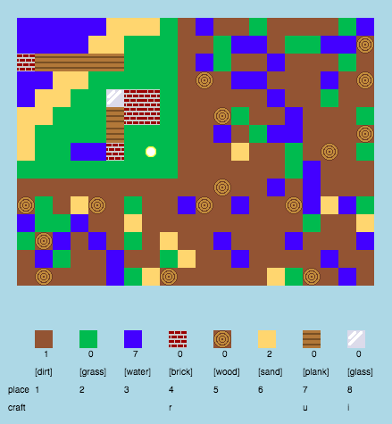
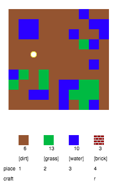
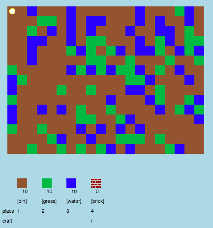
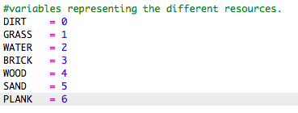

# Introduzione {.intro}

In questo progetto apporterai miglioramenti al design e al codice di una versione 2D di Minecraft.

  <iframe src="https://trinket.io/embed/python/9ac3995d69?outputOnly=true&start=result" width="600" height="500" frameborder="0" marginwidth="0" marginheight="0" allowfullscreen>
  </iframe>
  

# Passo 1: Il gioco { .activity}

## Lista di controllo delle attività { .check}

+ Apri questo trinket: <a href="http://jumpto.cc/codecraft-go" target="_blank">jumpto.cc/codecraft-go</a>. 

+ Usa i tasti WASD della tastiera per spostare il giocatore nel mondo, che è pieno di tante risorse diverse (terra, erba e acqua).

    

+ Premi la barra spaziatrice per raccogliere risorse. Raccogli qualche risorsa diversa e vedi come vengono aggiunte al tuo inventario.

    

+ Premi i tasti numerici (da 1 a 3) per collocare una risorsa sulla mappa. Ad esempio, premi 3 per mettere un po' d'acqua sulla mappa. Questo funzionerà solo se hai dell' acqua nell'inventario.

    

+ Puoi fabbricare un oggetto premendo il tasto visualizzato nel menu. Fabbricare significa combinare insieme elementi che hai già nell'inventario per crearne di nuovi. Prova a premere il tasto "r" per fabbricare un nuovo mattone (purché tu abbia 2 terre e 1 acqua nell'inventario).

    

+ Dopodiché puoi premere il tasto "4" per collocare i mattoni che hai fabbricato.

    

## Salva il progetto {.save}

## Sfida: Costruisci il tuo mondo {.challenge}
Sei capace a costruire una casetta con giardino e piscina? Cos'altro puoi creare?

## Salva il progetto {.save}

# Passo 2: Personalizzazione del gioco { .activity}

Modifichiamo adesso qualche variabile per vedere come funziona il gioco.

+ Fai clic sul file "variables.py" per vedere delle variabili che possono essere modificate.

    

+ Modifica il valore della variabile "BACKGROUNDCOLOUR" e fai clic su "Run" per vedere in che modo cambia il gioco.

    

+ La variabile "MAXTILES" indica la quantità di ciascuna risorsa che può essere tenuta nell'inventario. Modifica questa variabile per poter conservare più (o meno) di 20 unità di ciascuna risorsa.

    

## Sfida: Cambia le dimensioni del tuo mondo { .challenge}
Puoi cambiare i valori delle variabili "MAPWIDTH" e "MAPHEIGHT" per cambiare le dimensioni del mondo?

## Salva il progetto {.save}

# Passo 3: Creazione di una nuova risorsa di legno { .activity}

Creiamo una nuova risorsa di legno. Per farlo, devi prima aggiungere delle variabili al tuo file"variables.py".

+ Per prima cosa devi dare un numero alla tua nuova risorsa. Potrai quindi usare la parola "WOOD" (che significa legno in inglese) nel codice, invece del numero 4.

    

+ Devi aggiungere la tua nuova risorsa "WOOD" al tuo elenco di risorse in "resources".

    

+ Devi anche dare alla tua risorsa un nome che verrà visualizzato nell'inventario.

    

    Nota che c'è una virgola alla fine della riga precedente.

+ La tua risorsa avrà anche bisogno di un'immagine. Il progetto contiene già un'immagine chiamata "wood.png" che dovresti aggiungere al tuo dizionario delle immagini ("textures").

    

+ Aggiungi il numero della tua risorsa che deve essere nell'inventario all'inizio.

    

+ Per finire, aggiungi il tasto che bisogna premere per mettere il legno nel mondo. 

    

+ Lancia il progetto per vedere se funziona. Vedrai che hai ora una nuova risorsa di legno ("wood") nell'inventario.

    

+ Ma nel mondo di legno non ce n'è! Per correggere questo intoppo, fai clic sul file "main.py" e cerca la funzione denominata "generateRandomWorld()".

        

    Questo codice genera un numero casuale compreso tra 0 e 10 e utilizza questo numero per decidere quali risorse inserire:

    + 1 o 2 = acqua
    + 3 o 4 = erba
    + tutti gli altri = terra

+ Aggiungi questo codice per aggiungere legno al mondo ogni volta che il numero casuale di "randomNumber" è 5.

    

+ Prova di nuovo il progetto. Questa volta dovresti vedere che del legno comincia ad apparire nel mondo.

    

## Sfida: Crea la sabbia { .challenge}
Puoi aggiungere una risorsa di sabbia ("SAND" in inglese) al gioco? Prova a usare guida la stessa procedura descritta qui sopra.

Il progetto contiene già un'immagine di sabbia in "sand.png" ma puoi benissimo creare e caricare una tua immagine se lo preferisci.

## Salva il progetto {.save}

# Passo 4: Fabbricare tavole di legno { .activity}

Creiamo adesso una nuova risorsa di tavole, che può essere fabbricata con il legno.

+ Per prima cosa, aggiungiamo la nuova variabile "PLANK" al gioco. Plank significa tavola in inglese.

    

+ Aggiungi la nuova variabile "PLANK" al gioco. 

    

+ Chiama questa risorsa "plank" (tavola).

    

+ Dai alla tua risorsa "PLANK" un'immagine. Il progetto contiene già un'immagine per la tavola in "plank.png" ma puoi benissimo creare una tua immagine se lo preferisci.

    

+ Aggiungi tavole all'inventario.

    

+ Imposta un tasto per collocare tavole.

    

+ Dato che questa risorsa può essere fabbricata, devi creare una regola di fabbricazione, vale a dire, una tavola può essere fabbricata con 3 mattonelle di legno. Aggiungi questo codice al dizionario di fabbricazione "crafting". 

    

+ Da ultimo, devi impostare un tasto per fabbricare nuove tavole.

    

+ Per testare la tua nuova risorsa di tavole, raccogli qualche mattonella di legno e usale per fabbricare delle tavole. Colloca quindi le tue nuove tavole nel mondo.

    

## Salva il progetto {.save}

## Sfida: Fabbricare il vetro con la sabbia { .challenge}
Prova a creare una nuova risorsa di vetro, che può essere fabbricata con la sabbia. Puoi farlo usando come guida la stessa procedura descritta qui sopra.

Il progetto contiene già un'immagine per il vetro in "glass.png" ma puoi benissimo creare una tua immagine se lo preferisci.

## Salva il progetto {.save}

## Sfida: Crea altre risorse { .challenge}
Prova ad aggiungere al gioco altre risorse ed altre regole di fabbricazione.

## Salva il progetto {.save}