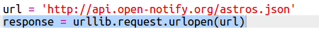
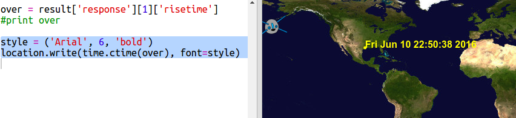

# Introduzione {.intro}

In questo progetto, userai un servizio web per scoprire l'attuale posizione della Stazione Spaziale Internazionale (ISS) e tracciare la sua posizione su una mappa. 

<div class="trinket">
  <iframe src="https://trinket.io/embed/python/b95851338c?outputOnly=true&start=result" width="600" height="500" frameborder="0" marginwidth="0" marginheight="0" allowfullscreen>
  </iframe>
  
</div>

# Passo 1: Chi è nello Spazio? { .activity}

Userai un servizio web che fornisce informazioni sullo spazio in tempo reale. Innanzitutto, scopriamo chi si trova attualmente nello spazio. 

## Lista delle attività { .check}

+ Un servizio web ha un indirizzo (url) esattamente come una pagina web. Invece di restituire HTML per una pagina web, restituisce dati. 

    Apri <a href="http://api.open-notify.org/astros.json" target="_blank">http://api.open-notify.org/astros.json</a> in un browser di internet. 

    Dovresti vedere qualcosa del genere:

    ```
    {
      "message": "success", 
      "number": 3, 
      "people": [
        {
          "craft": "ISS", 
          "name": "Yuri Malenchenko"
        }, 
        {
          "craft": "ISS", 
          "name": "Timothy Kopra"
        }, 
        {
          "craft": "ISS", 
          "name": "Timothy Peake"
        }
      ]
    }
    ```

    I dati sono in tempo reale, per cui vedrai un risultato diverso. Il formato è chiamato JSON (pronunciato Jason). 

+ Facciamo una chiamata al servizio web da Python così che possiamo vedere i risultati.

    Apri questo trinket: <a href="http://jumpto.cc/iss-go" target="_blank">jumpto.cc/iss-go</a>. 

+ I moduli `urllib.request` e `json` modules sono già stati importati. 

    Aggiungi il seguente codice a 'main.py' per inserire l'indirizzo web che hai appena usato in una variabile:

    
   
+ Ora chiamiamo il servizio web:

    


+ Poi dovrai caricare la risposta JSON nella struttura dati Python:

    


    Dovresti vedere qualcosa del genere:

    ```
    {'message': 'success', 'number': 3, 'people': [{'craft': 'ISS', 'name': 'Yuri Malenchenko'}, {'craft': 'ISS', 'name': 'Timothy Kopra'}, {'craft': 'ISS', 'name': 'Timothy Peake'}]}
    ```

    Questo è un dizionario Python con 3 chiavi: messaggio, numero e persone. 

    Il valore 'success' del messaggio ti dice che la richiesta è andata a buon fine. Bene. 

    Nota che vedrai risultati diversi in base a chi si trova attualmente nello spazio!

+ Ora stampiamo le informazioni in una maniera più leggibile. 

    Innanzitutto, controlliamo il numero di persone nello spazio e stampiamolo:
  
    

    `result['number']` stamperà il valore associato con la chiave 'number' nel dizionario risultante.  Nell'esempio questo è '3'. 

+ Il valore associato con la chiave 'people' è una lista di dizionari. + Mettiamo quel valore in una variabile così che lo puoi usare:

    


    Dovresti vedere qualcosa del genere: 
    
    ```
    [{'craft': 'ISS', 'name': 'Yuri Malenchenko'}, {'craft': 'ISS', 'name': 'Timothy Kopra'}, {'craft': 'ISS', 'name': 'Timothy Peake'}]
    ```

+ Ora dovrai stampare una linea per ogni astronauta.

    Per fare ciò in Python, puoi usare un loop 'for'. Attraverso ogni loop, 'p' verrà si collocherà in un dizionario per ogni astronauta diverso.

    

+ Ora puoi controllare i valori di 'name' e 'craft'.

    
  
    Dovresti vedere qualcosa del genere:

    ```
    Persone nello Spazio:  3
    Yuri Malenchenko
    Timothy Kopra
    Timothy Peake
    ```

    Stai usando dei dati in tempo reale per cui i tuoi risultati dipenderanno dal numero di persone attualmente nello spazio. 

## Salva il progetto {.save}

## Sfida: Mostra il Veicolo {.challenge}

Oltre al nome dell'astronauta, il servizio web fornisce anche il veicolo in cui sono (come la ISS).

Puoi aggiungere alla tua scritta in modo che printi anche il veicolo in cui si trova l'astronauta. 

Esempio:

```
Persone nello Spazio:  3
Yuri Malenchenko in ISS
Timothy Kopra in ISS
Timothy Peake in ISS
```

## Salva il progetto {.save}

# Passo 2: Dov'è la ISS? { .activity}

La Stazione Spaziale Internazionale è in orbita attorno alla Terra. Orbita la terra ogni ora e mezza circa. La ISS viaggia a una velocità media di 7,66 km per secondo. È veloce! 

Usiamo ora un latro servizio web per scoprire dove si trova la Stazione Spaziale Internazionale. 

## Lista delle attività { .check}

+ Apri prima la url per il servizio web in un nuovo tab nel tu browser di internet: <a href="http://api.open-notify.org/iss-now.json" target="_blank">http://api.open-notify.org/iss-now.json</a>
  
    Dovresti vedere qualcosa del genere:
  
    ```
    {
    "iss_position": {
      "latitudine". 8,54938193505081, 
      "longitudine". 73,16560793639105
    }, 
    "message": "success", 
    "timestamp": 1461931913
    }
    ```
  
    Il risultato contiene le coordinate del luogo sulla Terra dove si trova attualmente la ISS. 

    La longitudine è la posizione Est-Ovest e va da -180 a 180. 0 è il Meridiano Zero che attraversa Greenwich, a Londra. 

    La latitudine è la posizione Nord-Sud e va da 90 a -90. 0 è l'Equatore. 

+ Ora devi chiamare lo stesso servzio web da PythoN. Aggiungi il seguente codice alla fine del tuo testo per ottenere l'attuale posizione della ISS:

    


Creiamo delle variabili per salvare la latitudine e la longitdine, e poi stampiamole:

    

+ Sarebbe pià utile mostrare la posizione su una mappa.

    Innanzitutto, dobbiamo importare i cursori tartaruga dalla libreria. 
  
    
  
Carichiamo una mappa del mondo come immagine di sfondo, ce n'è già una inclusa nel tuo trinket.

    
  
    La NASA ha fornito questa bellissima mappa e ci ha dato il permesso di riutilizzarla. 
  
    La mappa è centrata a 0, 0 che è proprio quello di cui abbiamo bisogno. 

+ Dovrai impostare la misura dello schermo per combaciare la misura dell'immagine che è 720 per 360. 

    Aggiungi `setup schermo(720, 360)`:

    
  
+ Vui essere in grado di mandare la tartaruga a una specifica latitudine e longitudine. Per renderlo facile, possiamo impostare lo schermo per combaciare le coordinate che stiamo usando:

     
  
    Ora le coordinate combaceranno quelle della latitudine e longitudine che otteniamo dal servizio web. 

Creiamo una tartaruga per la ISS. 

    

    Il tuo progetto include 'iss.png' e 'iss2.png', provali entrambi e vedi quale preferisci.  

+ La ISS inizia nel centro della mappa, ora muoviamola verso la corretta posizione sulla mappa:

    
  
    Nota che la latitudine all'inizio viene data normalmente, ma dobbiamo prima dare la longitudine quando tracciamo le coordinate (x,y). 

+ Prova il tuo programma facendolo partire. La ISS dovrebbe muoversi verso la sua posizione attuale sopra la Terra. 

    Aspetta qualche secondo e fai partire il tuo programma di nuovo per vedere dove si è spostata la ISS. 

    

## Salva il progetto {.save}

# Passo 3: Quando sarà la ISS in alto? { .activity}

Esiste anche un servizio web che puoi chiamare per scoprire quando la ISS raggiungerà un luogo particolare. 

Proviamo a scoprire quando la ISS arriverà al Centro Spaziale Di Houston, USA, che si trova a una latitudine 29.5502 e longitudine 95.097.
  
## Lista delle attività { .check} 

+ Innanzitutto, tracciamo un puntino sulla mappa a queste coordinate:

    

+ Ora otteniamo la data e l'ora in cui la ISS sarà in alto. 

    Come prima, possiamo chiamare il servizio web inserendo la url nella barra dell'indirizzo di un browser di internet: <a href="http://api.open-notify.org/iss-pass.json" target="_blank">http://api.open-notify.org/iss-pass.json</a>
  
    Dovresti vedere un errore:

    

+ Questo servizio web prende latitudine e longitudine come input, per cui dobbiamo includerle nella url che stiamo usando.

    Gli input vengono aggiunti dopo un '?' e separati da `&`. 

    Aggiungi gli input 'lat e 'lon' alla url come mostrato: <a href="http://api.open-notify.org/iss-pass.json?lat=29.55&lon=95.1" target="_blank">http://api.open-notify.org/iss-pass.json?lat=29.55&lon=95.1</a>
  
    
  
    La risposta include vari passaggi a orari diversi, noi guarderemo solo il primo. L'ora viene data in un formato standard, sarai in grado di trasformarla in una ora più leggibile in Python.

+ Ora chiamiamo il servizio web da Python: Aggiungi il seguente codice alla fine della tua scritta:

    

+ Ora otteniamo dal risultato l'ora del primo passaggio.

    Aggiungi il seguente codice:

    


+ L'ora viene data come marcatura oraria, dunque avremo bisogno del modulo orario di Python così che possiamo stamparla in una forma più leggibile e trasformarla in ora locale. Facciamo in modo che la tartaruga scriva l'orario del passaggio sul puntino. 

+ Aggiungi una linea 'importa tempo' in cima alla tua scritta:

    

+ La funzione `time.ctime()` trasformerà l'ora in una forma leggibile che potrai scrivere con la tartaruga: 

    
 
    (Puoi rimuovere o commentare la linea 'stampa').

## Salva il progetto {.save}

## Sfida: Trova altri orari di passaggio {.challenge}

Puoi usare pagine web come <a href="http://www.latlong.net/" target="_blank">http://www.latlong.net/</a> per controllare la latitudine e longitudine dei luoghi ai quali sei interessato. 

Puoi controllare e tracciare gli orari del passaggio per altri luoghi? 

Dovrai cambiare gli input di latitudine e longitudine al servizio web. 
+ Dovrai segnare il luogo e il risultato sulla mappa. 


## Salva il progetto {.save}
