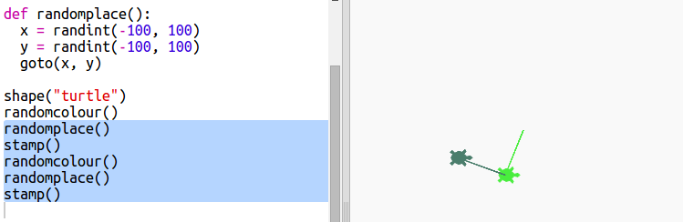

# Introduzione {.intro}

In questo progetto, creerai arte moderna generata dal computer. Userai delle funzioni per scrivere i codici che puoi utilizzare ripetutamente.

  <iframe src="https://trinket.io/embed/python/47bbc2fc2b?outputOnly=true&start=result" width="600" height="500" frameborder="0" marginwidth="0" marginheight="0" allowfullscreen>
  </iframe>
  

# Passo 1: Colori a caso { .activity}

## Lista di controllo delle attività { .check}

+ Apri questo trinket: <a href="http://jumpto.cc/modern-go" target="_blank">jumpto.cc/modern-go</a>.

+ Puoi stabilire il colore di una tartaruga dicendo quanto rosso, verde e blu vuoi da 0 a 255.

    Aggiungi il seguente codice per ottenere una tartaruga viola:

    

    Il viola è creato mescolando rosso e blu.

+ Prova numeri diversi per ottenere colori diversi.

    Ricordati che ogni numero può essere da 0 a 255.

+ Che ne dici di scegliere un colore a caso?

    Aggiorna il tuo codice per scegliere un numero a caso tra 0 e 255 per i valori del rosso, verde e blu.

    

+ Clicca più volte 'Run' per ottenere tartarughe di diversi colori.

+ Può essere divertente, ma c'è anche tanto da ricordare e digitare ogni volta che vuoi assegnare un colore a caso alla tartaruga, e non è molto facile da leggere.

    In Python, possiamo scrivere 'def' per definire una funzione che possiamo chiamare ogni volta che vogliamo assegnare un colore a caso alla tartaruga.

    Stai già chiamando funzioni, 'color()ì e 'randint()ì sono funzioni che sono state definite per te.

    Mettiamo il codice dei colori a caso in una funzione usando def:

    

  Assicurati di far rientrare il codice dentro la funzione. Le funzioni sono di solito collocate in cima allo script dopo le importazioni.

+ Se esegui il tuo codice adesso, non otterrai una tartaruga di un colore a caso. Questo succede perché hai definito la tua funzione, ma non l'hai ancora chiamata.

+ Aggiungi una linea per chiamare la tua nuova funzione:

    

    Nota che il tuo nuovo codice è molto più facile da capire perché la parte complessa sta nella funzione. È facile capire cosa fa 'randomcolour()' (colori a caso.).

# Passo 2: Luogo a caso { .activity}

## Lista di controllo delle attività { .check}

Creiamo un'altra funzione per muovere la tartaruga verso un luogo a caso sullo schermo. Il centro dello schermo è (0,0) quindi posizioneremo tartarughe in un'area quadrata attorno al centro.

+ Aggiungi una funzione 'randomplace()' (luogo a caso):

    

+ Prova la tua nuova funzione chiamandola e poi chiamando 'stamp()', puoi chiamarla più di una volta:

    

+ Ops, la tartaruga disegna quando si muove. Mettiamo la penna su all'inizio e giù fino alla fine così che la tartaruga non disegni mentre si muove:

    

    Hai notato che hai dovuto solo 'aggiustare' il codice in un posto? Questa è un'altra cosa buona delle funzioni.

+ Ora prova il tuo codice un po' di volte.

## Salva il progetto {.save}

## Sfida: Arte di tartaruga {.challenge}
Puoi definire una funzione 'randomheading()' che possa far puntare la tartaruga in una direzione a caso e faccia funzionare il seguente codice?

Suggerimenti:

- `setheading(<number>)` cambierà la direzione verso cui si rivolge la tartaruga.

- `<number>` dovrebbe essere tra 1 e 360 (il numero di gradi in un cerchio)

- Puoi usare `randint(1, 360)` per scegliere un numero tra 1 e 360.

## Salva il progetto {.save}

# Passo 3: Crea arte moderna rettangolare { .activity}

## Lista di controllo delle attività { .check}

Ora creiamo dell'arte moderna disegnando tanti rettangoli di diversa misura e colore.

+ Prima aggiungiamo il seguente codice al fondo del tuo script, dopo il tuo codice sfida, per ripulire lo schermo dopo l'arte della tartaruga e puntiamo la tartaruga nella sua solita direzione:

    

+ Puoi commentare l'arte della tua tartaruga posizionando un `#` all'inizio di ogni linea così che non venga eseguito mentre lavori all'arte dei rettangoli. (Puoi sempre eliminare il commento dopo per esibire la tua opera).

    

+ Ora aggiungiamo una funzione per disegnare un rettangolo che abbia una misura a caso, un colore a caso e una posizione a caso!

    Aggiungiamo una funzione `drawrectangle()` dopo le tue altre funzioni:

    

    Se vuoi risparmiare del tempo in digitare, guarda in `snippets.py` per un codice che ti possa aiutare.  

+ Aggiungi il seguente codice al fondo di 'main.py' per chiamare la tua nuova funzione:

    

    Esegui diverse volte il tuo script per vedere il cambiamento di altezza e larghezza.

+ Il rettangolo è sempre dello stesso colore e inizia alla stessa posizione.

    Ora dovrai assegnare alla tartaruga un colore a caso e poi muoverla verso un luogo a caso. Ma, aspetta, non hai già creato delle funzioni per quello? Fantastico. Semplicemente chiamale dall'inizio della funzione 'drawrectangle':

    

    Incredibile, senza fatica e molto più facile da leggere.

+ Ora chiamiamo 'drawrectangle()' in loop per creare bella arte moderna:

    

+ Accidenti, un poco lento, vero? Per fortuna, puoi accelerare la tartaruga.

    Trova la linea dove hai regolato la forma della 'tartaruga' e aggiungi il codice evidenziato:

    

    'speed(0)' è la più veloce o puoi usare numeri che vanno da 1 (lento) a 10 (veloce). Sperimenta fino ad ottenere la velocità che preferisci.

## Sfida: Altra arte moderna { .challenge}
Puoi creare una funzione che disegna una forma e chiama le tue funzioni 'randomcolour()' e / o 'randomplace()'?

Puoi chiamare le tue funzioni dall'interno di un loop 'for' come hai fatto nell'arte del rettangolo per generare arte moderna.

Idee:

- Le tartarughe hanno una funzione chiamata puntino che prende come input un raggio (distanza dal centro al bordo del cerchio). Per esempio, turtle.dot(10) Puoi creare una funzione 'drawcircle()' che disegna un circolo con un raggio a caso.

    

- Guarda in 'snippets.py' per esempi di codice per disegnare stelle con le tartarughe.

    

## Salva il progetto {.save}
