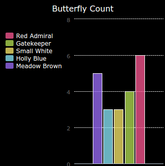
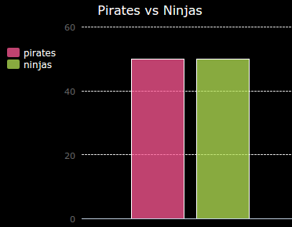
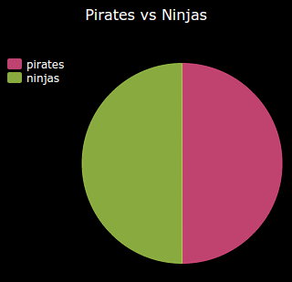

# Introduzione {.intro}

In questo progetto, creerai grafici circolari e a barre dai dati raccolti dai soci del Code Club.  

  <iframe src="https://trinket.io/embed/python/70d24d92b8?outputOnly=true&start=result" width="600" height="500" frameborder="0" marginwidth="0" marginheight="0" allowfullscreen>
  </iframe>
  

# Passo 1: Crea un Grafico Circolare { .activity}

I Grafici a Torta sono un metodo utile per mostrare i tuoi dati. Facciamo un sondaggio degli animali preferiti nel tuo Code Club e poi presentiamo i dati con un grafico circolare.

## Lista di controllo delle attività { .check}

+ Chiedi al tuo volontario di aiutare ad organizzare un sondaggio. Puoi registrare i risultati in un computer collegato a un proiettore o a una lavagna bianca che tutti possono vedere.

  Scrivi una lista di animali e assicurati che venga incluso il preferito di ciascun socio.

  Poi chiedi a tutti di votare per il loro preferito alzando la mano quando viene chiamato. Si vota solo un animale!

  Ad esempio:

  

+ Apri il modello vuoto di Python Trinket: <a href="http://jumpto.cc/python-new" target="_blank">jumpto.cc/python-new</a>.

+ Creiamo un grafico circolare per mostrare i risultati del tuo sondaggio. Userai la libreria PyGal per eseguire il lavoro più difficile.

  Innanzitutto, importa la libreria Pygal:

  

+ Ora crea un grafico circolare e rappresentalo (visualizzalo):

  

  Non preoccuparti, diventa più interessante man mano che aggiungerai dati!

+ Aggiungiamo i dati per uno degli animali. Usa i dati che hai raccolto.

  

  C'è solo un dato, per cui coprirà l'intero grafico.

+ Ora aggiungiamo gli altri dati allo stesso modo.

  Ad esempio:

  

+ E per completare il tuo grafico, aggiungi un titolo:

  

## Salva il progetto {.save}

## Sfida: Crea il tuo grafico a barre {.challenge}

Puoi creare grafici a barre in un modo simile. Semplicemente usa `barchart = pygal.Bar()` per creare un nuovo grafico a barre, e poi aggiungi i dati e visualizzali allo stesso modo in cui hai fatto con il grafico circolare. 

Raccogli i dati dai soci del tuo Code Club per creare il tuo grafico a barre.

Assicurati di scegliere un argomento che tutti conoscono!

Ecco alcune idee:

+ Qual è il tuo sport preferito?
+ Qual è il gusto di gelato che preferisci?
+ Con quale mezzo vai a scuola?
+ In quale mese compi gli anni?
+ Giochi a Minecraft? (sì/no)

Non fare domande che diano dati personali, come per esempio l'indirizzo delle persone. Se sei in dubbio, chiedi al leader del tuo club.

Esempi:

# Passo 2: Leggi i dati di un file { .activity}

Se possibile, è meglio salvare i dati in un file piuttosto che dovere includerli nel tuo codice.

## Lista di controllo delle attività { .check}

+ Aggiungi un nuovo file al tuo progetto e chiamalo 'pets.txt':

  

+ Ora aggiungi i dati al file. Puoi usare i dati raccolti sugli animali preferiti o i dati in esempio.

  

+ Torna a 'main.py' e commenta le linee che rappresentano grafici e tabelle (così che non vengono visualizzati):

  

+ Ora leggiamo i dati dal file.

  

  Il loop 'for' girerà sulle linee del file. `splitlines()` elimina il carattere della nuova linea dalla fine della linea. 

+ Ogni linea deve essere separata in un'etichetta e un valore:

  

  Questo dividerà la linea agli spazi, per cui non includere gli spazi nelle etichette. (Puoi aggiungere in un secondo momento supporto per gli spazi nelle etichette.)

+ Potresti ottenere un errore così:

  

  Questo succede se hai una linea vuota alla fine del tuo file.

  Puoi risolvere l'errore semplicemente ottenendo l'etichetta e il valore se la linea non è vuota.

  Per fare ciò, fai rientrare il codice dentro il tuo loop 'for' e aggiungi su di esso il codice 'if line:' :

  

+ Puoi rimuovere la linea 'print(label, value), ora funziona tutto.

+ Ora aggiungiamo l'etichetta e il valore al nostro nuovo grafico circolare e rappresentiamoli;

  

  Nota che 'add' prevede che il valore sia un numero, 'int(value) trasforma il valore da una sequenza a un numero intero.

  Se vuoi usare i decimali come 3,5 (numeri a virgola mobile), potresti invece utilizzare 'float(value)'.

## Salva il progetto {.save}

## Sfida: Crea un nuovo grafico da un file {.challenge}

Puoi creare un nuovo grafico circolare o a barre dai dati di un file? Dovrai creare un nuovo file .txt.

Suggerimento: Se vuoi avere degli spazi nelle etichette, allora usa 'line.split(': ')` e aggiungi i due punti al file dei tuoi dati, per esempio 'Red Admiral: 6'

## Sfida: Altri grafici e tabelle! {.challenge}

Puoi creare dallo stesso file un grafico circolare e uno a barre? Puoi sia raccogliere i dati che hai raccolto prima o raccogliere dei nuovi dati.

## Salva il progetto {.save}
