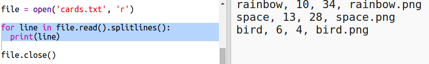
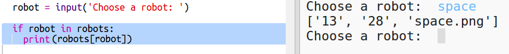
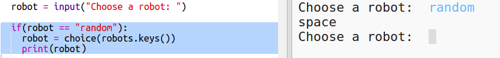

# Introduzione {.intro}

In questo progetto leggerai dati da un file per creare carte robotiche. Poi puoi giocare a Carte Robotiche con un amico.

  <iframe src="https://trinket.io/embed/python/9ccc368bd5?outputOnly=true&start=result" width="600" height="500" frameborder="0" marginwidth="0" marginheight="0" allowfullscreen>
  </iframe>
  

# Passo 1: Leggi i dati robot da un file { .activity}

Spesso è utile poter leggere informazioni da un file. Puoi ora cambiare i dati in un file senza dover cambiare il tuo codice. 

## Lista di controllo delle attività { .check}

+ Apri questo trinket: <a href="http://jumpto.cc/trumps-go" target="_blank">jumpto.cc/trumps-go</a>. 

+ Il tuo progetto d'inizio include un file 'cards.txt' che contiene dati sui robot. 

  Clicca su 'cards.txt' per vedere i dati:

  

  Ogni linea ha dati su un robot. Gli oggetti nei dati sono separati da virgole. 

  Ogni linea contiene le seguenti informazioni:

  nome, indice d'intelligenza, durata di vita della batteria, nome del file dell'immagine

+ Leggiamo i dati dal file in modo che tu possa usarli. 

  Il primo passo è di aprire nel tuo script il file 'cards.txt':
  
  
  
+ Ora puoi leggere i dati dal file.

  
  
+ Quando hai finito, dovresti sempre chiudere un file:

  

+ Questo ci dà il file come una sequenza, dovrai romperla in pezzi di dati individuali. 

  Innanzitutto, puoi dividere il file in una lista di linee:

  
  
  Guarda attentamente l'uscita. Ci sono tre oggetti nella lista, ciascuno è una linea da un file. 
  
+ Ora puoi girare su quelle linee una alla volta.

  
  
+ Invece di stampare le linee, leggile in variabili:

  
  
+ Vuoi essere in grado di usare questi dati in un secondo momento per controllare i valori di un particolare robot. Usiamo il nome del robot come chiave di un dizionario. 

  Aggiungi un dizionario 'robots':

  
  
+ Ora aggiungiamo una voce al dizionario per ciascun robot. 

  Il nome è la chiave e il valore è una lista di dati per quel robot. 

  Aggiungi il codice evidenziato:
 
  
  
  Puoi rimuovere 'print robots' quando hai provato il tuo script. 

# Passo 2: Visualizza i dati { .activity}

Ora puoi visualizzare i dati del robot in un modo più iinteressante. 

Visualizziamo una carta robotica con un'immagine e i dati per la sua intelligenza e utilità. 

Quando hai completato questo passo, sarai capace di visualizzare robot come questo:

## Lista delle attività { .check}

+ Chiedi all'utente quale robot vorrebbe vedere:

  
  
+ Se il robot è nel dizionario, allora controlla i suoi dati:

  
  
  Prova il tuo codice inserendo il nome di un robot.

  
+ Se il robot non esiste, allora darà un errore:

  
  
 Prova il tuo codice inserendo il nome di un robot che non è nel dizionario.

+ Ora userai la tartaruga Python per visualizzare i dati del robot. 

  Importa la libreria della tartaruga in cima al tuo script e configura lo schermo e la tartaruga:

  

+ Ora aggiungi il codice per fare in modo che la tartaruga stampi il nome del robot:

  
  
+ Prova a cambiare la variabile 'style' fino a raggiungere il testo desiderato. 
  
  Invece di 'Arial' puoi provare: `Courier`, `Times` o `Verdana`. 
  
  Cambia '14' a un numero diverso per cambiare la dimensione del carattere. 
  
  Puoi cambiare 'bold' per 'normal' o 'italic'. 
  
+ Conserva la lista di statistiche per il robot in una variabile invece di stamparla.

  
  
+ Ora puoi accedere alle statistiche per il robot come oggetti in una lista:

  + `stats[0]` è l'intelligenza
  + `stats[1]` è la batteria
  + `stats[2]` è il nome dell'immagine
  
  Aggiungi un codice per visualizzare le statistiche dell'intelligenza e della batteria:
  
  
   
  
+ Accidenti! Le statistiche sono sovrapposte. Dovrai aggiungere un codice per muovere la tartaruga:

   

+ E per finire, aggiungiamo l'immagine del robot per completare lo schermo. 

  Dovrai aggiungere una linea per registrare l'immagine quando leggi i dati da 'cards.txt':
  
  
     
+ E aggiungi un codice per posizionare e timbrare l'immagine:

  
  
+ Prova il tuo codice inserendo un robot e poi un altro e vedrai che vengono visualizzati uno sopra l'altro!

  Dovrai ripulire lo schermo prima di visualizzare un robot: 

  

## Salva il progetto {.save}

## Sfida: Aggiungi altri robot {.challenge}

Puoi aggiungere dati a 'cards.txt' sugli altri robot? 

Clicca sul tasto immagini per vedere le immagini del robot che puoi usare. 

Sarai tu a decidere quanta batteria e intelligenza avranno.

## Salva il progetto {.save}

## Sfida: Aggiungi altre statistiche ai robot {.challenge}
Ti vengono in mente altre statistiche da aggiungere ai robot? Potresti aggiungere 'speed' (velocità) o 'usefulness' (utilità) o pensare a qualcos'altro. 

Dovrai:

+ Aggiungere dati al file per ogni nuova categoria 
+ Aggiungere la nuova categoria al codice che legge i dati.
+ Scrivere la nuova categoria quando visualizzi una carta

Potresti perfino aggiungere un colore e mostrare le statistiche per i robot con il loro colore. 

Suggerimento: Usa `color('red')` per cambiare il testo della tartaruga a rosso prima di scrivere. 

Esempio: 

 

## Salva il progetto {.save}

# Passo 3: Visualizza un robot a caso { .activity}

Aggiungiamo un codice in modo che tu ottenga un robot a caso quando digiti A Caso invece che il nome del robot.

## Lista delle attività { .check}

+ Per prima cosa, dovrai importare la funzione di selezione dal modulo a caso:

  
  
+ Puoi usare 'choice' (scelta) per scegliere un nome a caso per il robot dalla lista di chiavi dal dizionario del robot. 

  
  

## Salva il progetto {.save}

## Sfida: Gioca a carte robotiche con un amico {.challenge}
Condividi il tuo progetto con un amico e gioca a Carte Robotiche. Usate entrambi lo stesso progetto così che sia equo! Il giocatore 1 richiede un robot a caso e poi sceglie una categoria. Il giocatore 2 poi richiede un robot a caso e tu controlli chi ha il punteggio più alto per la categoria scelta, poi scambiatevi. 

Il gioca funziona meglio se giocate entrambi con lo stesso mazzo di carte. Condividi con un amico un link al progetto trinket così che possiate usare entrambi lo stesso mazzo di carte. 

## Salva il progetto {.save}
