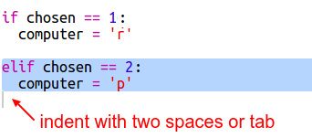
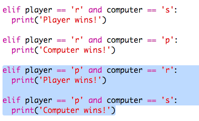
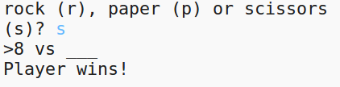

# Introduzione {.intro}

In questo progetto, creerai un gioco di Morra Cinese e giocherai contro il computer.  

Regole: Sia tu che il computer sceglierete sasso, carta o forbici. Il vincitore viene decretato da queste regole:

+ Il sasso smussa le forbici
+ La carta copre il sasso
+ Le forbici tagliano la carta

<div class="trinket">
  <iframe src="https://trinket.io/embed/python/e1e1d873be?outputOnly=true&start=result" width="600" height="500" frameborder="0" marginwidth="0" marginheight="0" allowfullscreen>
  </iframe>
  
</div>

# Passo 1: Turno del Giocatore { .activity}

Per prima cosa, fate scegliere Sasso, Carta o Forbici al giocatore. 

## Lista di controllo delle attività { .check}

+ Apri questo trinket: <a href="http://jumpto.cc/rps-go" target="_blank">jumpto.cc/rps-go</a>. 

+ Il progetto contiene già il codice per importare una funzione che userai in questo progetto. 

  
  
  Userai 'randint' dopo per generare numeri a caso.

+ Per prima cosa, fai in modo che il giocatore scelga tra Sasso, Carta o Forbici digitando 'r', 'p' o 's'. 

  
  
+ Ora stampa quello che ha scelto il giocatore:

  
  
+ Prova il tuo codice cliccando 'Run'. Clicca nella finestra d'uscita del trinket e inserisci la tua scelta. 


# Passo 2: Turno del Computer { .activity}

Adeso è il turno del computer. Puoi usare la funzione 'randint' per generare un numero a caso e decidere tra sasso, carta e forbici. 

## Lista di controllo delle attività { .check}  


+ Usa 'randint' per generare un numero a caso per decidere se il computer ha scelto sasso, carta o forbici. 

  
  
+ Esegui tante volte il tuo script (dovrai inserire ogni volta 'r', 'p' o 's'.)
  
  Dovresti vedere che 'chosen' è regolato a caso a 1, 2 o 3. 
  
+ Diciamo:
  
  + 1 = sasso (r)
  + 2 = carta (p)
  + 3 = forbici (s)

  Usa 'if' per controllare se il numero scelto è '1' (`==` è usato per vedere se 2 cose sono le stesse). 
  
  
  
+ Python usa_l'indentatura_ (muovere il codice verso destra) per mostrare quale codice si trova dentro 'if'. Puoi usare due spazi (batti due volte la barra spaziatrice) o premi il_tasto tab_ (di solito nella tastiera si trova sopra il Blocco Maiuscole.)

  Imposta il computer a 'r' dentro il 'if' usando l'indentatura:
  
  
  
+ Puoi aggiungere un controllo alternativo usando 'elif' (abbreviazione di _else if_):

  

  Questa condizione verrà controllata solo se la prima condizione fallisce (se il computer non sceglie '1')
  
+ E per finire, se il computer non sceglie '1' o '2' allora deve avere scelto '3'. 

  Questa volta, possiamo semplicemente usare 'else' che significa altrimenti. 
  
  
  
+ Ora, invece di stampare il numero a caso che il computer ha scelto, puoi stampare la lettera. 

   
   
   Puoi cancellare la linea 'print(chosen)' o fare in modo che il computer la ignori aggiungendo un `#` all'inizio della linea.
      
+ Prova il tuo codice cliccando Run e scegliendo la tua opzione. 

+ Attenzione, la scelta del computer si stampa in una nuova linea. Puoi risolverlo aggiungendo `end=' '` dopo `vs`, indicando a Python di finire con uno spazio invece di una nuova linea. 

   
      
+ Gioca qualche partita cliccando Run e facendo una scelta.

  Per adesso, dovrai essere tu a capire chi ha vinto. In seguito, aggiungerai il codice Pythin per verificarlo.   
  
## Salva il progetto {.save}


# Passo 3: Controlla il Risultato { .activity}

Ora aggiungiamo il codice per vedere chi ha vinto. 

## Lista di controllo delle attività { .check}

+ Dovrai paragonare le variabili 'player' e 'computer' per vedere chi ha vinto. 

  Se sono le stesse, allora ci sarà un pareggio.
  
  
  
+ Prova il tuo codice giocando un po' di volte finché non raggiungi un pareggio. 

  Dovrai cliccare 'Run' per cominciare una nuova partita. 

+ Ora guardiamo ai casi in cui il giocatore sceglie 'r' (sasso) ma il computer invece no. 

  Se il computer ha scelto 's' (forbici), allora il giocatore vince (sasso batte forbici). 
  
  Se il computer ha scelto 'p' (carta), allora il computer vince (carta batte sasso).
  
  Possiamo controllare la scelta del giocatore *e* quella del computer usando 'and'.
  
  
  
+ Dopo, guardiamo ai casi in cui il giocatore sceglie 'p' (carta) ma il computer invece no.

  
  
+ E per finire, puoi aggiungere il codice per controllare il vincitore quando il giocatore ha scelto 's' (forbici) e il computer ha scelto sasso o carta?

+ Ora inizia a giocare per provare il tuo codice. 

  

  Clicca 'Run' per cominciare una nuova partita. 
  
## Salva il progetto {.save}

## Sfida: Arte ASCII {.challenge}

Invece di usare le lettere r, p e s per rappresentare sasso, carta e forbici, puoi usare l'arte ASCII?

Ad esempio:



Dove:
```
sasso: O
carta: ___
forbici: >8
```

+ Invece di dire 'print computer', dovrai aggiungere una nuova linea a ciascuna delle opzioni in 'if' per stampare la corretta arte ASCII. 

Suggerimenti:


+ Invece di dire 'print player', dovrai aggiungere una nuova frase if per controllare quale oggetto ha scelto il giocatore e stampare la corretta arte ASCII.

Suggerimento:


Ricordati che aggiungere `end=' '` alla fine di un 'print' lo fa finire con uno spazio invece di una nuova linea. 

## Salva il progetto {.save}


## Sfida: Crea un nuovo gioco {.challenge}

Puoi creare il tuo nuovo gioco come Sasso, Carta, Forbici, ma con oggetti diversi?

Clicca il tasto 'Duplicate' per fare una copia del tuo progetto Sasso, Carta, Forbici. 

Questo esempio usa Fuoco, Legna e Acqua:


## Salva il progetto {.save}
