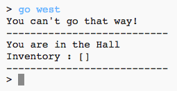

# Introduzione:  { .intro}

Disegna e codifica il tuo gioco di labirinto RPG. Lo scopo del gioco sarà di raccogliere oggetti e scappare da una casa, assicurandosi di evitare tutti i mostri!

  <iframe src="https://trinket.io/embed/python/d06adeb527?outputOnly=true&start=result" width="600" height="500" frameborder="0" marginwidth="0" marginheight="0" allowfullscreen>
  </iframe>
  

# Passo 1: Aggiungere nuove stanze { .activity}

## Lista di controllo delle attività { .check}

+ Alcuni codici di questo gioco sono stati forniti. Scrivi questo trinket: <a href="http://jumpto.cc/rpg-go" target="_blank">jumpto.cc/rpg-go</a>. 

+ Questo è un gioco RPG molto basico, dove ci sono solo 2 stanze. Ecco una mappa del gioco:

  

  Puoi digitare 'go south' per muoverti dall'ingresso alla cucina, e poi 'go north' per tornare di nuovo all'ingresso!

  

+ Cosa succede quando digiti una direzione verso la quale non puoi andare? Digita 'go west' nell'ingresso e otterrai un amichevole messaggio di errore.

  

+ Se trovi la variabile 'rooms', puoi vedere che la mappa è codificata come un dizionario di stanze:

  

  Ogni stanza è un dizionario e le stanze sono collegate tra di loro usando le direzioni.  
  

+ Aggiungiamo alla tua mappa una stanza da pranzo, a est dell'ingresso.

  

  Hai bisogno di una terza stanza, denominata 'dining room'. Dovrai anche collegarla all'ingresso a ovest. Avrai anche bisogno di aggiungere dati all'ingresso, in modo che tu possa muoverti verso la stanza da pranzo a est.
  
  

+ Prova il gioco con la tua nuova stanza da pranzo.

  

  Non puoi entrare ed uscire dalla stanza da pranzo, semplicemente controlla di aver aggiunto tutti i codici qui sopra (incluse le virgole aggiuntive alle linee di sopra).

## Salva il progetto {.save}

## Sfida: Aggiungere nuove stanze { .activity}

Puoi aggiungere altre stanze al tuo gioco? Per esempio, potresti creare un soggiorno a sud della stanza da pranzo. Ricordati di aggiungere una porta a/da una delle altre stanze!

## Salva il progetto {.save}

# Passo 2: Aggiungere oggetti da raccogliere { .activity }

Ora lasciamo degli oggetti nelle stanze così che il giocatore possa raccoglierli mentre si muove attraverso il labirinto.

## Lista di controllo delle attività { .check}

+ Aggiungere un oggetto in una stanza è facile, puoi semplicemente aggiungerlo al dizionario di una stanza. Mettiamo una chiave all'ingresso.

  

  Ricordati di inserire una virgola dopo la linea sopra il nuovo oggetto, o il tuo programma non funzionerà!

+ Se esegui il tuo gioco aggiungendo il codice sopra, potrai vedere ora una chiave nell'ingresso, e puoi perfino prenderla (digitando 'get key') che la aggiunge al tuo inventario!

    

## Salva il progetto {.save}

## Sfida: Aggiungere nuovi oggetti { .activity}

Aggiungi un oggetto ad alcune stanze nel tuo gioco. Puoi aggiungere quello che credi utile per cercare di scappare dalla casa! Per esempio, uno scudo o una pozione magica.

## Salva il progetto {.save}

# Passo 3: Aggiungere nemici { .activity }

Questo gioco è troppo facile! Aggiungiamo ad alcune stanze dei nemici che il giocatore deve evitare.

## Lista delle attività { .check}

+ Aggiungere un nemico a una stanza è facile come gli altri oggetti. Aggiungiamo alla cucina un mostro affamato:

  

+ Assicurati anche che il gioco finisca se il giocatore entra in una delle stanze dove si trova il mostro. Puoi fare ciò con il seguente codice, che dovresti aggiungere alla fine del gioco:

  

  Questo codice controlla se c'è un oggetto nella stanza, e se c'è, se quell'oggetto è un mostro. Nota che questo codice è indentato, collocandolo in linea con il codice di sopra. Questo significa che il gioco controllerà la presenza di un mostro ogni volta che il giocatore si sposta in una nuova stanza.

+ Prova il tuo codice andando in cucina, dove adesso si trova un mostro.

  

## Salva il progetto {.save}

## Sfida: Aggiungi altri mostri {.challenge}

Aggiungi altri mostri al tuo gioco per rendere più difficile la fuga dalla casa!

## Salva il progetto {.save}

# Passo 4: Vincere il gioco { .activity}

Diamo al tuo giocatore una missione che deve essere completata per vincere il gioco.

## Lista delle attività { .check}

+ In questo gioco, il giocatore vince raggiungendo il giardino e scappando dalla casa. Avrà bisogno di avere anche la chiave e la pozione magica. Ecco una mappa del gioco.

  

+ Per prima cosa, dovrai aggiungere un giardino al sud della stanza da pranzo. Ricordati di aggiungere porte che colleghino alle altre stanze della casa.
  
  

+ Aggiungi una pozione alla stanza da pranzo (o in un'altra stanza della casa).

  
  
+ Aggiungi questo codice per fare in modo che il giocatore possa vincere il gioco quando arriva al giardino con la chiave e la pozione:

  

  Assicurati che questo codice sia indentato, in linea con il codice di sopra. Questo codice significa che il messaggio 'Sei scappato dalla casa...HAI VINTO!' sia visualizzato se il giocatore si trova nella stanza 4 (il giardino) e se la chiave e la pozione sono nell'inventario.
  
  Se hai più di 4 stanze, potresti aver bisogno di usare un numero di stanza diverso per il tuo giardino nel codice sopra.

+ Prova il tuo gioco per assicurarti che il giocatore possa vincere!

  

+ Per finire, aggiungiamo delle istruzioni al gioco, così che il giocatore sappia quello che deve fare. Modifica la funzione `showInstructions()` per includere altre informazioni.

  

  Dovrai aggiungere istruzioni per indicare all'utente quali oggetti deve raccogliere, e cosa deve evitare!

+ Prova il tuo gioco e vedrai le tue nuove istruzioni!
  
  

## Salva il progetto {.save}

## Sfida: Migliora il tuo gioco { .challenge}

Usa quello che hai imparato per creare il tuo gioco. Aggiungi stanze, mostri da evitare e oggetti da raccogliere. Ricordati di modificare il codice in modo che il giocatore vince quando raggiunge una certa stanza con alcuni degli oggetti nel suo inventario. Potrebbe essere utile abbozzare una mappa prima di iniziare a codificare! 

Potresti perfino aggiungere delle scale alla tua mappa e avere più di un piano di stanze, digitando 'go up' e 'go down'.

## Salva il progetto {.save}
