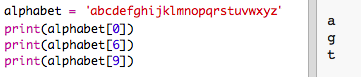
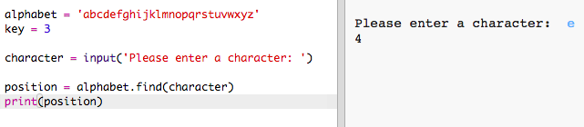
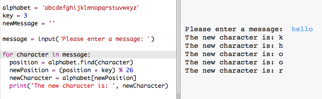

#Introduzione:  { .intro}

Il 15 dicembre 2015, l'astronauta inglese Tim Peake partì con la missione Principia alla Stazione Spaziale Internazionale che si trova in orbita attorno alla Terra. Questo progetto è connesso con il Diario Spaziale di Principia, una risorsa gratuita per le scuole del Regno Unito come parte della Missione Principia di Tim Peake dell'Agenzia Spaziale Astronauti Europei. Per ulteriori informazioni, visita [http://principiaspacediary.org](http://principiaspacediary.org).

In questo progetto, imparerai a creare il tuo programma di criptaggio per mandare e ricevere messaggi con un amico. Questo progetto è connesso con l'attività "Terra a Principia" a pagina 16 del Diario Spaziale.

  <iframe src="https://trinket.io/embed/python/402256078c?outputOnly=true&start=result" width="600" height="500" frameborder="0" marginwidth="0" marginheight="0" allowfullscreen>
  </iframe>
  

#Passo 1: Il messaggio cifrato Cesare { .activity}

Un messaggio cifrato è un tipo di codice segreto dove scambi le lettere in modo che nessuno possa leggere il tuo messaggio.

Userai uno dei messaggi cifrati più antichi e famosi, il Cesare, il cui nome deriva da Giulio Cesare.

Prima di iniziare a codificare, proviamo a usare il messaggio cifrato Cesar per nascondere una parola.

## Lista di controllo delle attività { .check}

+ Nascondere una parola si chiama criptaggio.

	Iniziamo a criptare la lettera 'a'. Per fare ciò, possiamo disegnare l'alfabeto in un cerchio, così:

	

+ Per trasformare una normale lettera in una segreta criptata, dovrai avere una chiave segreta. Usiamo il numero 3 come chiave (ma puoi usre qualsiasi numero tu voglia).

	Per criptare la lettera 'a', semplicemente muovi 3 lettere in senso orario, che ti daranno la lettera 'd'-

	

+ Puoi usare le tue conoscenze per criptare un'intera parola. Per esempio, 'hello' criptato diventa 'khoor'. Prova tu.

	+ h + 3 = __k__
	+ e + 3 = __h__
	+ l + 3 = __o__
	+ l + 3 = __o__
	+ o + 3 = __r__

+ Far tornare il testo alla normalità si chiama_decriptazione_. Per decriptare una parola, semplicemente sottrai la chiave invece di aggiungerla:

	+ k - 3 = __h__
	+ h - 3 = __e__
	+ o - 3 = __l__
	+ o - 3 = __l__
	+ r - 3 = __o__	

## Sfida: Usa un messaggio cifrato Cesar { .challenge}
Puoi mandare una parola segreta a un amico? Dovrete entrambi concordare su una chiave segreta prima di iniziare.

Potete perfino mandarvi intere sentenze l'uno all'altro.

#Passo 2: Criptare lettere { .activity}

Scriviamo un programma Python per criptare un singolo carattere. 

## Lista di controllo delle attività { .check}

+ Apri il modello vuoto di Python Trinket: <a href="http://jumpto.cc/python-new" target="_blank">jumpto.cc/python-new</a>. 

+ Invece di disegnare l'alfabeto in un cerchio, scriviamolo come una variabile 'alphabet'.

	

+ Ogni lettera dell'alfabeto ha una posizione, iniziando dalla posizione 0. Dunque la lettera 'a' si trova alla posizione ' dell'alfabeto, e 'c' alla posizione 2.

	

+ Puoi ottenere una lettera dalla tua variabile 'alphabet' scrivendo la posizione tra parentesi quadre.

	

	Potrai cancellare le frasi 'print' una volta che lo avrai provato.

+ In seguito, dovrai salvare la key' segreta in una variabile.

		

+ Poi, chiedi all'utente una lettera singola (chiamata 'characterì) da criptare.

	

+ Trova la 'position' del 'character'.

	

+ Puoi provare la 'position' salvata stampandola. Per esempio, quel carattere 'e' si trova alla posizione 4 nell'alfabeto.

	

+ Per criptare il 'character', dovresti aggiungere la 'key' alla 'position'.

	

+ Prova il tuo nuovo codice. Dato che la tua 'key' è 3, dovrebbe aggiungere 3 alla 'position' e salvarla nella tua variabile 'newPosition'. 

	Per esempio, la lettera 'e' si trova alla posizione 4.  Per criptare, aggiungi la 'key' (3), dando 7.

	

+ Cosa succede quando provi a criptare la lettera 'y'?

	

	Nota come la 'newPosition' è 27 e non ci sono 27 lettere nell'alfabeto!

+ Puoi usare un '%' per dire alla nuova posizione di tornare alla posizione 0 una volta che arriva alla posizione 26. (Questo progetto si basa sull'alfabeto inglese, che è composto da 26 lettere.) 

	

+ Per finire, stamperai la lettera alla nuova posizione.

	Per esempio, aggiungendo la chiave alla lettera 'e' dà 7 e la lettera alla posizione 7 dell'alfabeto è 'h'.

	

+ Prova il nuovo codice. Puoi anche rimuovere alcune delle frasi di stampa, semplicemente stampando il nuovo carattere alla fine.

	

## Salva il progetto {.save}

## Sfida: Chiavi variabili { .challenge}
Modifica il tuo programma, in modo che l'utente possa inserire la propria chiave da usare. Avrai bisogno di ottenere l'input dell'utente e di salvarlo nella variabile 'key'.

Ricordati di usare la funzione 'int()' per convertire l'input in un numero intero.

Puoi dunque usare una chiave negativa per decriptare i messaggi!

## Salva il progetto {.save}

#Passo 2: Criptare interi messaggi { .activity}

Invece di criptare e decriptare messaggi un carattere per volta, cambiamo il programma per criptare interi messaggi!

## Lista di controllo delle attività { .check}

+ Per prima cosa, controlla che il tuo codice sia così:

	

+ Crea una variabile per salvare il nuovo messaggio criptato.

	

+ Cambia il tuo codice per salvare il messaggio dell'utente e non solo un carattere.

	

+ Aggiungi un loop 'for' al tuo codice e indenta il resto del codice in modo che si ripeta per ogni carattere del messaggio.

	

+ Prova il codice. Dovresti notare che ogni carattere nel messaggio è criptato e stampato uno alla volta.

	

+ Aggiungiamo ogni carattere criptato alla tua variabile 'newMessage'.

	

+ Puoi 'print' il 'newMessage' man mano che si va criptando.

	

+ Se elimini gli spazi prima della frase 'print', il messaggio criptato verra visualizzato solo una volta alla fine. Puoi anche eliminare il codice per stampare le posizioni del carattere.

	

## Salva il progetto {.save}

#Passo 3: Caratteri Extra { .activity}

Alcuni caratteri non si trovano nell'alfabeto, e questo causa un errore.

## Lista di controllo delle attività { .check}

+ Prova il tuo codice con alcuni caratteri che non si trovano nell'alfabeto.

	Per esempio, potresti usare il messaggio `hi there!!`.

	

	Nota che lo spazio e i caratteri '!' sono tutti criptati come la lettera 'c'!

+ Per risolverlo, tradurrai un carattere solo se si trova nell'alfabeto. Per fare ciò, aggiungi una frase 'if' al tuo codice e indenta il resto del codice.

	

+ Prova il tuo codice con lo stesso messaggio. Che succede questa volta?

	

	Ora, il tuo codice semplicemente salta tutti i caratteri che non sono nell'alfabeto.

+ Sarebbe meglio se il tuo codice non criptasse niente che non sia nell'alfabeto, ma usasse solo il carattere originale.

	Aggiungi al tuo codice una frase 'else', che semplicemente aggiunge il carattere originale al messaggio criptato.

	

+ Prova il codice. Dovresti vedere che ogni carattere nell'alfabeto è criptato, ma tutti gli altri sono lasciati in pace!

	

## Salva il progetto {.save}

## Sfida: Criptare e decriptare messaggi { .challenge}
Cripta alcuni messaggi e dalli a un amico insieme alla chiave segreta. Vedi se riesce a decriptarli usando il suo programma!

Potresti anche duplicare il progetto e creare un programma separato per decriptare i messaggi.

## Salva il progetto {.save}

## Sfida: Calcolatore di amicizia { .challenge}
Scrivi un programma per mostrare quanto sono compatibili 2 persone, calcolando un punteggio di amicizia.

Il programma potrebbe ripetersi per ogni carattere nei 2 nomi e aggiungere punti a una variabile 'score' ogni volta che vengono trovate certe lettere.

Dovresti decidere le regole per assegnare i punti. Per esempio, potresti assegnare punti per le vocali o i caratteri che sono trovati nella parola 'friend'.

Potresti anche dare all'utente un messaggio personalizzato, basato sul suo punteggio:

## Salva il progetto {.save}
