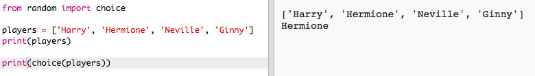
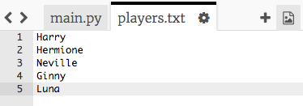

#Introduzione:  { .intro}
In questo progetto, imparerai come creare 2 squadre a caso da una lista di giocatori.

  <iframe src="https://trinket.io/embed/python/70d24d92b8?outputOnly=true&start=result" width="600" height="500" frameborder="0" marginwidth="0" marginheight="0" allowfullscreen>
  </iframe>
  

#Passo 1: Giocatori { .activity}

Iniziamo creando una lista di giocatori dalla quale scegliere.

## Lista di controllo delle attività { .check}

+ Apri il modello vuoto di Python Trinket: <a href="http://jumpto.cc/python-new" target="_blank">jumpto.cc/python-new</a>.

+ Puoi usare una variabile per salvare una_lista_di giocatori. La lista dovrebbe essere tra parentesi quadre `[ ]`, con una virgola tra ogni voce della lista.

	Aggiungiamo poi una lista di giocatori al tuo programma.

	

+ Aggiungi questo codice per stampare la tua variabile 'players':

	

+ Puoi raggiungere una voce della lista aggiungendo la sua posizione in parentesi quadre dopo il nome della variabile.

	La prima voce nella lista è alla_posizione 0_. Questa è diversa da Scratch, che inizia alla posizione 1.

	

## Salva il progetto {.save}

## Sfida: Aggiungi altri giocatori {.challenge}
Puoi aggiungere altri giocatori alla tua lista? Puoi aggiungere quanti giocatori vuoi, ma assicurati che ci sia un numero_pari_di giocatori.

Se preferisci, puoi anche cambiare i nomi dei primi 2 giocatori.

Puoi aggiungere un codice per stampare_solo uno_dei tuoi nuovi giocatori?

## Salva il progetto {.save}

#Passo 2: Giocatori a caso { .activity}

Scegliamo dei giocatori a caso!

## Lista di controllo delle attività { .check}

+ Per riuscire a ottenere un giocatore a caso dalla lista dei tuoi 'players', prima dovrai importare la parte 'choice' del modulo 'random'.

	

+ Per ottenere un giocatore a caso, puoi usare 'choice'. (Puoi anche eliminare il codice per stampare i giocatori individuali.)

	

+ Prova più volte il tuo codice 'choice' e vedrai che verrà scelto un giocatore diverso ogni volta.

+ Puoi anche creare una nuova variabile chiamata 'playerA', e usarla per salvare il tuo giocatore a caso.

	

+ Avrai bisogno di una nuova lista per salvare tutti i giocatori nella squadra A. Per prima cosa, questa lista dovrebbe essere vuota.

	

+ Puoi ora aggiungere il tuo giocatore scelto a caso al 'teamA'. Per fare ciò, puoi usare 'teamA.append'  (_append (allegare)_significa aggiungere alla fine).

	

+ Ora che il tuo giocatore è stato scelto, puoi rimuoverlo dalla tua lista di 'players'.

	

+ Prova questo codice aggiungendo un comando 'print' per mostrare i 'players' rimasti dai quali scegliere.

	[screenshot](images/team-players-remove-test.png)

	Nell'esempio di sopra, Hermione è stata scelta per il 'teamA', ed è quindi stata rimossa dalla lista di 'players'.

## Salva il progetto {.save}

## Sfida: Scegliere per la squadra B { .challenge}
Puoi aggiungere un codice per scegliere un giocatore a caso per la squadra B? Avrai bisogno di:

+ Creare una nuova lista 'teamB'
+ Scegliere un giocatore a caso per la squadra B (chiamato 'playerB')
+ 'append' il giocatore scelto alla tua lista 'teamB'
+ 'remove' il giocatore scelto dalla tua lista di 'players'

Il codice che ti servirà per il 'teamB' sarà_molto_simile al codice che hai già scritto per il 'teamA'!

## Salva il progetto {.save}

#Passo 3: Scegliere tanti giocatori { .activity}

Dopo, dovrai assicurarti che ogni giocatore sia stato scelto per una squadra.

## Lista di controllo delle attività { .check}

+ Evidenzia il tuo codice per scegliere i giocatori per la squadra A e la squadra B, e premi il tasto tab per indentare il codice.

	

+ Aggiungi un loop_while_per continuare a scegliere giocatori finché la lunghezza della lista di 'players' è 0.

	

+ Lancia il codice per vedere se funziona. Vedrai che verranno scelti giocatori per la squadra A e la squadra B finché non ne saranno rimasti più.

	

+ Aggiungi un codice per stampare la tua lista 'teamA'_dopo_il tuo loop 'while' (assicurandoti che non sia indentato).

	Questo significa che il 'teamA' verrà stampato solo una volta, dopo che sono stati scelti tutti i giocatori.

	

+ Puoi fare la stessa cosa per 'teamB' e puoi anche cancellare gli altri comandi di stampa, in quanto erano lì solo per provare il tuo codice.

	Il tuo codice dovrebbe apparire così:

	

+ Prova di nuovo il tuo codice e vedrai la tua lista di giocatori così come le squadre finali.

	

## Salva il progetto {.save}

#Passo 4: File { .activity}

Puoi usare un file per salvare la tua lista di giocatori.

## Lista di controllo delle attività { .check}

+ Clicca sull'icona + e crea un nuovo file chiamato 'players.txt'.

	

+ Aggiungi i giocatori al tuo nuovo file. Assicurati che non ci siano linee vuote dopo il tuo ultimo giocatore.

	

+ Cambia la tua lista di 'players' in modo che sia vuota.

	

+ Apri il tuo file 'players.txt' (la `'r'` significa solo lettura).

	

+ Leggi la lista dal file e aggiungi alla tua lista di 'players'. (Il codice 'splitlines' significa che ogni linea nel file è una nuova voce nella lista di 'players').

	

+ Se provi il tuo codice, dovrebbe funzionare esattamente come prima. Tuttavia, ora è molto più facile aggiungere giocatori al tuo file 'players.txt'.

## Salva il progetto {.save}

#Passo 5: Giocatori dispari { .activity}

Miglioriamo il programma per farlo funzionare con un numero dispari di giocatori.

## Lista di controllo delle attività { .check}

+ Aggiungi un altro nome alla tua lista 'players.txt', in modo che tu abbia un numero dispari di giocatori.

	

+ Se provi il tuo codice, vedrai che otterrai un messaggio di errore.

	

+ L'errore è perché il tuo programma continua a scegliere giocatori a caso per la squadra A e poi la squadra B. Tuttavia, se c'è un numero dispari di giocatori allora dopo aver scelto un giocatore per la squadra A non ci saranno giocatori rimasti per la squadra B.

	per risolvere questo bug, puoi dire al tuo programma che rompa 'break' il tuo loop 'while' se la lista dei tuoi 'players' è vuota.

	

+ Se provi di nuovo il codice, vedrai che adesso funziona con un numero dispari di giocatori.

	

## Salva il progetto {.save}

## Sfida: Nomi casuali di squadra { .challenge}
Puoi dare a entrambe le tue squadre un nome a caso?

Puoi creare una lista chiamata 'teamNames' contenente i nomi da scegliere.

Puoi dunque scegliere (e visualizzare) un nome a caso per ogni squadra.

## Salva il progetto {.save}

## Sfida: Immagazzinamento dei nomi di squadra { .challenge}
Puoi immagazzinare in un file la tua lista di nomi di squadra?

## Salva il progetto {.save}

## Sfida: Altre squadre { .challenge}
Puoi migliorare il tuo programma per dividere i giocatori in 3 squadre invece di 2?

## Salva il progetto {.save}
