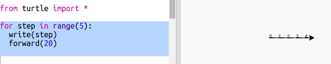
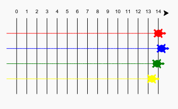

# Introduzione {.intro}

In questo progetto, userai i loop per creare un gioco di tartarughe in gara e disegnerai un percorso di gara.  

  <iframe src="https://trinket.io/embed/python/9339862606?outputOnly=true&start=result" width="600" height="500" frameborder="0" marginwidth="0" marginheight="0" allowfullscreen>
  </iframe>
  

# Passo 1: Percorso di gara { .activity}

Creerai un gioco con tartarughe che gareggiano. Per prima cosa, avranno bisogno di un percorso di gara.

## Lista di controllo delle attività { .check}

+ Apri il modello vuoto di Python Trinket: <a href="http://jumpto.cc/python-new" target="_blank">jumpto.cc/python-new</a>. 

+ Aggiungi il seguente codice per disegnare una linea usando  'turtle':

  
   
+ Ora usiamo la tartaruga per disegnare slcune linee del percorso. 

  La funzione 'write' della tartaruga scrive il testo allo schermo. 
  
  Prova:

  
  
+ Ora dovrai riempire i numeri in mezzo per creare le linee:

  
  
+ Hai notato che il tuo codice è molto ripetitivo? L'unica cosa che cambia è il numero da scrivere.

  C'è una maniera migliore per farlo in Python. Puoi usare il loop 'for'. 
  
  Aggiorna il tuo codice per usare un loop 'for':
  
  
   
+ Vediamo un po', quello stampa solo numeri fino a 4. In Python 'range(5)' restituisce cinque numeri, da 0 a 4. Per fare in modo che restituisca anche il numero 5, ddovrai usare 'range(6)':

  
   
+ Ora possiamo tracciare alcune linee di percorso. La tartaruga inizia alle coordinate (0,0) nel mezzo dello schermo. 

  Muovi invece la tartaruga in alto a sinistra:
  
  

+ Ah, prima dovrai sollevare la penna!

  
  
+ Invece di disegnare una linea in orizzontale, disegniamo delle linee verticali per creare un percorso:

  
  
  `right(90)` fa girare la tartaruga a destra di 90 gradi (un angolo retto.) Muovere 'forward(10)' prima di mettere giù la penna lascia un piccolo vuoto tra il numero e l'inizio della riga. Dopo aver disegnato la linea, solleva la penna e vai 'backward(160)' la lunghezza della linea più il vuoto. 
  
+ Se centri i numeri sembrerà più ordinato:

  

+ E puoi anche accelerare la tartaruga così che disegni più velocemente:

  

## Salva il progetto {.save}

## Sfida: Altre linee {.challenge}

Puoi cambiare il tuo codice in modo che le linee del percorso attraversino lo schermo?

 
Se vuoi fare andare la tartaruga ancora più veloce, puoi usare 'speed(0)'. 

# Passo 2: Tartarughe in gara { .activity}

Ora arriva la parte divertente. Aggiungiamo alcune tartarughe che gareggiano. Se le tartarughe facessero ogni volta la stessa cosa, sarebbe molto noioso, per cui in ogni turno si muoveranno un numero di passi a caso. Vince la tartaruga che arriva più lontana in 100 turni. 

## Lista di controllo delle attività { .check}

+ Quando usi comandi come 'forward(20)', stai usando una tartaruga singola. Ma puoi creare altre tartarughe. Aggiungi il seguente codice alla fine del tuo script (ma assicurati che non sia indentato):

  

  La prima linea crea una tartaruga chiamata 'ada'. Le prossime linee stabiliscono il colore e la forma della tartaruga. Ora sembra davvero una tartaruga!
  
+ Mandiamo la tartaruga alla linea iniziale:

  
   
+ Ora dovrai fare gareggiare la tartaruga muovendo un numero a caso di passi alla volta. Avrai bisogno della funzione 'randint' dalla libreria 'random' Python. + Aggiungi questa riga 'import' in cima al tuo script:

  

+ La funzione 'randint' restituisce un numero intero a caso tra i valori scelti. La tartaruga si muoverà avanti di 1, 2, 3, 4 o 5 passi per ogni turno. 

  
  
+ Una tartaruga non è abbastanza per fare una gara! Aggiungiamone un'altra:

  
  
  Nota che il codice per muovere la tartaruga blu ha bisogno di essere nello_stesso_loop 'for' del codice per muovere la tartaruga rossa, in modo che ognuna di loro faccia un movimento per ogni turno. 
  
## Salva il progetto {.save}

## Sfida: Tempo di gara! {.challenge}
  
Ora sei pronto a gareggiare. Scegli una tartaruga e un avversario, e vedi chi vince. 

Puoi aggiungere altre tartarughe per giocare con gli amici?

 
I colori includono: arancione, viola, violetto, rosso, turchese, magenta e marrone - o puoi andare a <a href="http://jumpto.cc/colours">jumpto.cc/colours</a> e scegliere il colore che vuoi!

## Salva il progetto {.save}
 
## Sfida: Fai un giro {.challenge}

Puoi usare un loop `for turn in range():` per far compiere un giro di 360 gradi a ogni tartaruga dopo che raggiunge la linea di partenza? Dovrai assicurarti che siano rivolte nella giusta direzione all'inizio della gara!

`ada.right(36)` girerà la tartaruga rossa di 36 gradi. 

**Suggerimento:** Un giro completo è di 360 gradi. Una tartaruga può girare a destra di 10 gradi 36 volte, o a sinistra di 5 gradi 72 volte, o qualsiasi altro numero che faccia 360!

## Sfida: Linee tratteggiate {.challenge}

Puoi usare un loop per creare le linee del percorso tratteggiate invece che continue? 

  
**Suggerimento:** Trova il codice che disegna una linea dritta. Prova ad usare: 'for', `forward()`, `penup()` and `pendown()`

## Salva il progetto {.save}
