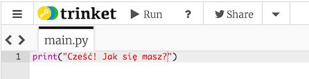
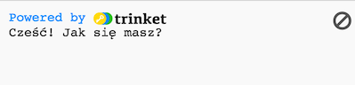
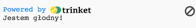
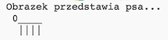
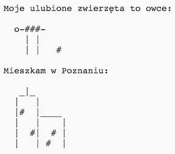
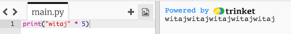
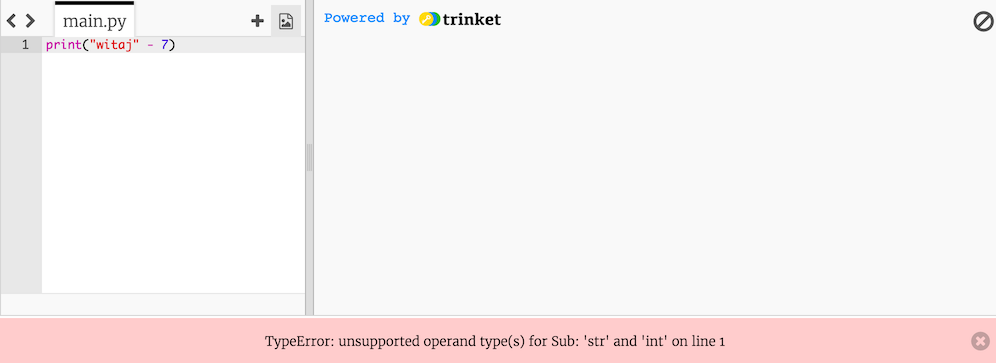
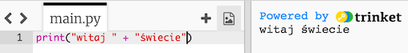
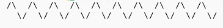
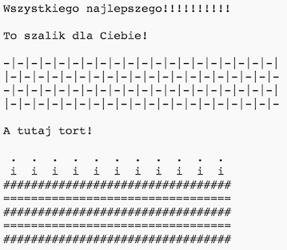

---
title: ASCII Art
level: Python 1
language: pl
stylesheet: python
embeds: "*.png"
materials: ["Project Resources/*.*"]
...

# Wstęp {.intro}

Python umożliwia przekształcenie listy poleceń w użyteczne programy i ciekawe gry! Wykonując ten projekt nauczysz się, jak uruchomić program napisany w języku Python a także jak za jego pomocą wyświetlić tekst na ekranie.

# Krok 1: Powiedz "cześć" {.activity}

## Lista zadań {.check}

+ Zacznijmy od napisania bardzo prostego programu w języku Python, abyś wiedział(a) jak go uruchomić. Otwórz edytor: https://trinket.io/python/7c0a7396c0. Jeśli pracujesz online, możesz również posłużyć się wersją wyświetloną poniżej.

    <div class="trinket">
        <iframe src="https://trinket.io/embed/python/7c0a7396c0" width="100%" height="400" frameborder="0" marginwidth="0" marginheight="0" allowfullscreen></iframe>
    </div>

+ W pliku `main.py` wpisz:

    ```python
    print("Cześć! Jak się masz?")
    ```

    Ten program wyświetli na ekranie tekst. Zauważ, że tekst, który chcesz wyświetlić jest wpisany w cudzysłowie (`"`). Twój kod powinien wyglądać mniej więcej tak:

    

+ Uruchom program klikając `Run`. Po prawej stronie zobaczysz, tekst wpisany w polecenie `print`.

    

+ Jeśli zrobisz błąd, na przykład zapomnisz wpisać drugiego cudzysłowu (`"`), wtedy pod edytorem wyświetlony zostanie komunikat, który w języku angielskim mówi na czym polega błąd. Spróbuj!

    

+ Gratulacje, od teraz oficjalnie jesteś programistą języka Python! Możesz z dumą się tym pochwalić.

## Zapisz swój projekt {.save}

## Wyzwanie: Co masz na myśli? {.challenge}
Zmień powyższy program, aby wyświetlał na ekranie coś ciekawszego!



## Zapisz swój projekt {.save}

# Krok 2: Coś o Tobie {.activity .new-page}

## Lista zadań {.check}

+ Wyświetlmy coś zabawniejszego niż zwykły tekst... ASCII art! ASCII art polega na tworzeniu obrazków z tekstu. Poniżej przykład - to miał być pies!

    

    Aby zrobić takie arcydzieło, możesz wpisać w edytorze poniższe polecenia i uruchomić program:

    ```python
    print("Obrazek przedstawia psa...")
    print(" 0____  ")
    print("  ||||  ")
    ```

+ Jeśli wolisz, możesz użyć trzech pojedyńczych apostrofów (`'''`) zamiast cudzysłowów. Pozwalają one wyświetlić za pomocą jednego polecenia tekst, który ma wiele linii. Tak jak tutaj:

    ```python
    print('''
    Obrazek przedstawia psa...
     0____
      ||||
    ''')
    ```

    Kiedy uruchomisz ten program zobaczysz, że wyświetla takiego samego psa, jak poprzednio.

## Zapisz swój projekt {.save}

## Wyzwanie: Coś o Tobie {.challenge}
Napisz program w Pythonie, w którym opowiesz innym o sobie używając do tego ASCII art. Możesz stworzyć obrazki dotyczące twojego hobby, przyjaciół, rodziny... co tylko chcesz! Oto przykład:



## Zapisz swój projekt {.save}

# Krok 3: Działania na tekście {.activity}

## Lista zadań {.check}

+ Python potrafi także wykonywać obiczenia przy użyciu tekstu! Co się stanie, jeśli pomożymy `"witaj"` przez 5? Zapytajmy Pythona uruchamiając taki program:

    ```python
    print("witaj" * 5)
    ```

    Gwiazdka `*` w programie powyżej to znak mnożenia. Uruchom ten program, a zobaczysz odpowiedź:

    

+ Możesz zmienić wyświetlony tekst, aby był łatwiejszy do przeczytania. Wystarczy w programie dodać spację po słowie `"witaj"`:

    ```python
    print("witaj " * 5)
    ```

    Uruchom ten program, a zobaczysz, że odpowiedź jest nieco czytelniejsza niż poprzednio.

+ Jeżeli `"witaj "` pomnożone przez 5 daje `"witaj witaj witaj witaj witaj"`, to co się stanie z `"witaj" - 7`? Czy takie działanie ma jakiś sens?

    

    Oj, nie działa! Zamiast wyniku dostaliśmy komunikat błędu. Wygląda na to, że takie działanie nie ma sensu w Pythonie!

+ A co z dodawaniem? Jak myślisz, jaki będzie wynik `"witaj " + "świecie"`? Spróbuj uruchamiając taki program:

    ```python
    print("witaj " + "świecie")
    ```

    

    Czy takiego wyniku oczekiwałeś/oczekiwałaś?

## Zapisz swój projekt {.save}

## Wyzwanie: Wyrazy i liczby {.challenge}
Co wyświetli na ekranie poniższy program? Zastanów się, a potem uruchom program i sprawdź czy zgadłeś/zgadłaś.

```python
print("ha "*4)
print("ta"*2 + "rak")
print("He" + "l"*2 + "o" + "!"*10)
```

Potrawisz wymyślić swoje wyrazy?

## Zapisz swój projekt {.save}

# Krok 4: Wzory ASCII {.activity}

## Lista zadań {.check}

+ Wiesz już, jak działają obliczenia na tekscie, to co teraz? Dlaczego warto tego używać? Cóż, powiedzmy, że chcesz narysować prostokąt w ASCII art, który ma 30 znaków szerokości i 3 znaki wysokości. Możesz albo narysować go trudniejszym sposobem, tak jak tu:

    ```python
    print("##############################")
    print("##############################")
    print("##############################")
    ```

    Albo oszczędzić trochę czasu i narysować go prościej - jak tu:

    ```python
    print("#" * 30)
    print("#" * 30)
    print("#" * 30)
    ```

    Oba wyświetlą na ekranie dokładnie ten sam prostokąt:

    

+ Możesz nawet użyć działań do stworzenia ciekawych wzorów, takich jak ta fala:

    ```python
    print("/\  "*10)
    print("  \/"*10)
    ```

    

## Zapisz swój projekt {.save}

## Wyzwanie: Nakoduj szalik {.challenge}
Twój najlepszy przyjaciel urządza przyjęcie z okazji 11. urodzin. Postanowiłeś/aś, że w prezencie nakodujesz szalik! Użyj działań, gdzie tylko możesz, aby stworzyć swój niepowtarzalny wzór szalika.

Jeśli masz gest, możesz nawet nakodować dla niego tort (razem z 11 świeczkami)!



## Zapisz swój projekt {.save}
