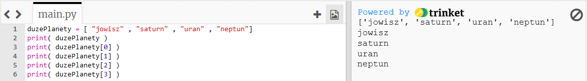
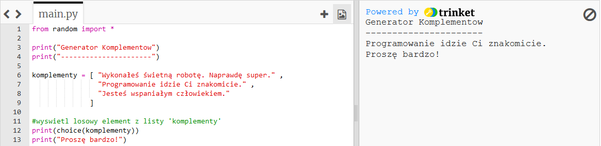
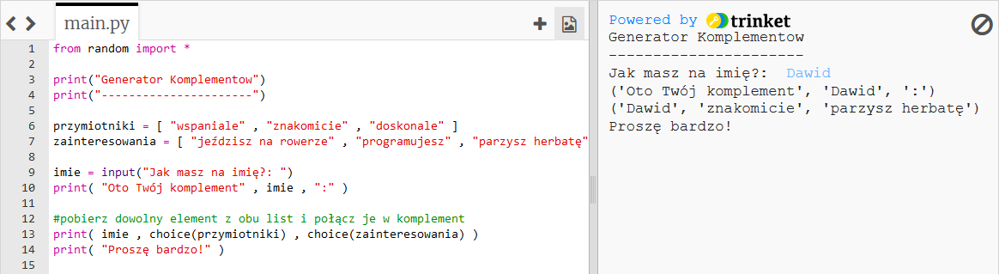
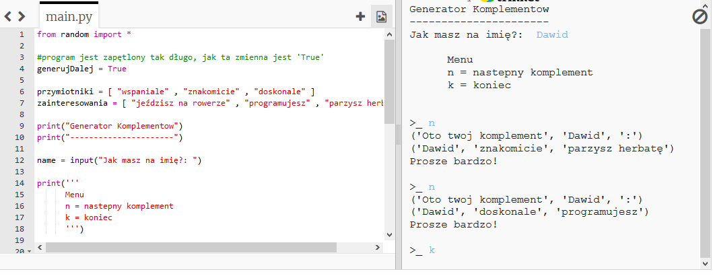
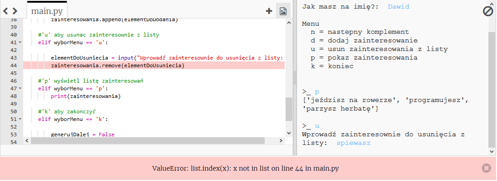
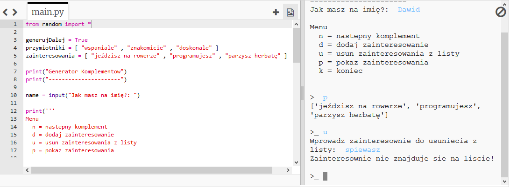
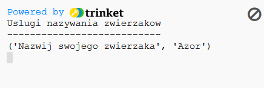

---
title: Compliment Generator
level: Python 1
language: en
stylesheet: python
embeds: "*.png"
materials: ["Project Resources/*.*","Club Leader Resources/*.*"]
...

#Introduction:  { .intro}

Learn how to use lists, to store lots of data in 1 variable.

#Step 1: It's nice to be nice { .activity}

In this project, you'll make a program to give the user a randomly generated compliment!

## Activity Checklist { .check}

+ In your projects so far, you've used a variable to store a single piece of data, such as a name or a score. But what if you want to store lots of data? In Python, you can use a _list_ to store lots of data in 1 variable:

    ```python
    bigPlanets = [ "jupiter" , "saturn" , "uranus" , "neptune"]
    ```

    This list of text is also known as an _array_ of text. To access items in the list, you just need to know the position of the item. Run this program to give yourself a better idea of how lists work:

    ```python
    bigPlanets = [ "jupiter" , "saturn" , "uranus" , "neptune"]
    print( bigPlanets )
    print( bigPlanets[0] )
    print( bigPlanets[1] )
    print( bigPlanets[2] )
    print( bigPlanets[3] )
    ```

    

    As you can see, positions start at 0 and not 1, so `bigPlanets[1]` is "saturn" (the second item) and not "jupiter".

+ You can use a list called `compliments` to store all of the possible compliments for your compliment generator program, and then use `choice(compliments)` to choose a random compliment for the user:

    ```python
    from random import *

    print("Compliment Generator")
    print("--------------------")

    compliments = [ "Great job on that thing you did. Really super." ,
                    "You have really really nice programming skills." ,
                    "You make an excellent human."
                  ]

    #print a random item in the 'compliments' list
    print(choice(compliments))
    print("You're welcome!")
    ```

    

+ You could make your compliments a little more interesting, by combining random items from 2 different lists:

    ```python
    from random import *

    print("Compliment Generator")
    print("--------------------")

    adjectives = [ "amazing" , "above-average" , "excellent" ]
    hobbies = [ "riding a bike" , "programming" , "making a cup of tea" ]

    name = input("What is your name?: ")
    print( "Here is your compliment" , name , ":" )

    #get a random item from both lists, and add them to the compliment
    print( name , "you are" , choice(adjectives) , "at" , choice(hobbies) )
    print( "You're welcome!" )
    ```

    

## Save Your Project {.save}

## Challenge: Adding more compliments { .challenge}
Try to think of some more compliments, and add them to your program! Remember that you need to add a comma (`,`) between the items in your lists.

## Save Your Project {.save}

#Step 2: Endless compliments { .activity}

## Activity Checklist { .check}

+ Using what you know about `while` loops and `if` statements, you could modify your program to keep giving out compliments until the user decides to quit:

    ```python
    from random import *

    #the program loops as long as this variable is 'True'
    running = True

    adjectives = [ "amazing" , "above-average" , "excellent" ]
    hobbies = [ "riding a bike" , "programming" , "making a cup of tea" ]

    print("Compliment Generator")
    print("--------------------")

    name = input("What is your name?: ")

    print('''
    Menu
      c = get compliment
      q = quit
    ''')

    while running == True:

        menuChoice = input("\n>_").lower()

        #'c' for a compliment
        if menuChoice == 'c':

            print( "Here is your compliment" , name , ":" )

            #get a random item from both lists, and add them to the compliment
            print( name , "you are" , choice(adjectives) , "at" , choice(hobbies) )
            print( "You're welcome!" )

        #'q' to quit
        elif menuChoice == 'q':

            running = False
            
        else:

            print("Please choose a valid option!")
    ```

    

    Remember that the the `while` loop continues to run as long as the variable `running` is set to `True`. If the user inputs `q` to quit, `running` is set to `False`.

## Save Your Project {.save}

#Step 3: Personalising compliments { .activity}

## Activity Checklist { .check}

+ Your compliment generator is starting to take shape, but it has a problem: what if your user can't ride a bike or make a cup of tea? In that case, your compliments won't be true, and won't cheer them up!

    Let's modify your program, so that the user can choose to add or remove items from the `hobbies` list, to allow them to personalise the compliments they receive:

    ```python
    from random import *

    running = True
    adjectives = [ "amazing" , "above-average" , "excellent" ]
    hobbies = [ "riding a bike" , "programming" , "making a cup of tea" ]

    print("Compliment Generator")
    print("--------------------")

    name = input("What is your name?: ")

    print('''
    Menu
      c = get compliment
      a = add hobby to list
      d = delete hobby from list
      p = print hobbies
      q = quit
    ''')

    while running == True:

        menuChoice = input("\n>_").lower()

        #'c' for a compliment
        if menuChoice == 'c':

            print( "Here is your compliment" , name , ":" )

            #get a random item from both lists, and add them to the compliment
            print( name , "you are" , choice(adjectives) , "at" , choice(hobbies) )
            print( "You're welcome!" )

        #'a' to add a hobby
        elif menuChoice == 'a':

            itemToAdd = input("Please enter the hobby to add: ")
            hobbies.append(itemToAdd)

        #'d' to delete a hobby
        elif menuChoice == 'd':

            itemToDelete = input("Please enter the hobby to remove: ")
            hobbies.remove(itemToDelete)

        #'p' to print the hobbies list
        elif menuChoice == 'p':
            print(hobbies)

        #'q' to quit
        elif menuChoice == 'q':

            running = False
            
        else:
            
            print("Please choose a valid option!")
    ```

    As you can see, you can use `append()` to add to a list, and `remove()` to remove an item. Run this program, and personalise the hobbies in the list to suit you. Ask the program for compliments until you're in a good mood!

+ When testing the program above, did you run into any problems? At the moment, your compliment generator crashes if you try and remove a compliment that isn't in the list:

    

    You can fix this problem, by first checking that the item to remove exists in the list. Replace your code to remove a hobby with this code:

    ```python
        #'d' to delete a hobby
        elif menuChoice == 'd':

            itemToDelete = input("Please enter the hobby to remove: ")
            #only remove an item if it's in the list
            if itemToDelete in hobbies:
            	hobbies.remove(itemToDelete)
            else:
            	print("Hobby not in list!")
    ```

    Now run the program and try to delete a hobby that isn't in the list:

    

## Save Your Project {.save}

## Challenge: Duplicate hobbies { .challenge}
Another problem with the program is that it is possible to add the same hobby more than once:


Can you fix this problem, so that a hobby can only be added if it isn't already in the list:

```python
if itemToAdd not in hobbies:
	#add code here...
```

## Save Your Project {.save}

## Challenge: Pet naming service { .challenge}
Write a program to help a new pet owner to name their pet:



Your program could:
+ allow the user to add and remove names from the list;
+ give different names for male and female pets, or different types of animal;
+ ask the user how many names they need, in case they have more than 1 pet to name.

## Save Your Project {.save}