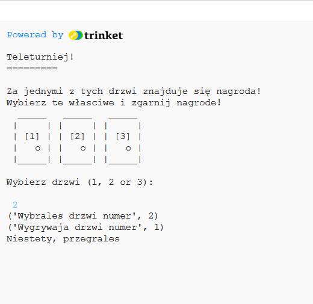
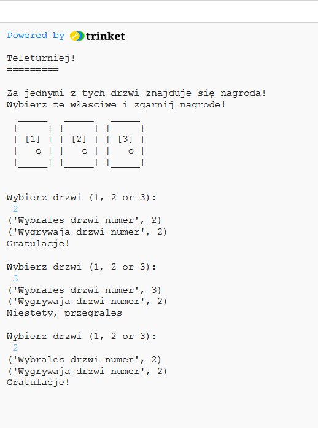
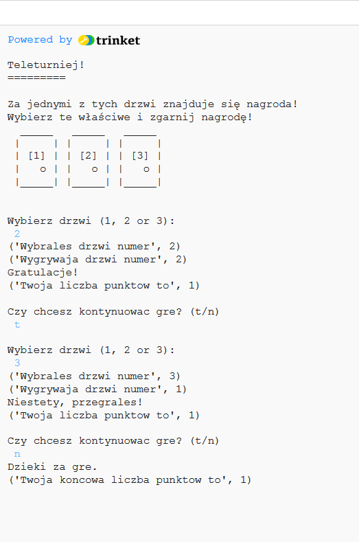
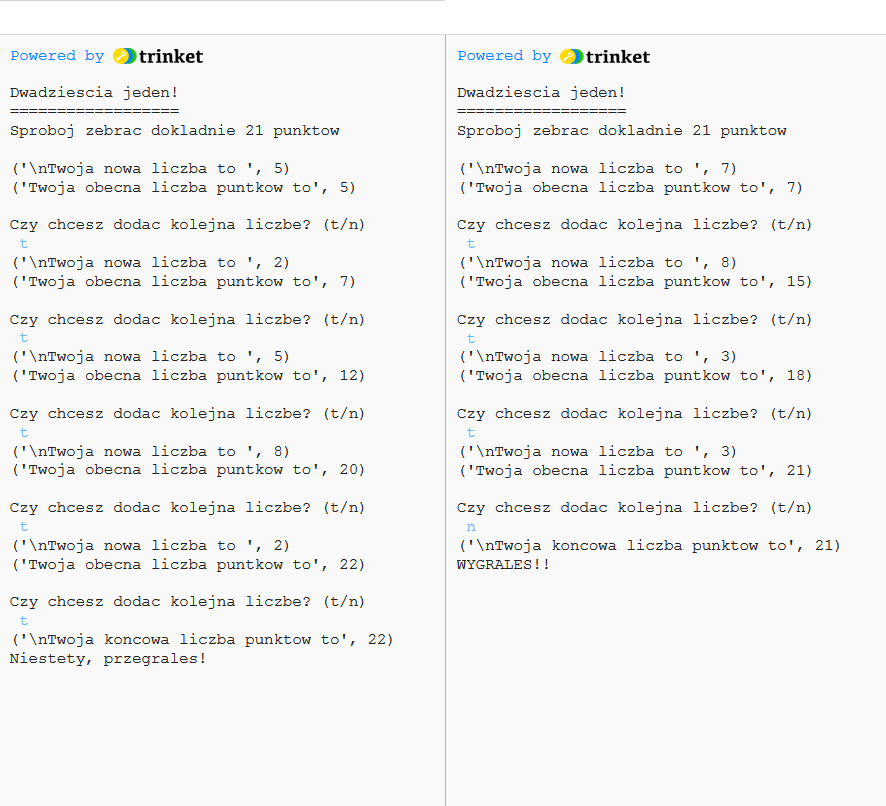

---
title: Teleturniej
level: Python 1
language: pl
stylesheet: python
embeds: "*.png"
materials: ["Project Resources/*.*","Club Leader Resources/*.*"]
...

#Wprowadzenie:  { .intro}

W tym projekcie nauczysz się jak stworzyć grę, w której trzeba zgadnąć za którymi drzwiami ukryta jest nagroda.

#Krok 1: Co jest za drzwiami? { .activity}
## Lista zadań { .check}

+ Wyobraź sobie teleturniej, w którym za jednymi z drzwi skrywa się wspaniała nagroda. Jeśli wybierzesz właściwe drzwi, wygrasz! Jeśli wybierzesz niewłaściwe drzwi, zostaniesz z niczym!

    Możesz zagrać w tę grę uruchamiając następujący program:

    ```python
    from random import *

    #wyswietl 3 drzwi i zasady gry
    print('''
    Teleturniej!
    =========

    Za jednymi z tych drzwi znajduje się nagroda!
    Wybierz te własciwe i zgarnij nagrode!
      _____   _____   _____
     |     | |     | |     |
     | [1] | | [2] | | [3] |
     |   o | |   o | |   o |
     |_____| |_____| |_____|

    Wybierz drzwi (1, 2 or 3):
    ''')

    #wczytaj wybrane drzwi i zapisz je jako liczbe całkowita
    wybraneDrzwi = input()
    wybraneDrzwi = int(wybraneDrzwi)

    #losowo wybierz liczbę oznaczajaca zwycieskie drzwi (liczbe pomiedzy 1 a 3)
    drzwiZNagroda = randint(1,3)

    #wyswietl graczowi wybrane i zwycieskie drzwi
    print("Wybrales drzwi numer", wybraneDrzwi)
    print("Wygrywaja drzwi numer", drzwiZNagroda)

    #gracz wygrywa jesli wybrane drzwi i wygrywajace drzwi sa takie same
    if wybraneDrzwi == drzwiZNagroda:
        print("Gratulacje!")
    else:
        print("Niestety, przegrales")

    ```

    

    Oto jak działa ten program: najpierw wybierana jest losowa liczba od 1 do 3, która oznacza drzwi za którymi jest nagroda. `randint(1,3)` oznacza 'wybierz losową liczbę całkowitą pomiędzy 1 a 3'. Następnie program pyta gracza o jego wybór i wyświetla "Gratulacje!" jeśli te dwie liczby są sobie równe lub "Niestety, przegrałeś!" jeśli się różnią.

    Liczba losowa użyta jest po to, aby wygrywające drzwi były za każdym razem inne. Żeby to zrobić, Python potrzebuje zaimportować kod, który pokaże mu jak to zrobić -  dlatego na początku programu wczytywana jest bilbioteka `random`.

    Linie rozpoczynające się od znaku `#` to komentarze. Są one ignorowane przez Pythona, ale bardzo pomocne w przypominaniu, co dokładnie robi Twój program! Na przyszłość staraj się używać komentarzy w swoich programach do objaśniania bardziej skomplikowanych sekcji.

+ Korzystając z tego, czego nauczyliśmy się do tej pory o pętlach, możesz w prosty sposób ulepszyć program tak, by gracz miał trzy szanse zamiast jednej. Uruchom poniższy program:

    ```python
    from random import *

    #wyswietl 3 drzwi i zasady gry
    print('''
    Teleturniej!
    =========

    Za jednymi z tych drzwi znajduje się nagroda!
    Wybierz te własciwe i zgarnij nagrode!
      _____   _____   _____
     |     | |     | |     |
     | [1] | | [2] | | [3] |
     |   o | |   o | |   o |
     |_____| |_____| |_____|
    ''')

    #daj graczowi 3 szanse
    for szansa in range(3):

        print("\nWybierz drzwi (1, 2 or 3):")

        #wczytaj wybrane drzwi i zapisz je jako liczbe całkowita
        wybraneDrzwi = input()
        wybraneDrzwi = int(wybraneDrzwi)
    
        #losowo wybierz liczbę oznaczajaca zwycieskie drzwi (liczbe pomiędzy 1 a 3)
        drzwiZNagroda = randint(1,3)
    
        #wyswietl graczowi wybrane i zwycieskie drzwi
        print("Wybrales drzwi numer", wybraneDrzwi)
        print("Wygrywaja drzwi numer", drzwiZNagroda)
    
        #gracz wygrywa jesli wybrane drzwi i wygrywające drzwi są takie same
        if wybraneDrzwi == drzwiZNagroda:
            print("Gratulacje!")
        else:
            print("Niestety, przegrales")
    ```

    

    Zauważ, że w tym programie kod wyświetlający drzwi jest _na_ _zewnątrz_ pętli, ponieważ potrzebujemy wyświetlić je tylko raz. Kod w którym generujemy liczby losowe i pytający gracza o wybór drzwi jest _wewnątrz_ pętli, ponieważ każda z tych czynności powinna być wykonana 3 razy. Gdyby kod generujący liczbę losową był umieszczony na zewnątrz pętli, drzwi z nagrodą byłyby takie same dla każdej szansy gracza.

    Dodatkowo, `\n` w linii `print("\nWybierz drzwi (1, 2 or 3):")` wywietla nową pustą linię na ekranie. Dzięki temu tekst jest podzielony i łatwiejszy do przeczytania.

## Zapisz Swój Projekt {.save}

## Wyzwanie: Liczenie punktów { .challenge}
Stwórz zmienną, w której zapisywane będzie ile razy gracz odgadnął właściwe drzwi. Potrzebujesz pomocy? Pamiętaj, że to zadanie jest podobne do liczenia punktów w programie `quiz`! Nie zapomnij wyświetlić graczowi ilości punktów na końcu programu (na zewnątrz pętli).

## Zapisz Swój Projekt {.save}

#Krok 2: Pętle `while` { .activity}
## Lista Zadań { .check}

+ Zamiast powtarzać program w pętli zadaną ilość razy, może lepiej byłoby pozwolić graczowi odpowiadać tak długo, jak długo chce grać? Aby to osiągnąć potrzebna będzie inna pętla, nazywana pętlą `while`. Wypróbuj ten program:

    ```python
    from random import *

    #gracz ustawia ta zmienna aby zakonczyc gre ('True' po angielsku znaczy prawda)
    gramDalej = True

    punkty = 0

    #wyswietl 3 drzwi i zasady gry
    print('''
    Teleturniej!
    =========

    Za jednymi z tych drzwi znajduje się nagroda!
    Wybierz te właściwe i zgarnij nagrodę!
      _____   _____   _____
     |     | |     | |     |
     | [1] | | [2] | | [3] |
     |   o | |   o | |   o |
     |_____| |_____| |_____|
    ''')

    #powtarzaj zawsze wtedy, gdy  zmienna 'gramDalej' jest ustawiona na 'True'
    while gramDalej == True:

        print("\nWybierz drzwi (1, 2 or 3):")

        #wczytaj wybrane drzwi i zapisz je jako liczbe calkowita
        wybraneDrzwi = input()
        wybraneDrzwi = int(wybraneDrzwi)

        #losowo wybierz liczbe oznaczajaca zwycieskie drzwi (liczbe pomiedzy 1 a 3)
        drzwiZNagroda = randint(1,3)

        #wyswietl graczowi wybrane i zwycieskie drzwi
        print("Wybrales drzwi numer", wybraneDrzwi)
        print("Wygrywaja drzwi numer", drzwiZNagroda)

        #gracz wygrywa, jesli wybrane drzwi i wygrywajace drzwi sa takie same
        if wybraneDrzwi == drzwiZNagroda:
            print("Gratulacje!")
            punkty = punkty + 1
        else:
            print("Niestety, przegrales!")

        print("Twoja liczba punktow to", punkty)

        #zapytaj gracza, czy chce kontynuowac gre
        print("\nCzy chcesz kontynuowac gre? (t/n)")
        odpowiedz = input()
        #zakoncz gre jesli gracz wpisze 'n'
        if odpowiedz == 'n':
            gramDalej = False

    print("Dzieki za gre.")
    print("Twoja koncowa liczba punktow to", punkty)
    ```

    

    Pętla `while` pozwala powtarzać program _do_ _momentu_, w którym stanie się coś, co go zatrzyma. W tym programie gracz gra tak długo, jak długo zmienna `gramDalej` jest ustawiona na `True`. Jeśli gracz nie ma ochoty grać dalej i wpisze `n`, zmienna `gramDalej` ustawiana jest na `False` (`False` po angielsku to nieprawda) i pętla przestaje się wykonywać. Dane, które mają dwa stany: `True` i `False` nazywane są zmiennymi _logicznymi_ (lub _boolowskimi_).

+ Poproś kogoś, by pomógł Ci przetestować Twoją grę, aby upewnić się, że program wykonuje się dopóki nie zostanie wpisanie `n`.

## Wyzwanie: Naprawianie odpowiedzi gracza { .challenge}
+ Co się stanie, kiedy gracz spróbuje zakończyć grę wpisując `N` zamiast `n`? Potrafisz użyć funkcji `lower()` do naprawienia tego problemu?

+ Co się stanie, jeśli gracz wpisze `no` , a nie po prostu `n`? Czy potrafisz poprawić swój program tak, aby zakończył się, jeśli racz wpisze `odpowiedz == 'n' lub odpowiedz == 'no'`answer == 'n' or answer == 'no'`?? 

## Wyzwanie: Przegrana { .challenge}
Czy potrafisz zmodyfikować swoją grę tak, aby suma punktów gracza spadała do zera, kiedy wybierze niewłaściwe drzwi? Czy po takiej zmianie jest jeszcze zabawniej czy gra staje się zbyt trudna?

#Krok 3: Czy masz szcęście? { .activity}
## Lista Zadań { .check}

+ Zamiast powtarzać próby, aż gracz postanowi zakończyć grę, można ustawić grę tak, aby kończyła się po zdobyciu przez gracza trzech punktów. Celem gry byłoby wtedy zgromadzenie trzech punktów w jak najmniejszej liczbie prób:

    ```python
    from random import *

    #ta zmienna mówi, ile prób już wykorzystano
    liczbaProb = 0

    punkty = 0

    #wyswietl 3 drzwi i zasady gry
    print('''
    Teleturniej!
    =========

    Za jednymi z tych drzwi znajduje się nagroda!
    Wybierz te właściwe i zgarnij nagrodę!
      _____   _____   _____
     |     | |     | |     |
     | [1] | | [2] | | [3] |
     |   o | |   o | |   o |
     |_____| |_____| |_____|
    ''')

    #powtarzaj, dopóki suma punktów jest mniejsza od 3
    while punkty < 3:

        #dodaj 1 do liczby wykorzystanych prób
        liczbaProb = liczbaProb + 1
        
        print("\nProba", liczbaProb, ": Wybierz drzwi (1, 2 or 3):")

        #wczytaj wybrane drzwi i zapisz je jako liczbe calkowita
        wybraneDrzwi = input()
        wybraneDrzwi = int(wybraneDrzwi)
        
        #losowo wybierz liczbe oznaczajaca zwycieskie drzwi (liczbe pomiedzy 1 a 3)
        drzwiZNagroda = randint(1,3)

        #wyswietl graczowi wybrane i zwycieskie drzwi
        print("Wybrales drzwi numer", wybraneDrzwi)
        print("Wygrywaja drzwi numer", drzwiZNagroda)

        #gracz wygrywa, jesli wybrane drzwi i wygrywajace drzwi sa takie same
        if wybraneDrzwi == drzwiZNagroda:
            print("Gratulacje!")
            punkty = punkty + 1
        else:
            print("Niestety, przegrales!")

        print("Twoja liczba punktow to", punkty)
        
    print("\n** Udalo sie! Zgromadziles trzy punkty w", liczbaProb,"probach **")
    ```

    Pętla `while` w tym programie wykonuje się tak długo, jak długo suma punktów gracza jest mniejsza od trzech (`while punkty < 3:`). Gdy gracz zgromadzi trzy punkty, program się kończy i wyświetla liczbę wykonanych prób.

## Zapisz swój projekt {.save}

## Wyzwanie: Dwadzieścia jeden { .challenge}
Czy potrafisz stworzyć grę, której celem jest zgromadzenie dokładnie 21 punktów? Program powinien wybrać losową liczbę od 1 do 10, która zostanie dodana do sumy punktów zdobytych przez gracza. Następnie gracz wybiera pommiędzy zachowaniem obecnej sumy punktów lub dodaniem do niej oklejnej losowo wybranej liczby. Wygrana oznacza zgromadzenie dokładnie 21 punktów. Pamiętaj o dodaniu komentarzy do swojego programu! 

Oto przykład gry:



Możesz używać (lub zmieniać) elementów swojego programy "Teleturniej", by utworzyć nową grę. Oto kilka wskazówek:

+ Możesz użyć pętli `while`, aby program wykonywał się tak długo, jak gracz będzie chciał kontynuować:

```python
while gramDalej == True:
```

+ Jeśli gracz wpisze `n` aby zachować obecną sumę punktów, możesz ustawić wartość zmiennej `gramDalej` na `False`:

```python
if odpowiedz == 'n':
    gramDalej = False
```

+ Na końcu programu (na zewnątrz pętli `while`), możesz wyświetlić "Gratulacje!" graczowi, który zdobędzie dokładnie 21 punktów:

```python
if punkty == 21:
    print("Gratulacje!")
```

## Zapisz swój projekt {.save}
