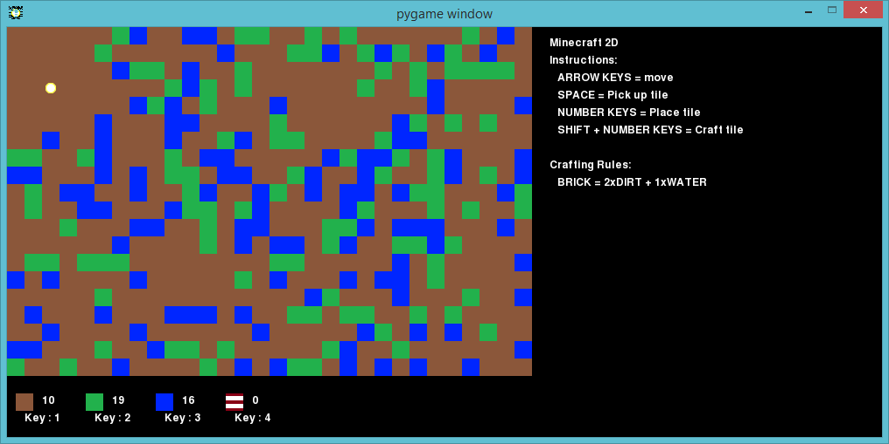
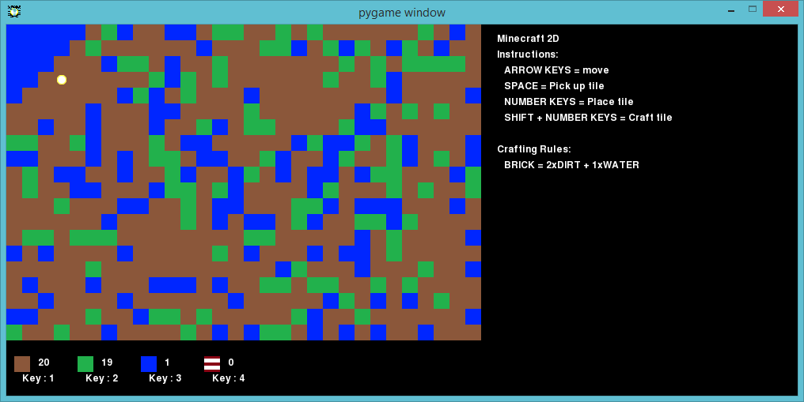

---
title: Minecraft 2D
level: Python 2
language: en
stylesheet: python
embeds: "*.png"
materials: ["Project Resources/*.*"]
...

# Introduction { .intro}

In this project, you’ll design and code improvements to a 2D version of Minecraft.

# Step 1: Playing the game { .activity}

## Activity Checklist { .check}

  + Run the Minecraft2D.py file and you should see a screen that looks like this:

    

  + Your character is the yellow circle in the top-left of the game screen! Use the arrow keys to move around the world, which as you can see is full of different resources; dirt (the brown squares), grass (the green ones) and water (the blue ones).

  + You can press the spacebar to collect resources. For example, move onto some water and press spacebar, you’ll see that you now have one more water in your inventory. Pick up a few of each type of resource.

    

  + Press the number keys (1 to 4) to place a resource on the map. For example, press 3 to place some water on the map. This will only work if you have some spare water in your inventory.

    

  + You can craft an item by holding down the shift key and pressing a number. Crafting means combining items you already have in your inventory to create new ones. Try holding shift and pressing 4 to craft a new brick (as long as you have 2 dirt and 1 water in your inventory).

    

  + As you play, you’ll notice that you can only hold a maximum of 20 of each resource in your inventory. If you want to increase this, you can change the variable called `MAXTILES` in the variables.py file.

    ```python
  	# the maximum number of each resource that can be held
  	# ----------------------------------------------------

  	MAXTILES  = 20
    ```

    Change this number and then double-click the Minecraft.py file to store more of each resource.

## Save Your Project {.save}

## Challenge: Build your world { .challenge}

Play around with the game and see what you can build. Can you build a house, with a garden and a lake? A swimming pool? What else can you create?

Here’s a simple example:


## Save Your Project {.save}

# Step 2: Making things look nice { .activity}

Just having blocks of colour for each resource isn’t very interesting, so let’s try changing the graphics for each resource.

## Activity Checklist { .check}

  + In the Minecraft2D folder you’ll see that there are lots of images, one for each of the resources. If you right-click one of these images and open it in an image editor, you can change the graphics for a resource.

    Here are some improved graphics for the grass. I’ve added different shades of grass and even a few flowers:

    

  + Save the image and then reload the game and you’ll see the new graphics:

    

## Save Your Project {.save}

## Challenge: Improving the graphics { .challenge}

Open the images for dirt, water and brick, and see if you can improve the graphics for these resources.

## Save Your Project {.save}

## Challenge: Customising the game { .challenge}

Open the variables.py file and you’ll find some code for setting the image and caption for the game window:

```python
# the title bar text/image
# ------------------------

pygame.display.set_caption('pygame window')
pygame.display.set_icon(pygame.image.load('player.png'))
```

Edit these 2 lines of code to customise your game. Remember that if you change the icon to a new file then you’ll have to create it!

## Save Your Project {.save}

# Step 3: Adding more resources { .activity}

You only have 4 resources in your game; dirt, grass, water and brick. Let’s add more!

## Activity Checklist { .check}

  + Let’s firstly create the graphics for a new resource called ‘wood’. You can make a copy of an existing image and rename it. You can then edit the image to look like wood:

    

  + Once you have your image for wood, you can then add the resource to your game. Open the variables.py file and add wood as a resource:

    ```python
    # variables representing the different resources
    # ----------------------------------------------

    DIRT  = 0
    GRASS = 1
    WATER = 2
    BRICK = 3
    WOOD  = 4

    ```

  + In the same file, there is also a list of all the resources. You should add wood to that list too:

    ```python
    # a list of all game resources
    # ----------------------------

    resources = [DIRT,GRASS,WATER,BRICK,WOOD]
    ```

  + You also need to set the image for the wood resource in the textures dictionary, so that the correct graphics will be shown:

    ```python
    # a dictionary linking resources to textures
    # ------------------------------------------

    textures =   {
                    DIRT    : pygame.image.load('dirt.png'),
                    GRASS   : pygame.image.load('grass.png'),
                    WATER   : pygame.image.load('water.png'),
                    BRICK   : pygame.image.load('brick.png'),
                    WOOD    : pygame.image.load('wood.png')
                 }
    ```

    Notice that you need to add a comma (`,`) after the brick image in the line above.

  + You can also add wood to your inventory dictionary. You can choose how many you start with:

    ```python
    # the number of each resource that we have to start with
    # ------------------------------------------------------

    inventory =   {
                    DIRT    : 10,
                    GRASS   : 10,
                    WATER   : 10,
                    BRICK   : 0,
                    WOOD    : 5
                }
    ```

  + If you now run the game, you’ll see that you now have a wood resource that you can place on the map, but there isn’t any wood on the map to begin with:

    

  + To start the game with some wood resources dotted around, you need to edit the Minecraft2D.py file. Open the file and add the following lines:

    ```python
    # pick a random number between 0 and 9
    randomNumber = random.randint(0,10)
    # WATER if the random number is a 1 or a 2
    if randomNumber in [1,2]:
        tile = WATER
    # GRASS if the random number is a 3 or a 4
    elif randomNumber in [3,4]:
        tile = GRASS
    # ADD THESE 2 LINES - WOOD if the random number is a 5
    elif randomNumber in [5]:
        tile = WOOD
    # otherwise it's DIRT
    else:
        tile = DIRT
    ```

    Do you know what this code does? For each space on the map, the program chooses a random number between 0 and 9. Whenever the random number is a 5, wood is placed on the map. After you add this code, you should see some wood in your game:

    

## Save Your Project {.save}

## Challenge: Adding resources { .challenge}

Use the instructions above to add your own resources. You can add lava, metal, sand or anything else you can think of!

## Save Your Project {.save}

# Step 4: Crafting new resources { .activity}

You can add more resources to your game that the player can only get by crafting them. Let’s create a new ‘plank’ resource, so that the player can combine 3 wood resources together to make a nice shiny plank of wood!

## Activity Checklist { .check}

  + Follow the instructions in step 3 above to make a new ‘plank’ resource. However, make sure that there are 0 planks in the player’s inventory, and that there aren’t any planks on the map to begin with.

    

  + To allow the player to craft planks of wood, you'll need to add a crafting rule to your game. Open the variables.py file and add the following code to the crafting rules dictionary:

    ```python
    # rules to make new objects
    # -------------------------

    craft = {
                BRICK    : { WATER : 1, DIRT : 2 },
                PLANK    : { WOOD : 3 }
            }
    ```

    This code tells the game that it can create a new plank if there are 3 wood in the player's inventory. Again, don’t forget the comma after the line above.

  + You need to make sure that the player knows how to craft planks, by adding some more instructions to the list:

    ```python
    # instructions list
    # -----------------

    instructions =  [
                        "Minecraft 2D",
                        "Instructions:",
                        "   ARROW KEYS = move",
                        "   SPACE = Pick up tile",
                        "   NUMBER KEYS = Place tile",
                        "   SHIFT + NUMBER KEYS = Craft tile",
                        "",
                        "Crafting Rules:",
                        "   BRICK = 2xDIRT + 1xWATER",
                        "   PLANK = 3xWOOD"
                    ]
    ```

  + If you collect 3 wood and hold down shift and press 6, you should see a new plank in your inventory. You can then add planks of wood to your map!

    

## Save Your Project {.save}

## Challenge: Develop your own game { .challenge}

Use what you’ve learnt to create your own resources and crafting rules. For example, you could code crafting rules for making glass (from sand) diamond (from glass) or trees (from wood, water and dirt).

## Save Your Project {.save}
