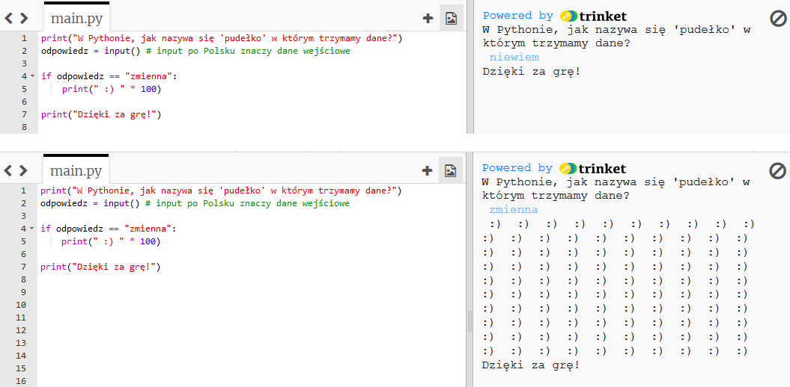
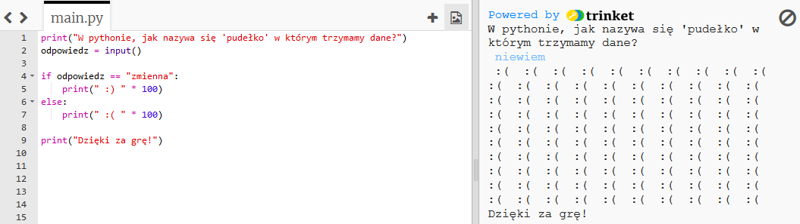
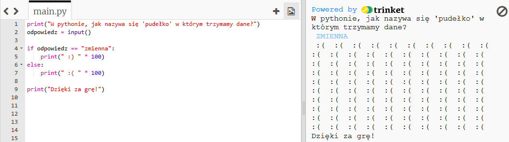
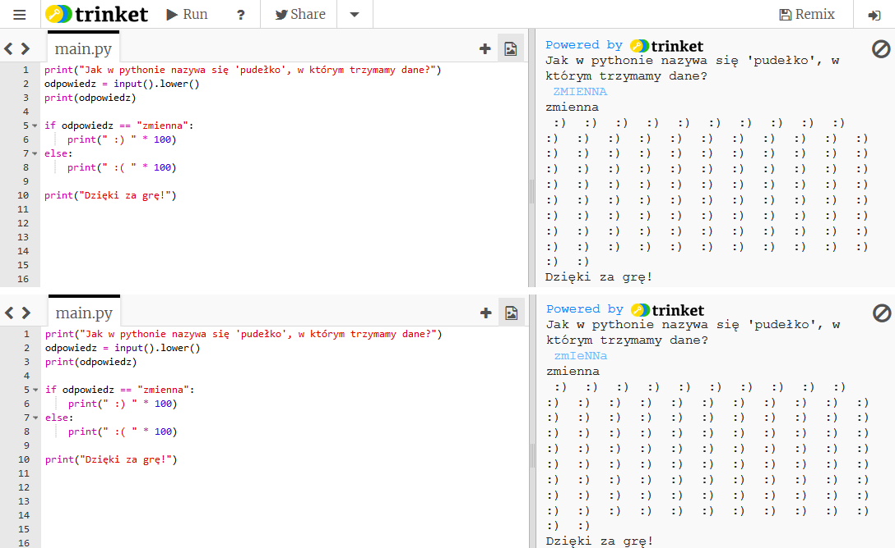
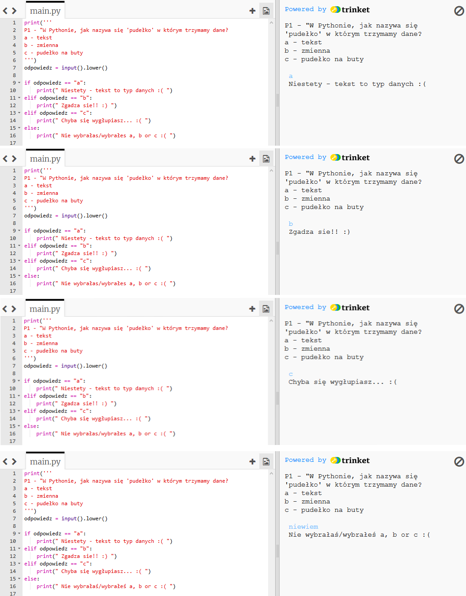

---
title: Quiz
level: Python 1
language: en
stylesheet: python
embeds: "*.png"
materials: ["Project Resources/Quiz.py"]
...

# Introduction:  { .intro}

In this project, you'll make a quiz game to challenge your friends.

# Step 1: Asking a question { .activity}

## Activity Checklist { .check}

+ Let's start by writing a very simple quiz program that asks the player a question, then shows them smiley faces if they input the correct answer.

	```python
	print("In Python, what do you call a 'box' used to store data?")
	answer = input()

	if answer == "variable":
		print(" :) " * 100)

	print("Thank you for playing!")
	```

	Take care to add the colon (`:`) to the end of the line `if answer == "variable":`, and indent the line below it (move it to the right) with spaces.

+ Once you've written the program above, try it out! What happens when you get the answer right? What happens when you get it wrong?

	

	The indented code (that prints the smiley faces) only runs *if* the answer is correct. But "Thank you for playing!" always appears, whether your answer is right or wrong. Why is that?

	Python uses two equals signs `==` to check if two things are the same. This is because one equals sign `=` is used to store something in a variable (for example `answer = input()`).

+ The program above prints smiley faces if the player gets the question right, but doesn't print anything to tell them they got the answer wrong. You can use an `else` statement to print sad faces if the user inputs anything other than the correct answer.

	```python
	print("In Python, what do you call a 'box' used to store data?")
	answer = input()

	if answer == "variable":
		print(" :) " * 100)
	else:
		print(" :( " * 100)

	print("Thank you for playing!")
	```

	Try out this new program. What happens when you enter the right answer? What happens when you enter anything else?

	

## Save Your Project {.save}

## Challenge: Question time { .challenge}

Use what you've learnt so far to create your own quiz. You can choose any topic you like, and your quiz should use `if` and `else` statements to let the player know how they're doing.

## Save Your Project {.save}

# Step 2: Testing { .activity}

It's always a good idea to test your programs, to make sure that they work properly.

## Activity Checklist { .check}

+ If you've tested your quiz, you may have noticed it's possible to get sad faces even when you input a correct answer! Like in this example, where the player has accidently presSED CAPS LOCK!

	

	This happens because Python is very strict when it compares the player's answer to the correct answer. To Python, "V" isn't the same as "v", and so if the player uses any capital letters in their answer, Python thinks the answer's wrong!

	Test this out in your game, to see if the same thing happens.

+ To fix the problem, you need to convert the player's input to lower case, so there are no capital letters in their answer. We can make sure this works by printing the modified answer. Make this change where the player inputs their answer:

	```python
	answer = input().lower()
	print(answer)
	```

+ Now test your quiz again. Have you fixed the problem? Try testing these examples:

	

## Save Your Project {.save}

# Step 3: Multiple choice { .activity}

## Activity Checklist { .check}

+ So far you've used `if` and `else` to let the player know if they got the answer right or wrong. But what if you wanted a multiple choice question, where the user could see one of 4 messages? You can use an `elif` statement to do this.

	```python
	print('''
	Q1 - In Python, what do you call a 'box' used to store data?
	a - text
	b - variable
	c - a shoe box
	''')
	answer = input().lower()

	if answer == "a":
		print(" Nope - text is a type of data :( ")
	elif answer == "b":
		print(" Correct!! :) ")
	elif answer == "c":
		print(" Don't be silly! :( ")
	else:
		print(" You didn't choose a, b or c :( ")
	```

	`elif` is short for "else if". So in the program above, the player sees one of 4 messages, depending on what they entered for their answer.

+ Add the code above to your quiz, so that you have a multiple choice question.

+ Test this new question 4 times, so that you see each of the 4 messages.

	

## Save Your Project {.save}

## Challenge: Multiple choice quiz  { .challenge}

Add a few multiple choice questions to your quiz program. Once you have finished making your quiz, get someone else to play it! How did they do? Did they enjoy it? Was it too easy or too hard?

## Save Your Project {.save}

## Challenge: Keeping score  { .challenge}

Can you use a `score` variable in your quiz program, to keep track of the player's score? This is how the variable could be used:

+ At the start of the program, set the score to 0.
+ Whenever a question is answered correctly, add 1 to the player's score. (`score = score + 1`)
+ Print the player's score at the end of the quiz.

## Save Your Project {.save}

## Challenge: How did I do?  { .challenge}

Can you print a personalised message to the player at the end of the game?

+ Say "well done" `if` they got all of the questions right.
+ `else` say "try again" if they got any wrong.

(You'll need to use your `score` variable to decide which message to print!)

## Save Your Project {.save}
