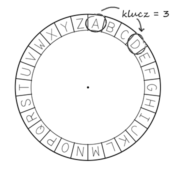
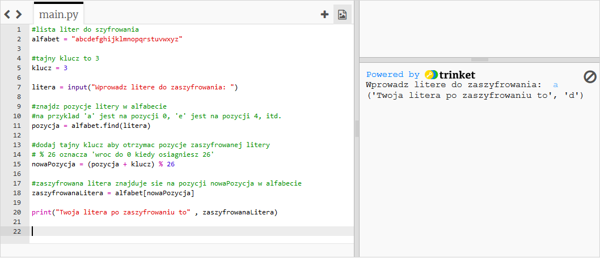
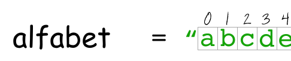
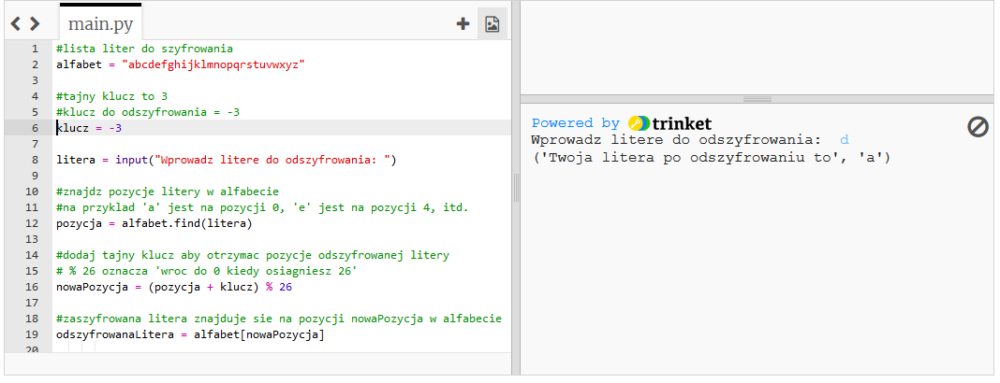
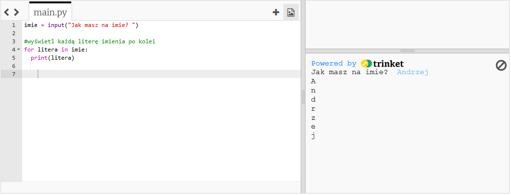
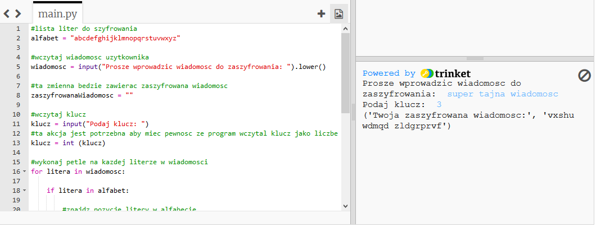
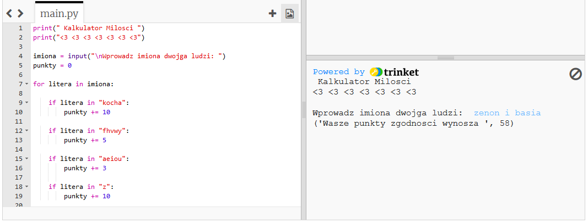

---
title: Secret Messages
level: Python 2
language: en
stylesheet: python
embeds: "*.png"
materials: ["Project Resources/*.*","Club Leader Resources/*.*"]
...

#Introduction:  { .intro}
In this project, you'll learn how to make your own encryption program, to send and receive secret messages to a friend.

#Step 1: Encrypting letters { .activity}

A cipher is a type of secret code, where you swap the letters around so no-one can read your message. You'll be using one of the oldest and most famous ciphers, the Caesar cipher, which is named after some guy called Julius Caesar.

You start by drawing the letters in a circle, like this:


To make a secret encrypted letter from a normal one, you need to have a secret key. For our example, let's use the number 3. To encrypt the letter 'a', you just move 3 letters clockwise, which gives us 'd':



To decrypt the message, you just move 3 letters anti-clockwise.

## Activity Checklist { .check}

+ Let's start by writing a Python program to encrypt a single character. Run this program, and enter the letter 'a' to check that it works:

	```python
	#a list of the letters to encrypt
	alphabet = "abcdefghijklmnopqrstuvwxyz"

	#the secret key is 3
	key = 3

	character = input("Please enter a character to encrypt: ")

	#find the position of the character in the alphabet
	#e.g. 'a' is position 0, 'e' is position 4, etc.
	position = alphabet.find(character)

	#add the secret key to find the encrypted character position
	# % 26 means 'go back to 0 once you get to 26'
	newPosition = (position + key) % 26

	#the encrypted letter is in the alphabet at newPosition
	encryptedLetter = alphabet[newPosition]
	        
	print("Your encrypted letter is" , encryptedLetter)
	```

	

+ In Python, text can be thought of as lots of characters joined together (called an _array_ of characters). The line:

	```python
	position = alphabet.find(character)
	```

	finds the position of the character in the `alphabet`. In most programming languages, positions always start at 0 and not 1, so in the text "abcdefghijklmnopqrstuvwxyz", 'a' is the character at position 0, 'b' is at position 1, and so on.

	

	Next, the secret key is added to the `position`, to get the `newPosition` of the encrypted character. So in the example, 'a' is at position 0, so after adding the key, we get `0 + 3 = 3`.  

	The code `% 26` means that when finding the position number of the encrypted character, the number is reset to 0 once it gets to 26. This means that the 'z' in our cipher joins back up to the 'a' again. 

	Next, this new position is used to find the encrypted character in the `alphabet`, and add it to the `encryptedMessage`, before finally printing the complete encrypted message. The code:

	```python
	alphabet[newPosition]
	```

	looks up the letter at a certain position. So `alphabet[0]` is 'a', `alphabet[3]` is 'd'.

	Also, notice that in this program you have used a short way of getting input from the user. Instead of writing:

	```python
	print("Please enter a character to encrypt: ")
	character = input()
	```

	You can just use the line:

	```python
	character = input("Please enter a character to encrypt: ")
	```

+ You can use the same program to decrypt a character, by using a key of, say, `-3` instead of `3`. This means that to decrypt a letter, you move backwards through the alphabet and not forwards, going back to 'z' once you get to 'a'.

	

	If you'd prefer to have separate encryption and decryption programs, just change this code to go backwards through the alphabet:

	```python
	#subtract the key to go backwards
	newPosition = (position - key) % 26
	```

## Save Your Project {.save}

## Challenge: Variable keys { .challenge}
Modify the encryption program above, so that the user can enter their own key to use. You'll need to get the user's input, and store it in the `key` variable. Remember to use the `int()` function to convert the input to a whole number.

## Save Your Project {.save}

## Challenge: Encrypting and decrypting characters { .challenge}
+ Use your program to encrypt:
	+ The letter 'd', using the secret key 7;
	+ The letter 'x', using the secret key 4;
+ Can you use your program to decrypt this message:
	+ omqemd (the secret key is 12)

## Save Your Project {.save}

#Step 2: Encrypting messages { .activity}

Instead of just encrypting and decrypting messages one character at a time, let's write a program to encrypt and decrypt entire messages!

## Activity Checklist { .check}

+ So far, you have used loops to repeat code:
	+ a set number of times;
	+ until something happens in your program.

	There is a third way to use loops, which is to repeat code for each item in some data. For example, if you wanted to loop through and print each character in someone's name, you could use this program:

	```python
	name = input("What is your name? ")

	#print out each character of their name
	for char in name:
		print(char)
	```

	

	In the program above, each letter of the name is stored in the variable `char` in turn, and then printed. `char` is just a variable name, and so you could change the name of the variable if you want to. Run this program to try it out.

+ You can use this type of loop to go through an entire message, and encrypt it one character at a time:

	```python
	#a list of the letters to encrypt
	alphabet = "abcdefghijklmnopqrstuvwxyz"

	#get the message from the user
	message = input("Please enter a message to encrypt: ").lower()

	#this variable will store the encrypted message
	encryptedMessage = ""

	#get the secret key
	key = input("Please enter the key: ")
	#This action is needed as if not the program wont take key as a number
	key = int (key)

	#loop through each character in the message
	for char in message:

	    if char in alphabet:
	        
			#find the position of the character in the alphabet
			#e.g. 'a' is position 0, 'e' is position 4, etc.
	        position = alphabet.find(char)
	        
			#add the secret key to find the encrypted character position
	        # % 26 means 'go back to 0 once you get to 26'
	        newPosition = (position + key) % 26
	        
	        #add the encrypted letter to the message
	        #the encrypted letter is in the alphabet at newPosition
	        encryptedMessage = encryptedMessage + alphabet[newPosition]
	        
	    else:
	        
	        #some characters (e.g. '£', '?') aren't in the alphabet, 
	        # so just add the unencrypted letter to the message
	        encryptedMessage = encryptedMessage + char

	print("Your encrypted message is:" , encryptedMessage)
	```

	

	In this program, each character of the message is encrypted and added to the `encryptedMessage` variable in turn. At the end of the program, the entire message is printed.

	There are some characters that the user might enter, that aren't in the `alphabet`. For example, spaces, commas and question marks. The statement `if char in alphabet:` means that only characters that appear in the alphabet are encrypted. Any other character is just added to the encrypted message without encrypting it first.

## Save Your Project {.save}

## Challenge: Encrypting and decrypting messages { .challenge}
Encrypt some messages, and give them to a friend along with the secret key. See if they can decrypt them using their program!

## Save Your Project {.save}

## Challenge: Improving your cipher { .challenge}
Can anyone decrypt your messages without the key? Can you change your program, to make it harder for people to crack your messages? Here are some ideas:

+ Jumble up the letters in the `alphabet` variable;
+ Add 1 to the key each time a letter is encrypted;
+ Remove any spaces and other characters from the encrypted message.

## Save Your Project {.save}

## Challenge: Love calculator { .challenge}
Write a program to show how compatible 2 people are, by calculating a compatibility score.



The program could loop through each of the characters in the 2 names, and add points to a `score` variable each time certain letters are found. You should decide on rules for awarding points. For example, you could award points for vowels, or characters that are found in the word "loves":

```python
if char in "aeiou":
	score = score + 5

if char in "loves":
	score = score + 10
```

You could also give the user a personalised message, based on their compatibility score:

```python
if score < 10:
	print("Forget it!")
```

## Save Your Project {.save}


