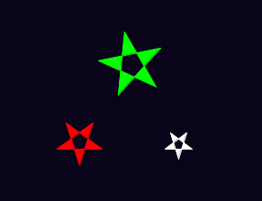
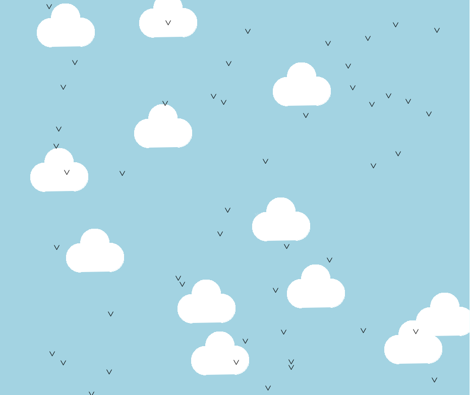

---
title: Teaching Turtles
level: Python 2
language: en
stylesheet: python
embeds: "*.png"
materials: ["Project Resources/*.*","Club Leader Resources/*.*"]
...

#Introduction: { .intro}
In this project, you'll learn more about drawing with the turtle, and how _functions_ can make writing your programs easier.

#Step 1: Drawing stars { .activity}

## Activity Checklist { .check}

+ Let's start by using what you already know about turtles to draw a star. Run this program, but make sure *not* to name the program `turtle.py` - any other name is fine! 

	```python
	from turtle import *

	#this will draw a light grey star on a dark blue background
	color("WhiteSmoke")
	bgcolor("MidnightBlue")

	pendown()
	begin_fill()

	#draw the star shape
	for side in range(5):
	    left(144)
	    forward(50)

	end_fill()
	penup()

	forward(100)
	done()
	```

	

	The only new commands here are `begin_fill()` and `end_fill()`. These commands are used to colour in a shape. Also notice that there is no pen line between the star and the turtle in the image above, as you have used the `penup()` function to stop the turtle drawing.

	Also, you might have noticed the names of some <a href="http://www.w3schools.com/html/html_colornames.asp">new colours</a>! You can also use hex colour codes, just like you did when making web pages.

+ If you wanted to draw 3 stars at different positions around the screen, then you can define your own new function called `drawStar()`, and then just call this new function 3 times:

	```python
	from turtle import *

	#a function for drawing a star
	#'def' means 'define'
	def drawStar():
		pendown()
		begin_fill()
		for side in range(5):
			left(144)
			forward(50)
		end_fill()
		penup()

	#this will draw a light grey star on a dark blue background
	color("WhiteSmoke")
	bgcolor("MidnightBlue")

	#use the function to draw stars!
	drawStar()
	forward(100)
	drawStar()
	left(120)
	forward(150)
	drawStar()

	hideturtle()
	done()
	```

	

	You've seen and used functions before. For example, `penup()` and `pendown()` are functions. When using these functions, you didn't need to know exactly how they worked, you could just use them whenever you needed them. 

	Your new `drawStar()` function works in the same way. Now that you have a function for drawing a star, you don't have to worry about exactly how to draw a star every time, you can just call the function which does all the hard work for you!

## Save Your Project {.save}

## Challenge: More functions { .challenge}
Define and use a function for drawing another shape, like a square or a triangle, or anything else you want to draw!

## Save Your Project {.save}

#Step 2: Passing data to functions { .activity}

You now have a function for drawing stars, but what if you wanted to draw lots of stars that are different sizes? One way would be to create lots of different functions, like `drawBigStar()`, `drawMediumStar()` and `drawSmallStar()`.

A better way is to _pass data_ to your `drawStar()` function, to tell it what size star you want! You've already used lots of functions that receive data before, such as:

```python
forward(100)
```
...which tells the `forward` function to move 100 pixels, and: 

```python
print("Hello")
```
...which tells the `print` function to print "Hello" to the screen.

## Activity Checklist { .check}

+ Here's a program with a `drawStar()` function that can draw stars of different sizes, using whatever number is passed to it.

	```python
	from turtle import *

	#a function for drawing a star of a particular size
	def drawStar(starSize):
		pendown()
		begin_fill()
		for side in range(5):
			left(144)
			forward(starSize)
		end_fill()
		penup()

	#this will draw a light grey star on a dark blue background
	color("WhiteSmoke")
	bgcolor("MidnightBlue")

	#use the function to draw stars of different sizes!
	drawStar(50)
	forward(100)
	drawStar(30)
	left(120)
	forward(150)
	drawStar(70)

	hideturtle()
	done()
	```

	

	When your program runs the line `drawStar(50)`, the number `50` is passed to the `drawStar()` function, and so the value of `starSize` is set to `50`. This means that the line `forward(starSize)` draws a line 50 pixels long.

	

+ You can pass as much data to your `drawStar()` function as you want. For example, you could also pass the colour of the star you want to draw:

	```python
	from turtle import *

	#a function for drawing a star of a particular size
	def drawStar(starSize, starColour):
		color(starColour)
		pendown()
		begin_fill()
		for side in range(5):
			left(144)
			forward(starSize)
		end_fill()
		penup()

	#this will draw a dark blue background
	bgcolor("MidnightBlue")

	#use the function to draw stars of different sizes!
	drawStar(50, "Red")
	forward(100)
	drawStar(30, "White")
	left(120)
	forward(150)
	drawStar(70, "Green")

	hideturtle()
	done()
	```

	

	Calling the function `drawStar(50, "red")` works in the same way as before, except now the first piece of data (`50`) becomes the value of `starSize`, and the second piece of data (`"Red"`) becomes the value of `starColour`.

## Save Your Project {.save}

## Challenge: Drawing planets { .challenge}
Create a function for drawing a planet called `drawPlanet()`. Pass data to the function, so that you can specify the size and colour of the planet you want to draw.

## Save Your Project {.save}

#Step 3: Random stars { .activity}

Let's use the `drawStar()` function to draw different sized stars randomly around the screen.

## Activity Checklist { .check}

+ Run this program, which moves the turtle to a new position, and then draws a white star:

	```python
	from turtle import *

	#a function for drawing a star of a particular size
	def drawStar(starSize, starColour):
		color(starColour)
		pendown()
		begin_fill()
		for side in range(5):
			left(144)
			forward(starSize)
		end_fill()
		penup()

	#this will draw a dark blue background
	bgcolor("MidnightBlue")

	#move to a different location (x=200,y=200)
	penup()
	setpos(200 , 200)
	pendown()

	#use the function to draw a large red star
	drawStar(50, "White")

	hideturtle()
	done()
	```

	The `setpos()` function moves the turtle to whatever x and y coordinates are passed to it. In the program above, the code `setpos(200 , 200)` moves the turtle to the point x=200, y=200 on the screen. What would happen if you changed the numbers passed to the `setpos()` function?

	

+ You'll be using code to move to a random location a lot, so let's define another function called `moveToRandomLocation()`, which, well, moves the turtle to a random location (obviously)!

	```python
	from turtle import *
	from random import *

	#a function for moving the turtle to a random location
	def moveToRandomLocation():
		penup()
		setpos( randint(-400,400) , randint(-400,400) )
		pendown()

	#a function for drawing a star of a particular size
	def drawStar(starSize, starColour):
		color(starColour)
		pendown()
		begin_fill()
		for side in range(5):
			left(144)
			forward(starSize)
		end_fill()
		penup()

	#this will draw a dark blue background
	bgcolor("MidnightBlue")

	#draw 30 stars (random sizes/locations)
	for star in range(30):
		moveToRandomLocation()
		drawStar( randint(5,25) , "White")

	hideturtle()
	done()
	```

	

	As you can see, this program draws 30 stars, each time moving to a random location and then drawing a star with a random size between 5 and 25 pixels. Remember that the code `randint(5,25)` chooses a random number between 5 and 25.

## Save Your Project {.save}

#Step 4: Functions within functions { .activity}

You can write functions that make use of other functions, to make writing large programs even easier!

## Activity Checklist { .check}

+ It would be great if we could add a galaxy of small multi-coloured stars to our drawing. As we already have a function to draw stars, we can create another function called `drawGalaxy()` that makes use of the `drawStar()` function that we already have:

	```python
	from turtle import *
	from random import *

	#a function for moving the turtle to a random location
	def moveToRandomLocation():
		penup()
		setpos( randint(-400,400) , randint(-400,400) )
		pendown()

	#a function for drawing a star of a particular size
	def drawStar(starSize, starColour):
		color(starColour)
		pendown()
		begin_fill()
		for side in range(5):
			left(144)
			forward(starSize)
		end_fill()
		penup()

	#a function for drawing a small galaxy of stars
	def drawGalaxy(numberOfStars):
		starColours = ["#058396","#0275A6","#827E01"]
		moveToRandomLocation()
		#draw lots of small coloured stars
		for star in range(numberOfStars):
			penup()
			left( randint(-180,180) )
			forward( randint(5,20) )
			pendown()
			#draw a small star in a random colour
			drawStar( 2, choice(starColours) )
	                
	speed(11)

	#this will draw a dark blue background
	bgcolor("MidnightBlue")

	#draw 30 white stars (random sizes/locations)
	for star in range(30):
		moveToRandomLocation()
		drawStar( randint(5,25) , "White")

	#draw 3 small galaxies of 40 stars
	for galaxy in range(3):
		drawGalaxy(40)

	hideturtle()
	done()
	```

	

	Calling `drawGalaxy(40)` 3 times means that 3 new galaxies are drawn, each containing 40 stars. For each galaxy, the `drawStar()` function is run 40 times, each time moving a small random amount before drawing a really small random colour star.

	The code `speed(11)` has also been added to speed up the turtle!

+ You can also draw constellations made up of stars, joined together with white lines. Again, this is really easy to do, because you already have the function to draw stars!

	```python
	from turtle import *
	from random import *

	#a function for moving the turtle to a random location
	def moveToRandomLocation():
		penup()
		setpos( randint(-400,400) , randint(-400,400) )
		pendown()

	#a function for drawing a star of a particular size
	def drawStar(starSize, starColour):
		color(starColour)
		pendown()
		begin_fill()
		for side in range(5):
			left(144)
			forward(starSize)
		end_fill()
		penup()

	#a function for drawing a small galaxy of stars
	def drawGalaxy(numberOfStars):
		starColours = ["#058396","#0275A6","#827E01"]
		moveToRandomLocation()
		#draw lots of small coloured stars
		for star in range(numberOfStars):
			penup()
			left( randint(-180,180) )
			forward( randint(5,20) )
			pendown()		
			#draw a small star in a random colour
			drawStar( 2, choice(starColours) )
	                
	#a function for drawing a joined constellation of stars
	def drawConstellation(numberOfStars):
		moveToRandomLocation()
		#first draw all stars except the last one,
		#joined by lines, like this: *--*--*--
		for star in range(numberOfStars-1):
			drawStar( randint(7,15) , "white")
			pendown()
			left( randint(-90,90) )
			forward( randint(30,70) )
		#now draw the last star
		drawStar( randint(7,15) , "White")

	speed(11)

	#this will draw a dark blue background
	bgcolor("MidnightBlue")

	#draw 30 white stars (random sizes/locations)
	for star in range(30):
		moveToRandomLocation()
		drawStar( randint(5,25) , "White")

	#draw 3 small galaxies of 40 stars
	for galaxy in range(3):
		drawGalaxy(40)

	#draw 2 constellations, each with a random number of stars
	for constellation in range(2):
		drawConstellation(randint(4,7))

	hideturtle()
	done()
	```

	

## Save Your Project {.save}

## Challenge: Functions everywhere! { .challenge}
Program the turtle to draw your own picture. Try to use functions wherever possible, to draw any shapes that you'll use a lot.

For example, you could draw a house, using `drawSquare()` and `drawTriangle()` functions.

You could even pass data to your functions, to allow you to draw shapes in different sizes and colours! Here are some examples:




## Save Your Project {.save}