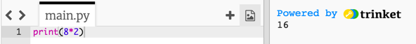
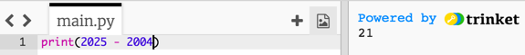
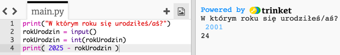
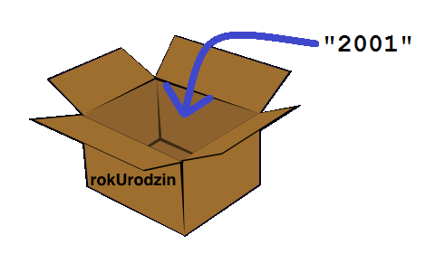
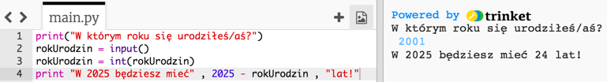
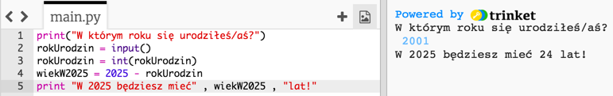
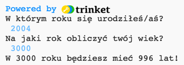
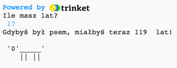

---
title: Rok 2025
level: Python 1
language: pl
stylesheet: python
embeds: "*.png"
materials: ["Club Leader Resources/*.*"]
...

# Wstęp  {.intro}

Wykonując ten projekt nauczysz się, jak napisać program, który powie ci ile będziesz mieć lat w 2025 roku!

# Krok 1: Ile? {.activity}

## Lista zadań {.check}

+ W języku Python możesz na ekranie wyświetlać nie tylko tekst, ale także liczby. Na przykład jeśli razem z kolegami i koleżankami w ósemkę będziecie składać się na prezent dla kogoś i każdy da po 2 złote, możesz użyć tego programu, aby sprawdzić ile uda wam się zebrać razem:

	```python
	print(8*2)
	```

	Gwiazdka `*` w tym programie to znak mnożenia, więc program powinien wyświetlić wynik działania 8 x 2.

+ Otwórz edytor trinket.io i uruchom powyższy program, a zobaczysz wynik:

	

## Zapisz swój projekt {.save}

## Wyzwanie: Kieszonkowe {.challenge}
Napisz w Pythonie program, który policzy, ile zarobisz pieniędzy, jeśli umyjesz 12 samochodów, a za każdy będziesz brał 2,50zł.

Uwaga! W języku Python pisząc liczbę z przecinkiem (np. `2,50`) zamiast przecinka stosuje się kropkę - `2.50`. 

## Zapisz swój projekt {.save}

# Krok 2: Ile będziesz mieć lat? {.activity}

## Lista zadań {.check}

+ Korzystając z tego, czego nauczyłeś/aś się do tej pory, jesteś zapewne w stanie napisać program, który obliczy ile będziesz mieć lat w 2025 roku. W Pythonie program do obliczania wieku może wyglądać na przykład tak:

	

	Jak widzisz, jeśli urodziłeś/aś się w 2004 roku, możesz policzyć ile będziesz mieć lat w 2025 roku wykonując działanie `2025- 2004`. W takim razie ktoś urodzony w 2004 roku będzie miał 21 lat w 2025 roku! Jeśli nie urodziłeś/aś się w 2004 roku możesz zmienić tę liczbę w programie.

## Zapisz swój projekt {.save}

## Wyzwanie: Pozmieniaj daty {.challenge}
Zmień program tak, aby dowiedzieć się ile lat w 2025 roku będzie miał ktoś, kto urodził się w 1998 roku. Ile lat będzie miał ten ktoś w 2050 roku?

## Zapisz swój projekt {.save}

#Step 3: Zmienne {.activity}

Wykonując poprzednie wyzwania trzeba było ciągle zmieniać liczby w programie, aby dostosować go do osób urodzonych w różnych latach albo aby obliczyć ich wiek w przyszłości. Byłoby dużo łatwiej, jeśli moglibyśmy zapytać kogoś o rok udodzenia i użyć jego odpowiedzi w swoich obliczeniach. Do tego właśnie służą zmienne!

## Lista zadań {.check}

+ Uruchom ten program:

	```python
	print("W którym roku się urodziłeś/aś?")
	rokUrodzin = input()
	rokUrodzin = int(rokUrodzin)
	print( 2025 - rokUrodzin )
	```

	Ten program czeka, aż wpiszesz swój rok urodzenia i naciśniesz enter. Zobaczysz wtedy, ile będziesz mieć lat w 2025 roku:

	

	Ten program używa funkcji `input()`, aby otrzymać od użytkownika informacje wpisane na klawiaturze. Te informacje przechowuje w zmiennej o nazwie "rokUrodzin", aby wykorzystać je później. Zmienną możesz wyobrazić sobie jako pudełko, którego można używać do przechowywania ważnych informacji.

	

	Zauważ, że zmienna (pudełko) jest podpisana "rokUrodzin", dzięki czemu łatwiej zapamiętać, co w niej przechowujemy!

	W linii...

	```python
	print( 2025 - rokUrodzin )
	```

	...odejmujemy liczbę, którą przechowujemy w zmiennej `rokUrodzin` od liczby 2025.

	Wszystko, co wpisujemy na klawiaturze zawsze jest przechowywane jako tekst. Musimy więc użyć funkcji `int()`, aby zmienić to, co użytkownik wpisał na liczbę całkowitą (w programowaniu taka liczba nazywa się _integer_).

+ Możesz zmienić program, aby był bardziej zrozumiały - dodaj komunikaty, które pomogą użytkownikowi zrozumieć, co znaczą liczby, które mu wyświetlasz. Zmień ostatnią linię programu:

	```python
	print "W 2025 będziesz mieć" , 2025 - rokUrodzin , "lat!"
	```
	
	Zauważ, że tym razem w poleceniu `print` nie używamy nawiasów!

+ Spróbuj uruchomić program jeszcze raz, aby zobaczyć jak działa po tych zmianach.

	

+ Ale czemu na tym poprzestać? Możesz przecież użyć kolejnej zmiennej, aby przechować w niej wynik zanim wyświetlisz go użytkownikowi. Spróbuj zmienić program w ten sposób:

	

## Zapisz swój projekt {.save}

## Wyzwanie: Rok 3000! {.challenge}
Twój program potrafi powiedzieć każdemu ile będzie miał lat w 2025 roku. A co jeśli ktoś będzie chciał poznać swój wiek w 2050 roku? Albo w 3000? Dodaj kolejną zmienną do programu, aby użytkownik mógł za jego pomocą policzyć ile będzie miał lat w wybranym przez siebie roku.



## Zapisz swój projekt {.save}

## Wyzwanie: Twój wiek w psich latach {.challenge}
Napisz program, który zapyta użytkownika o wiek a następnie powie mu ile ma lat w psich latach! Możesz przeliczyć lata ludzi na lata psie mnożąc wiek użytkownika przez 7.


