---
title: Arte em ASCII
level: Python 1
language: pt-BR
stylesheet: python
embeds: "*.png"
materials: ["Recursos do Projeto/*.*"]
...

#Introdução:  { .intro}

Python permite que você transforme uma série de instruções em programas e jogos legais! Nesse projeto você vai aprender: 

* Como executar um programa em Python; e 
* Como exibir texto na tela do computador.

#Passo 1: Dizendo oi { .activity}
## Lista de Atividades { .check}

+ Vamos começar escrevendo um programa bem simples, para que você aprenda como rodar um programa em Python. Mas antes disso você vai precisar abrir o IDLE, que é o editor que iremos utilizar:
    + No Windows, procure o IDLE no Menu Iniciar;
    + No Mac, abra o Terminal.app, digite `idle` e pressione enter;
    + No Linux, abra o Terminal, digite `idle` e pressione enter;

+ Se você não encontrou o IDLE baixe e instale o python à partir do site https://www.python.org/downloads/
+ Clique em `File → New Window`, e, na janela que aparecer, digite:

    ```python
    print("Oi, tudo bem?")
    ```

Esse programa vai imprimir (mostrar) um texto na sua tela. Veja que o texto que você quer imprimir está entre áspas ( `"` ). A imagem abaixo mostra o que você precisa fazer:

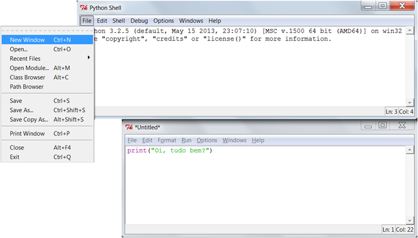

+ Salve o arquivo clicando em `File → Save` e dê o nome de `oi.py` ou algo parecido. Não se esqueça de digitar o `.py` no fim, ele fala para o computador que esse é um arquivo em Python. Sem o `.py`, o texto não vai seguir o código de cores, que deixa as coisas mais fáceis de entender.  	

    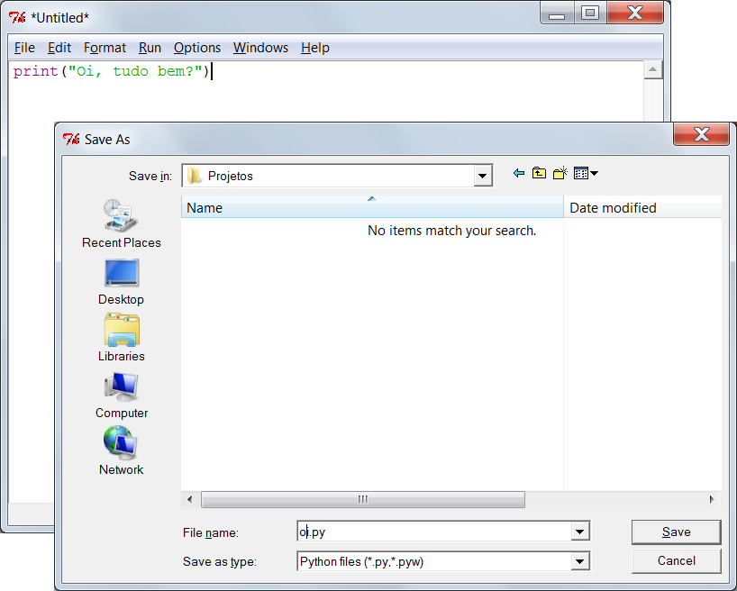

+ Execute o arquivo clicando em `Run -> Run Module`. Você verá outra janela aparecer, que é o Shell do Python. Esse é o lugar onde seu programa vai rodar. Se tudo funcionou como esperado, você verá seu texto impresso na tela.	

    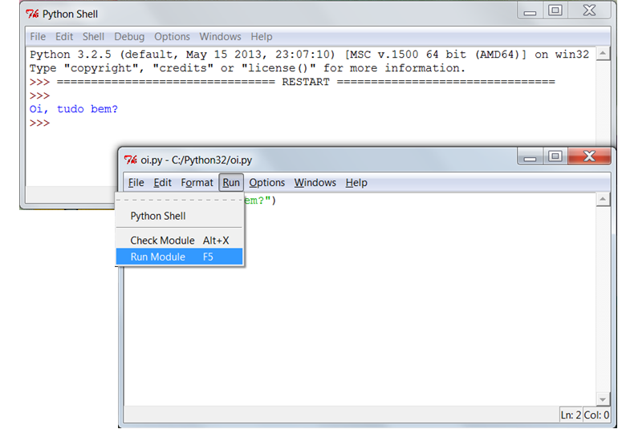

+ Se você cometeu algum erro, por exemplo se esqueceu as áspas ( `"` ), uma mensagem de erro irá aparecer, dizendo o que deu errado. Tente rodar o código com um erro!

    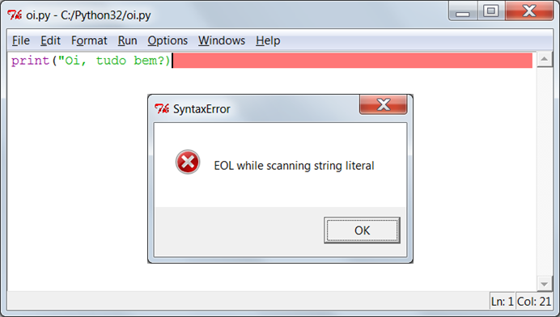

+ Parabéns, agora você já é oficialmente um programador Python! Se dê um tapinha nas costas (ou, se você tiver preguiça, peça para alguém fazê-lo para você). 	

## Salve o Projeto {.save}

## Desafio: No que você está pensando? { .challenge}
Mude o programa para imprimir algo mais interessante na tela!

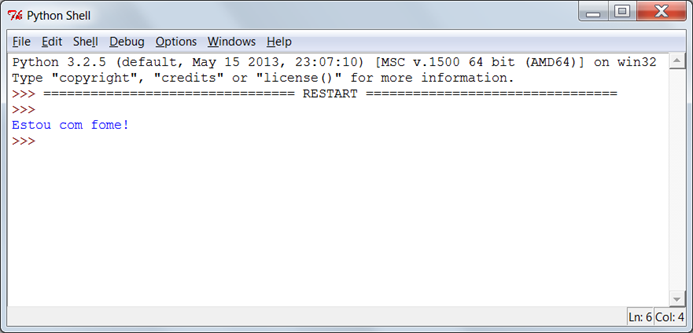

## Salve o Projeto {.save}

#Passo 2: Sobre você { .activity .new-page}
## Lista de Atividades { .check}

+ Vamos imprimir algo mais interessante do que texto... Arte em ASCII! Arte em ASCII significa criar imagens usando texto. Aqui vai um exemplo - deveria se parecer um cachorro!

    

    Para criar essa obra de arte, você deve digitar o seguinte no seu editor IDLE e rodar o programa em seguida:

    ```python
    print("Uma imagem de um cachorro...")
    print(" 0____  ")
    print("  ||||  ")
    ```

+ Se preferir, você pode usar 3 áspas simples ( `'` ) ao invés das áspas normais ( `"` ). Isso permite que você imprima mais de uma linha de texto com um único comando print. Desse jeito:

    ```python
    print('''
    Uma imagem de um cachorro...
     0____
      ||||
    ''')
    ```

    Se você rodar esse programa, verá que ele imprime um cachorro do mesmo jeito que antes.

## Salve Seu Projeto {.save}

## Desafio: Sobre você { .challenge}
Escreva um programa que diga aos outros sobre você, usando texto e arte em ASCII. Você pode criar imagens do que gosta de fazer, dos seus amigos, família... qualquer coisa que quiser! Olhe um exemplo:

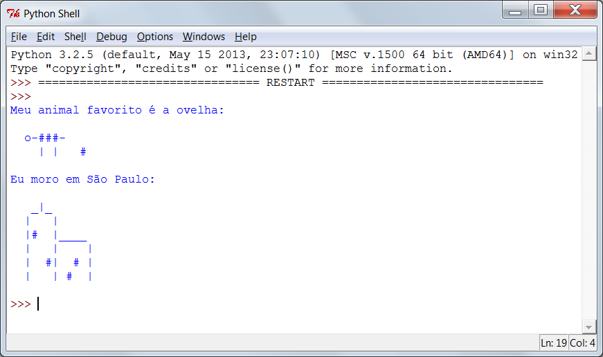

## Salve Seu Projeto {.save}

#Passo 3: Calculando texto { .activity}
## Lista de Atividades { .check}

+ Python também pode fazer contas usando texto! Qual o resultado de multiplicar `"ola"` por 5? Vamos perguntar ao Python, é só rodar esse programa:

    ```python
    print("ola" * 5)
    ```

A estrela (asterisco) `"*"` no programa acima é um símbolo de multiplicação. Execute o programa acima e você verá a seguinte resposta:

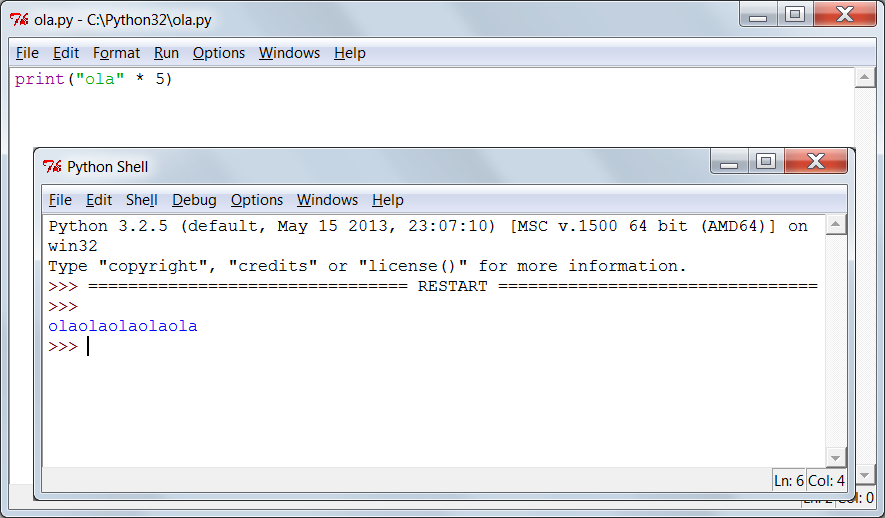

+ Você pode tornar o texto impresso acima mais fácil de ler, é só adicionar um espaço no fim da palavra `"ola"` no seu programa:

    ```python
    print("ola " * 5)
    ```

    Execute esse programa e você verá que agora a saída é mais fácil de ler do que antes.

+ Se `"ola "` multiplicado por 5 é `"ola ola ola ola ola "`, então o que é `"ola" - 7`? Essa conta faz algum sentido?	

    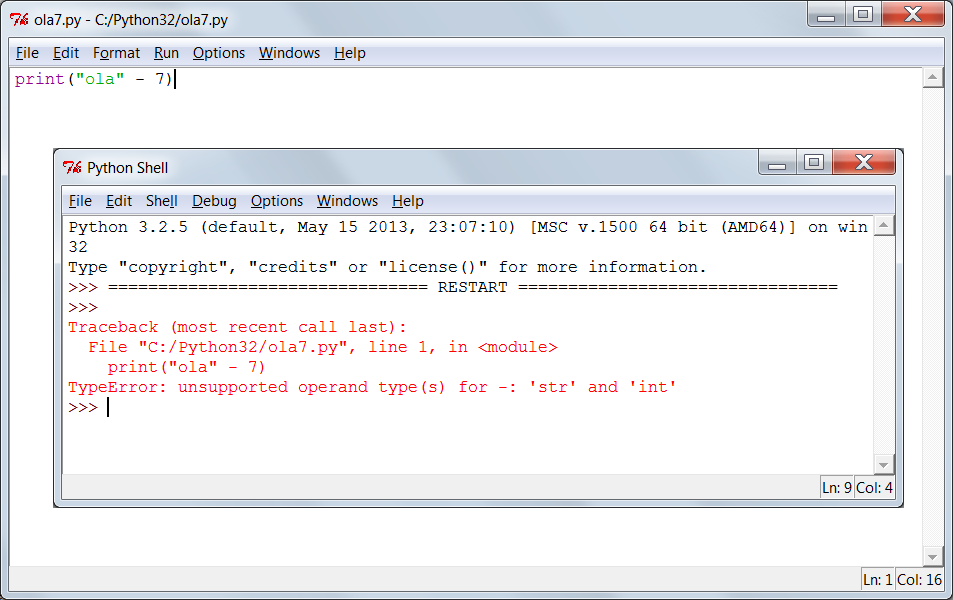

	Opa, você quebrou o Python! Ao invés de uma resposta, nós recebemos uma mensagem de erro. Parece que essa conta não faz sentido em Python!
    
+ E a adição? Que resposta você acha que `"ola, " + "tudo bem?"` teria? Tente isso, é só rodar o programa abaixo:
	
    ```python
    print("ola, " + "tudo bem?")
    ```

    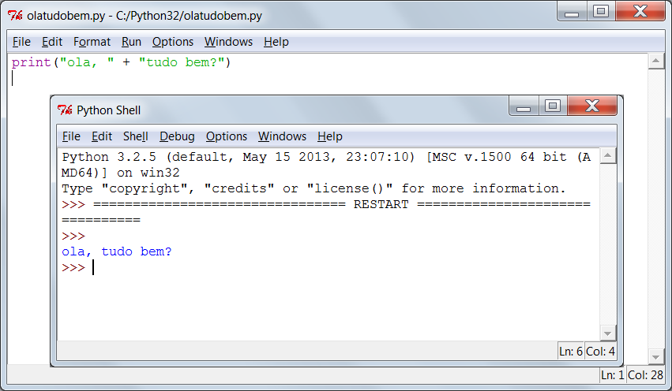

	A resposta foi o que você esperava?

## Salve seu Projeto {.save}

## Desafio: Palavras e números { .challenge}
O que o programa abaixo vai imprimir na tela? Veja se consegue descobrir corretamente antes de rodar o programa.

```python
print("ha "*4)
print("ba" + "na"*2)
print("Bra" + "sil" + "!"*10)
```

Você consegue montar suas próprias palavras assim?

## Salve seu Projeto {.save}

#Passo 4: Padrões em ASCII { .activity}
## Lista de Atividades { .check}

+ Agora que você já sabe como fazer cálculos com texto, o que vem depois? Por que isso é útil? Bom, imagine que você quisesse fazer arte em ASCII e desenhar um retângulo com 30 caracteres de comprimento e 3 caracteres de altura. Você poderia desenhá-lo do jeito difícil, assim:

    ```python
    print("##############################")
    print("##############################")
    print("##############################")
    ```

	Ou você poderia economizar tempo e desenhar do jeito fácil, assim:

    ```python
    print("#" * 30)
    print("#" * 30)
    print("#" * 30)
    ```

	Os dois resultam exatamente no mesmo retângulo impresso na tela:

    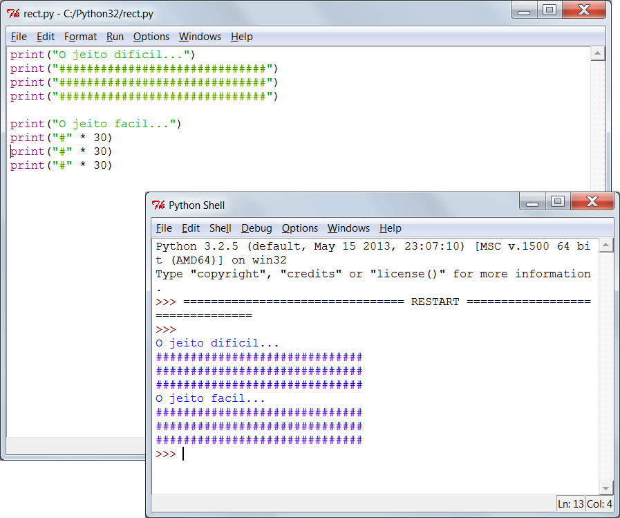

+ Você, inclusive, poderia usar cálculos para criar padrões interessantes, como esta onda:	

    ```python
    print("/\  "*10)
    print("  \/"*10)
    ```

    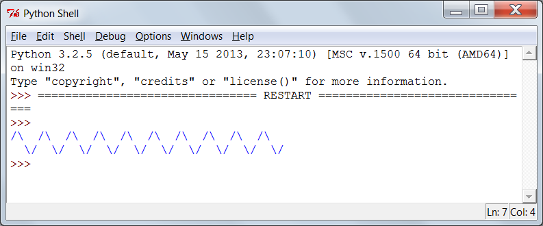

## Salve seu Projeto {.save}

## Desafio: Programe um dinossauro { .challenge}
Seu melhor amigo está dando uma festa de aniversário e, como presente, você decidiu programar um dinossauro para ele! Para criar seus próprios desenhos, use os cálculos que aprendeu sempre que possível.

Se estiver se sentindo generoso, você pode até programar um bolo para ele (com as velinhas)!

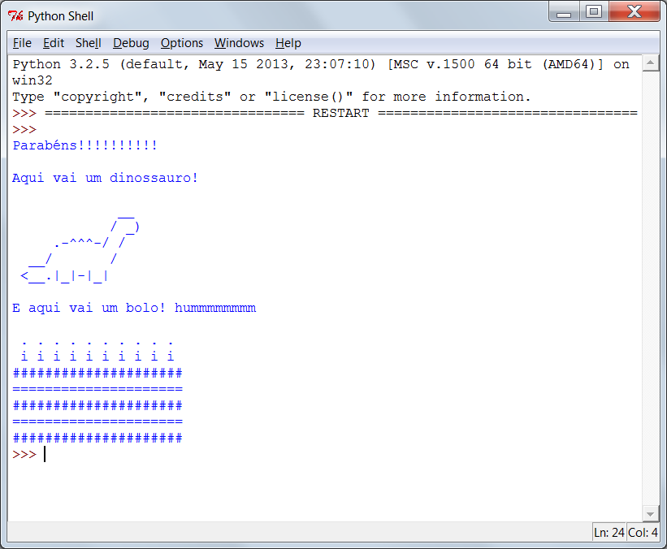

## Salve seu Projeto {.save}
