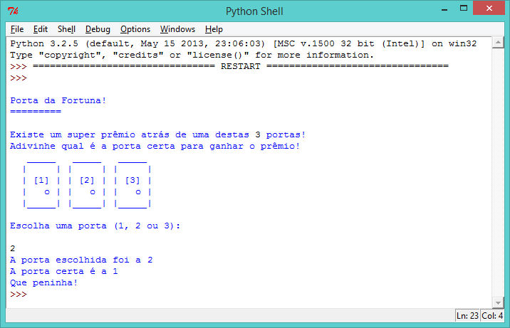
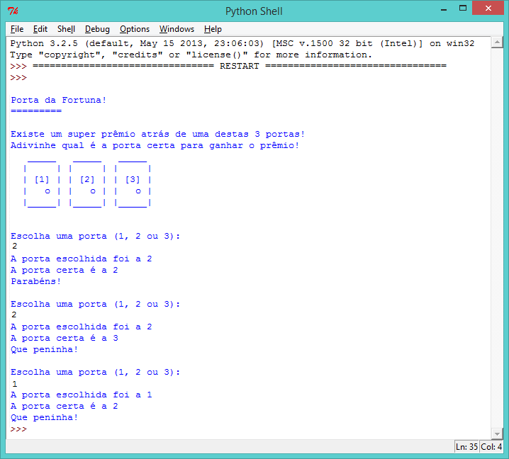
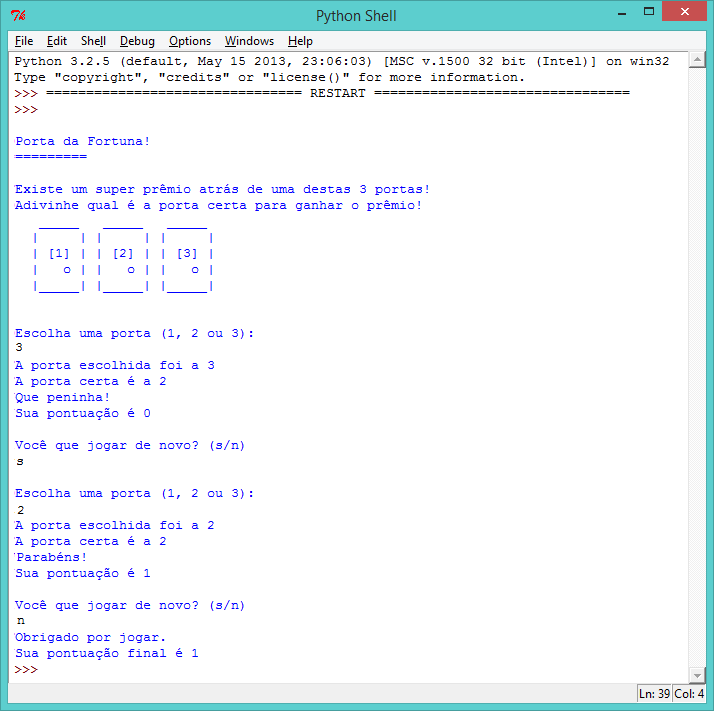
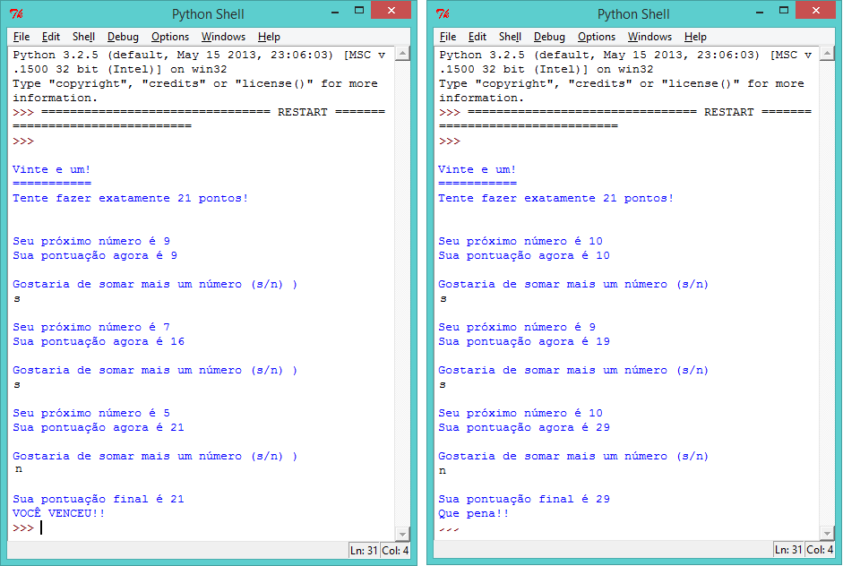

---
title: Porta da Fortuna
level: Python 1
language: pt-BR
stylesheet: python
embeds: "*.png"
materials: ["Project Resources/*.*","Club Leader Resources/*.*"]
...

#Introdução:  { .intro}

Neste projeto, você vai aprender como fazer um jogo de adivinhação, em que você deve adivinhar qual porta esconde o prêmio.

#Passo 1: O que tem atrás da porta? { .activity}
## Lista de Atividades { .check}

+ Imagine um jogo em que um super prêmio é escondido atrás de uma das 3 portas. Se você escolher a porta certa, você ganha o prêmio! E se escolher a errada, não ganha nada!
	
	Você pode jogar esse jogo ao rodar o seguinte programa:

    ```python
	from random import *

	#imprima as 3 portas e as instruções do jogo
	print('''
	Porta da Fortuna!
	=========

	Existe um super prêmio atrás de uma destas 3 portas!
	Adivinhe qual é a porta certa para ganhar o prêmio!
	  _____   _____   _____
	 |     | |     | |     |
	 | [1] | | [2] | | [3] |
	 |   o | |   o | |   o |
	 |_____| |_____| |_____|

	Escolha uma porta (1, 2 ou 3):
	''')

	#pegue a porta escolhida e a armazene como um número inteiro (int)
	portaEscolhida = input()
	portaEscolhida = int(portaEscolhida)

	#escolha aleatoriamente a porta que esconde o prêmio (entre 1 e 3)
	portaCerta = randint(1,3)

	#mostre ao jogador qual porta ele escolheu e qual era a porta certa
	print("A porta escolhida foi a", portaEscolhida)
	print("A porta certa é a", portaCerta)

	#o jogador ganha se o número da porta escolhida e o da porta certa forem o mesmo
	if portaEscolhida == portaCerta:
		print("Parabéns!")
	else:
		print("Que peninha!")

    ```

    

	O programa funciona assim: primeiro, um número aleatório entre 1 e 3 é escolhido, que diz o número da porta certa. `randint(1,3)` significa "escolha um número aleatório entre 1 e 3". Então, o programa pergunta ao jogador qual porta ele escolhe e diz "Parabéns!" se os dois números forem iguais, ou "Que peninha!" se forem diferentes. 

	Um número aleatório é usado para que a porta certa seja sempre diferente. Mas o Python não consegue gerar números aleatórios sem importar um código extra para isso, que é a razão pela qual a biblioteca `random` é importada logo no começo do programa.

	As linhas iniciadas com `#` são comentários. Esses comentários são ignorados pelo Python, mas eles são muito úteis para dizer o que o progrmaa faz! Tente usar comentários em seus programas a partir de agora, assim partes difíceis ficam mais faceis de entender.

+ Usando o que você já sabe sobre loops, você pode melhorar o jogo de um jeito muito fácil: permitir ao jogador jogar 3 vezes, ao invés de 1. Rode o seguinte programa:

    ```python
    from random import *

    #imprima as 3 portas e as instruções do jogo
    print('''
    Porta da Fortuna!
    =========

	Existe um super prêmio atrás de uma destas 3 portas!
	Adivinhe qual é a porta certa para ganhar o prêmio!
      _____   _____   _____
     |     | |     | |     |
     | [1] | | [2] | | [3] |
     |   o | |   o | |   o |
     |_____| |_____| |_____|
    ''')

	#deixe o jogador fazer 3 tentativas
    for attempt in range(3):

        print("\nEscolha uma porta (1, 2 ou 3):")

		#pegue a porta escolhida e a armazene como um número inteiro (int)
        portaEscolhida = input()
        portaEscolhida = int(portaEscolhida)

		#escolha aleatoriamente a porta que esconde o prêmio (entre 1 e 3)
        portaCerta = randint(1,3)

		#mostre ao jogador qual porta ele escolheu e qual era a porta certa
		print("A porta escolhida foi a", portaEscolhida)
		print("A porta certa é a", portaCerta)

		#o jogador ganha se o número da porta escolhida e o da porta certa forem o mesmo
        if portaEscolhida == portaCerta:
            print("Parabéns!")
        else:
            print("Que peninha!")

    ```

    

	No programa acima, perceba que o código para imprimir as 3 portas está _fora_ do loop, porque elas só precisam ser imprimidas uma vez. Os códigos para gerar números aleatórios e perguntar ao jogador qual porta ele escolhe estão _dentro_ do loop, porque cada um precisa ser rodado 3 vezes. Se o código de números aleatórios, para gerar a porta vencedora, estivesse fora do loop, a porta vencedora seria a mesma nas 3 adivinhações.

	E outra observação: `\n` na linha `print("\nChoose a door (1, 2 or 3):")` imprime uma nova linha na tela. Isso é feito para criar uma separação entre essa linha e o texto imprimido antes, para facilitar a leitura.    

## Salve seu projeto {.save}

## Desafio: Contando os pontos { .challenge}
Crie uma variável para saber quantas vezes o jogador adivinhou a porta corretamente. Se precisar de ajuda, lembre-se de que ela vai funcionar de um jeito parecido com a variável `score` no seu programa do Quiz! Não se esqueça de mostrar a pontuação final do jogador ao fim do programa (fora do loop).

## Salve seu projeto {.save}

#Passo 2: O loop `while` { .activity}
## Lista de Atividades { .check}

+ Ao invés de fazer seu programa repetir o jogo um número fixo de vezes, talvez seja interessante deixar o jogador escolher se ele quer jogar novamente ou não. Para isso, você precisa usar um tipo diferente de loop, chamado de loop `while`. Tente rodar este programa:

    ```python
    from random import *

	#o usuário muda esta variável para terminar o jogo
    jogando = True

    score = 0

    #imprima as 3 portas e as instruções do jogo
    print('''
    Porta da Fortuna!
    =========

	Existe um super prêmio atrás de uma destas 3 portas!
	Adivinhe qual é a porta certa para ganhar o prêmio!
      _____   _____   _____
     |     | |     | |     |
     | [1] | | [2] | | [3] |
     |   o | |   o | |   o |
     |_____| |_____| |_____|
    ''')

	#repetir, enquanto a variável 'jogando' estiver com valor 'True' (verdadeiro)
    while jogando == True:

        print("\nEscolha uma porta (1, 2 ou 3):")

		#pegue a porta escolhida e a armazene como um número inteiro (int)
        portaEscolhida = input()
        portaEscolhida = int(portaEscolhida)

		#escolha aleatoriamente a porta que esconde o prêmio (entre 1 e 3)
        portaCerta = randint(1,3)

		#mostre ao jogador qual porta ele escolheu e qual era a porta certa
		print("A porta escolhida foi a", portaEscolhida)
		print("A porta certa é a", portaCerta)

		#o jogador ganha se o número da porta escolhida e o da porta certa forem o mesmo
        if portaEscolhida == portaCerta:
            print("Parabéns!")
            score = score + 1
        else:
            print("Que peninha!")

        print("Sua pontuação é", score)

		#pergunte ao jogador de ele quer continuar jogando
        print("\nVocê que jogar de novo? (s/n)")
        resposta = input()
        #termina o jogo se o jogador digita 'n'
        if resposta == 'n':
            jogando = False

    print("Obrigado por jogar.")
    print("Sua pontuação final é de", score)
    ```

    

	O loop `while` permite que seu programa repita _até_ que alguma coisa aconteça para que ele pare. Nesse programa, você continua jogando enquanto a variável `jogando` estiver com valor `True` (verdadeiro). Se o jogador decidir que não quer jogar de novo e digitar `n`, a variável `jogando` recebe o valor `False` (falso) e o loop para de rodar. O nome para dados que são ou `True` (verdadeiro) ou `False` (falso) é de dados _Booleanos_.

+ Peça a alguém para testar seu jogo, para ter certeza de que ele continua rodando até que digitem `n` para terminá-lo.

## Desafio: Consertando a entrada { .challenge}
+ O que acontece se o jogador tentar terminar o jogo digitando `N` ao invés de `n`? Você pode usar a função `lower()` (que transforma o texto para letras minúsculas) para consertar esse problema?

+ O que acontece se ele digita `nao` ao invés de só `n`? Você poderia arrumar o programa, de modo que ele termine se `resposta == 'n' ou resposta == 'nao'`?

## Desafio: Perdendo o jogo { .challenge}
Você poderia modificar o jogo de modo que a pontuação do jogador vá para 0 toda vez que ele escolher a porta errada? Essa mudança deixa o jogo mais legal? Ou ela torna o jogo muito difícil?

#Passo 3: Quanta sorte você tem? { .activity}
## Lista de Atividades { .check}

+ Ao invés de repetir o jogo até que o jogador decida parar, você poderia repetir o jogo até que o jogador marque 3 pontos. O objetivo do jogo poderia ser marcar 3 pontos no menor número de tentativas possível:

    ```python
    from random import *

	#essa variável guarda o número de vezes que o jogo já foi jogado
    tentativas = 0

    score = 0

    #imprima as 3 portas e as instruções do jogo
    print('''
    Porta da Fortuna!
    =========

	Existe um super prêmio atrás de uma destas 3 portas!
	Adivinhe qual é a porta certa para ganhar o prêmio!
      _____   _____   _____
     |     | |     | |     |
     | [1] | | [2] | | [3] |
     |   o | |   o | |   o |
     |_____| |_____| |_____|
    ''')

	#repita enquanto a variável score for menor do que 3
    while score < 3:

		#soma 1 ao número de tentativas
        tentativas = tentativas + 1
        
        print("\nTentativa", tentativas, ": Escolha uma porta (1, 2 or 3):")

		#pegue a porta escolhida e a armazene como um número inteiro (int)
        portaEscolhida = input()
        portaEscolhida = int(portaEscolhida)

		#escolha aleatoriamente a porta que esconde o prêmio (entre 1 e 3)
        portaCerta = randint(1,3)

		#mostre ao jogador qual porta ele escolheu e qual era a porta certa
		print("A porta escolhida foi a", portaEscolhida)
		print("A porta certa é a", portaCerta)

		#o jogador ganha se o número da porta escolhida e o da porta certa forem o mesmo
        if portaEscolhida == portaCerta:
            print("Parabéns!")
            score = score + 1
        else:
            print("Que peninha!")

        print("Sua pontuação atual é", score)

    print("\n** Você conseguiu! Terminou o jogo em", tentativas, "tentativas **")
    ```

	O loop `while` nesse programa continua a rodar enquanto a variável score seja menor do que 3 (`while score < 3:`). Quando a pontuação chegar em 3, o programa termina e o número de tentativas é impresso na tela.

## Salve seu projeto {.save}

## Desafio: Vinte-e-um { .challenge}
Você consegue criar um jogo em que o objetivo é fazer exatamente 21 pontos? Esse programa deve gerar um número aleatório entre 1 e 10, que é adicionado à pontuação do jogador. O jogador pode, então, escolher ficar com aquela pontuação ou adicionar um outro número aleatório a ela. O jogador ganha se conseguir fazer exatamente 21 pontos. Lembre-se de adicionar comentários ao seu programa!

Veja aqui um exemplo do jogo:



Você pode usar (ou mudar) partes do seu programa para fazer esse novo jogo. Aqui vão algumas dicas que você pode usar para te ajudar:

+ Você pode usar um loop `while` para rodar o programa enquanto o jogador ainda queira continuar jogando:

```python
while jogando == True:
```

+ Se o jogador digitar `n`, porque quer continuar com a pontuação atual, você pode mudar a variável `jogando` para `False` (falso):

```python
if resposta == 'n':
    jogando = False
```

+ No fim do programa (fora do loop `while`), você pode dizer "Parabéns!" para o jogador se a pontuação dele for exatamente 21:

```python
if pontuação == 21:
    print("Parabéns!")
```

## Salve seu projeto {.save}
