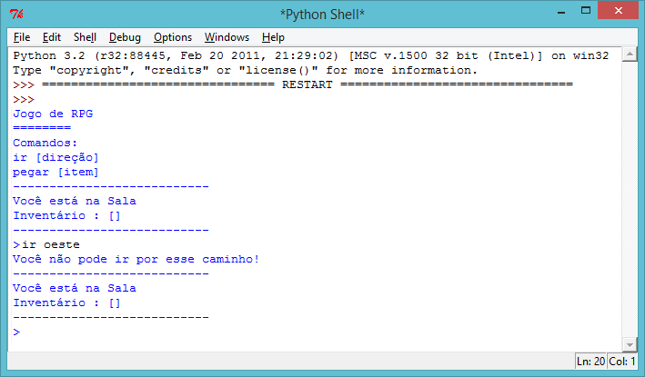
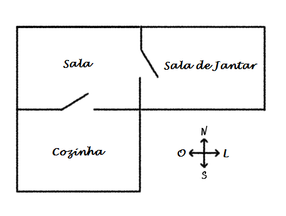
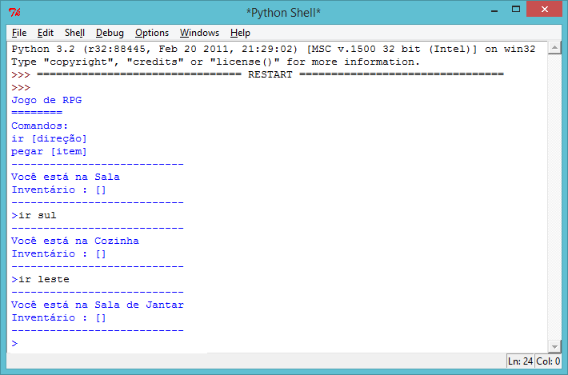
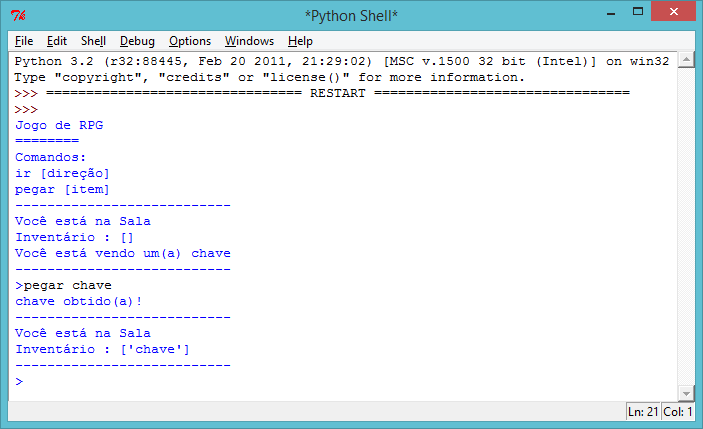
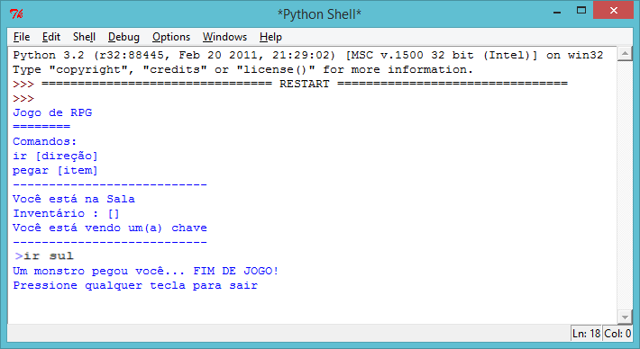
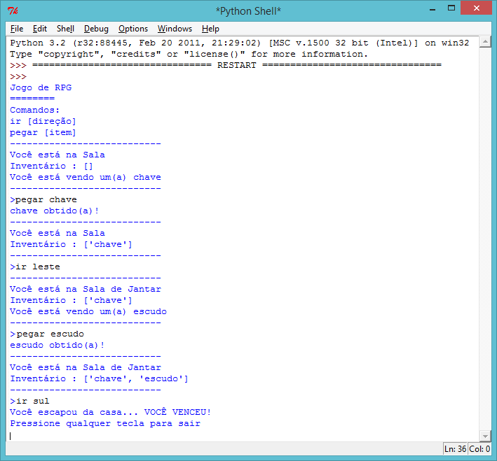
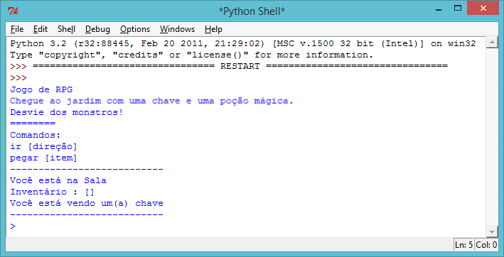

---
title: RPG
level: Python 2
language: pt-BR
stylesheet: python
embeds: "*.png"
materials: ["Project Resources/*.*"]
...

# Introdução:  { .intro}

Neste desafio, você vai desenvolver e programar seu próprio jogo de labirinto no estilo RPG. O objetivo do jogo é coletar objetos e escapar de uma casa, desviando de todos os monstros!

# Etapa 1: Adicionando novos cômodos { .activity}
## Lista de verificação da atividade { .check}

  + Se você executar o arquivo RPG.py, você vai poder jogar um jogo básico de RPG com apenas 2 cômodos. Esse é o mapa do jogo:

    

    Você pode digitar `ir para o sul` para ir da sala para o cozinha, e depois `ir para o norte` para ir novamente para a sala!

    

  + Você também pode ver o que acontece quando você digita uma direção na qual você não pode ir. Por exemplo, não há nenhum cômodo a oeste da sala, então se você digitar `ir para o oeste`, uma mensagem de erro será obtida.

    

  + Se você editar o arquivo RPG.py, você vai ver que o mapa é programado como um dicionário de cômodos:

    ```python
    # um dicionário que liga um cômodo a outro
    locais = {

                1 : {  "nome"  : "Sala" ,
                       "sul" : 2
                    } ,

                2 : {  "nome"  : "Cozinha" ,
                       "norte" : 1
                    }

             }
    ```

    Na verdade, este é um dicionário que liga o número de uma sala a outro dicionário que contém todas as informações sobre o cômodo. Por exemplo, o cômodo 1 no código acima é a sala. A sala está ligada ao cômodo 2 (a cozinha) ao sul. O cômodo 2 (a cozinha) também está ligada ao cômodo 1 (a sala) ao norte.

  + Vamos adicionar outro cômodo ao seu mapa (uma sala de jantar), para deixá-lo mais interessante!

    

    Esta nova sala de jantar está conectada à sala (a oeste). Vamos adicionar este novo cômodo ao código:

    ```python
    # um dicionário que liga um cômodo a outro
    locais = {

                1 : {  "nome"  : "Sala" ,
                       "sul" : 2
                    } ,

					
                2 : {  "nome"  : "Cozinha" ,
                       "norte" : 1
                    },


                3 : {  "nome"  : "Sala de jantar",
                       "oeste"  : 1
                    }

             }
    ```

    Para adicionar esse cômodo ao jogo, observe que você precisa adicionar um novo cômodo (cômodo número 3), e dar um nome a ele. Você também precisa conectar o cômodo 1 (a sala) ao oeste do novo cômodo. Você precisa adicionar informações ao dicionário da sala, para permitir que você acesse a sala de jantar pelo leste. Lembre-se de adicionar uma vírgula depois do segundo cômodo no dicionário, caso contrário seu código não vai funcionar!

  + Experimente jogar com a nova sala de jantar:

    

    Se você não puder entrar e sair da sala de jantar, verifique se você adicionou todo o código acima (incluindo as vírgulas extras nas linhas acima).

## Salve seu projeto {.save}

## Desafio: Adicione novos cômodos { .challenge}

Adicione mais cômodos ao seu jogo. Por exemplo, você pode criar uma sala de estar ao sul da sala de jantar. Lembre-se de adicionar uma porta que vai de/para um dos outros cômodos!

## Salve seu projeto {.save}

# Etapa 2: Adicionando itens para coletar { .activity }

Agora que você tem vários cômodos, vamos deixar alguns itens neles para o jogador coletar conforme se move pelo labirinto.

## Lista de verificação da atividade { .check}

  + Adicionar um item em um cômodo é fácil. Você pode simplesmente adicioná-lo ao dicionário de um cômodo. Por exemplo, vamos colocar uma chave na sala.

    ```python
    # um dicionário que liga um cômodo a outro
    locais = {

                1 : {  "nome"  : "Sala" ,
                       "sul" : 2 ,
					   "leste"  : 3 ,
					   "item"  : "chave"
                    } ,

					
                2 : {  "nome"  : "Cozinha" ,
                       "norte" : 1
                    },


                3 : {  "nome"  : "Sala de jantar",
                       "oeste"  : 1
                    }


             }
    ```

    Lembre-se de colocar uma vírgula depois da linha acima do novo item, ou seu programa não vai funcionar!

  + Se você executar seu jogo depois de adicionar o código acima, você vai ver uma chave na sala, e você pode até pegá-la (digitando `pegar chave`) e adicioná-la ao seu inventário!

    

## Salve seu projeto {.save}

## Desafio: Adicione novos itens { .challenge}

Adicione um item a alguns dos cômodos do seu jogo. Você pode adicionar qualquer coisa que considere útil para escapar da casa! Por exemplo, um escudo ou uma poção mágica.

## Salve seu projeto {.save}

# Etapa 3: Adicionando inimigos { .activity }

Esse jogo está muito fácil! Vamos adicionar alguns inimigos em alguns cômodos dos quais o jogador precisa desviar.

## Lista de verificação da atividade { .check}

  + Adicionar um inimigo em um cômodo é tão fácil quanto adicionar qualquer outro item. Vamos adicionar um monstro faminto na cozinha:

    ```python
    # um dicionário que liga um cômodo a outro
    locais = {

                1 : {  "nome"  : "Sala" ,
                       "sul" : 2 ,
					   "leste"  : 3 ,
					   "item"  : "chave"
                    } ,

					
                2 : {  "nome"  : "Cozinha" ,
                       "norte" : 1 ,
					   "item"  : "monstro"
                    },


                3 : {  "nome"  : "Sala de jantar",
                       "oeste"  : 1
                    }


             }
    ```

  + Você também precisa fazer com que o jogo acabe se o jogador entrar em um cômodo no qual há um monstro. Você pode fazer isso com o código a seguir, que você adicionar ao final do jogo.

    ```python
        # o jogador perde se entrar em um cômodo com um monstro
        if "item" in locais[localAtual] and "monstro" in locais[localAtual]["item"]:
            print("Um monstro pegou você... FIM DE JOGO!")
            print("Pressione qualquer tecla para sair")
            input()
            break
    ```

    Este código verifica se há um item no cômodo e, se houver, verifica se o item é um monstro. Observe que esse código está indentado, alinhado com o código acima dele. Isso significa que o jogo vai verificar se há um monstro toda vez que o jogador for para um novo cômodo.

  + Teste seu código indo para a cozinha, onde há um monstro.

    

## Salve seu projeto {.save}

## Desafio: Adicionando mais monstros { .challenge}

Adicione mais monstros ao seu jogo para que escapar da casa fique mais difícil!

## Salve seu projeto {.save}

# Etapa 4: Vencendo o jogo { .activity }

Vamos dar uma missão ao jogador, a qual precisa ser realizada para que ele vença o jogo.

## Lista de verificação da atividade { .check}

  + Neste jogo, o jogador ganha se chegar ao jardim e escapar da casa. Eles também precisam ter a chave e o escudo em seu inventário. Temos aqui o mapa do jogo.

    

    Observe que há outro cômodo número quatro (o jardim) que se conecta à sala de jantar (ao norte).

  + Use as orientações da etapa 1 acima para adicionar um jardim ao seu jogo. Lembre-se de adicionar portas, para conectá-lo aos demais cômodos da casa.

  + Use as orientações da etapa 2 acima para adicionar um escudo à sala de jantar (ou a outro cômodo da casa).

  + Para permitir que o jogador vença o jogo quando chegar ao jardim com a chave e o escudo, adicione este código ao final do seu jogo:

    ```python
        # o jogador vence o jogo se ele chegar ao jardim com uma chave e um escudo
        if localAtual == 4 and 'chave' in inventario and 'escudo' in inventario:
            print("Você escapou da casa... VOCÊ VENCEU!")
            print("Pressione qualquer tecla para sair")
            input()
            break
    ```

    Novamente, verifique se seu código está indentado e alinhado com o código acima. Este código significa que a mensagem `...VOCÊ VENCEU!` é exibida se o jogador estiver no cômodo 4 (o jardim) e se a chave e o escudo estiverem no inventário. Se você tiver mais de 4 cômodos, você pode precisar usar um número diferente para o jardim no código acima.

  + Teste seu jogo para garantir que o jogador consiga vencer!

    

  + Por fim, vamos adicionar algumas instruções ao jogo, para que o jogador saiba o que ele precisa fazer. Edite a função `mostrarInstrucoes()` para incluir mais informações.

    ```python
    def mostrarInstrucoes():
        # imprime um menu principal, os comandos e as instruções
        print('''
    Jogo de RPG
    ========
    Instruções:
      Chegue ao jardim
      ...
    ========
    Comandos:
      ir [direção]
      pegar [item]
    ''')
    ```

    Você precisa adicionar instruções para dizer ao usuário quais itens pegar e do que desviar!

    

## Salve seu projeto {.save}

## Desafio: Desenvolva seu próprio jogo { .challenge}

Use o que você aprendeu para criar seu próprio jogo. Adicione vários cômodos, monstros dos quais desviar e itens para coletar. Lembre-se de modificar o código para que o jogador vença quando chegar em um certo cômodo com alguns dos itens em seu inventário. É útil fazer o rascunho do mapa antes de começar a programar! Você pode até adicionar escadas ao seu mapa e ter mais de um andar de cômodos, digitando `ir para cima` e `ir para baixo`.

## Salve seu projeto {.save}
