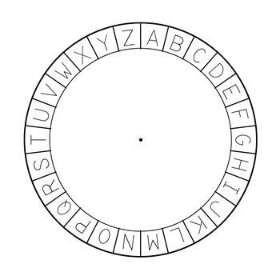
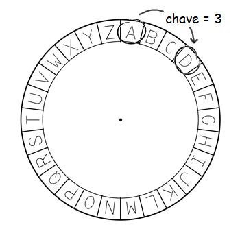
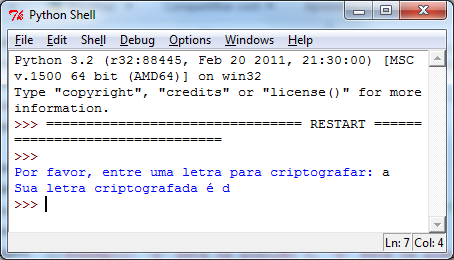
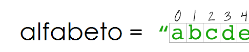
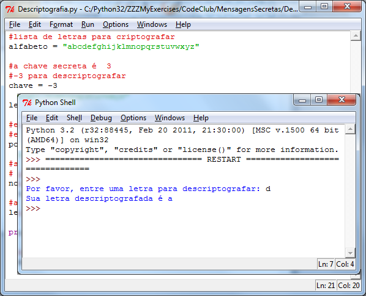
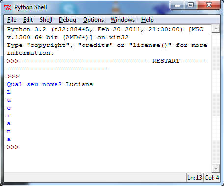
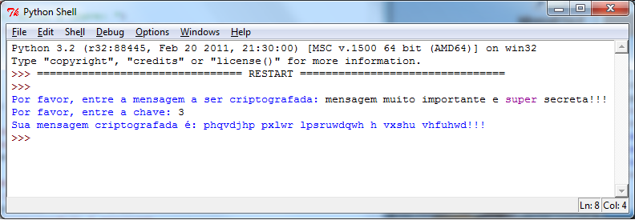
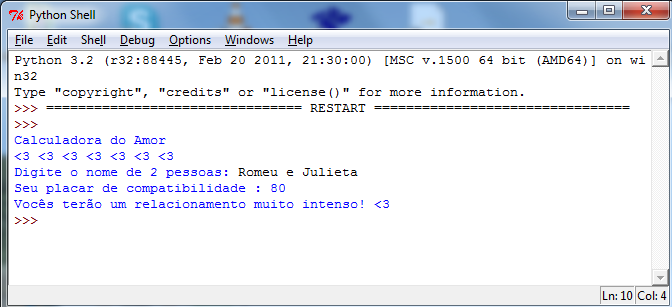

---
title: Secret Messages
level: Python 2
language: pt-BR
stylesheet: python
embeds: "*.png"
materials: ["Recursos do Projeto/*.*","Club Leader Resources/*.*"]
...

# Introdução:  { .intro}
Neste projeto você aprenderá como fazer seu próprio programa de criptografia, assim você poderá enviar e receber mensagens secretas de um amigo.

# Passo 1: Criptografando mensagens { .activity}

Uma cifra é um tipo de código secreto, onde você troca as letras e ninguém consegue ler suas mensagens. Você usará uma das mais antigas e mais famosas cifras, a cifra de César, que foi nomeada em homenagem a um tal de Júlio César. 

Você começará desenhando letras em um círculo, como este:



Para criar uma mensagem criptografada secreta a partir de uma mensagem normal, você precisa de uma chave secreta. Em nosso exemplo, vamos usar o número 3. Para criptografar a letra 'a', você simplesmente moverá 3 letras no sentido horário, o que resulta na letra 'd':



Para descriptografar a mensagem, você simplesmente move 3 letras no sentido anti-horário. 

## Lista de Atividades{ .check}

+ Vamos começar escrevendo um programa Python que criptografa um único caracter. Execute este programa, e entre com a letra 'a' para verificar se ele funciona:

	```python
	#lista de letras para criptografar
	alfabeto = "abcdefghijklmnopqrstuvwxyz"

	#a chave secreta é  3
	chave = 3

	letra = input("Por favor, entre com uma letra para criptografar: ")

	#encontre a posição da letra em alfabeto
	#exemplo: 'a' está na posição 0, 'e' está na posição 4, etc.
	posicao = alfabeto.find(letra)

	#some a chave secreta para encontrar a posição da letra criptografada
	#% 26 significa 'volte para 0 quando você chegar no 26'
	novaPosicao = (posicao + chave) % 26

	#a letra criptografada está no alfabeto na nova posição
	letraCriptografada = alfabeto[novaPosicao]
	        
	print("Sua letra criptografada é" , letraCriptografada)
	```

	

+ Em Python, textos podem ser considerados como um  conjunto de caracteres/letras unidas (também chamadas de _array_ de caracteres). A linha:

	```python
	posicao = alfabeto.find(letra)
	```

	encontra a posição de letra em `alfabeto`. Na maioria das linguagens de programação, posições sempre começam do 0 e não do 1, assim, no texto "abcdefghijklmnopqrstuvwxyz", 'a' é o caracter que está na posição 0, 'b' está na posição 1, e assim por diante.

	

	Em seguida, a chave secreta é somada à `posicao`, para obter a `novaPosicao` do caracter criptografado. Assim, neste exemplo, 'a' está na posição 0, assim, depois de somar a chave, nós obtemos `0 + 3 = 3`.  

	O código `% 26` significa que no processo de encontrar o número da posição do caracter criptografado, o número é reiniciado para 0 assim que ele atinge 26. Isso significa que após 'z' em nossa cifra, voltamos para 'a' novamente. 

	Em seguida, esta nova posição é usada para encontrar o caracter criptografado em `alfabeto`, e ela é acrescentada à `letraCriptografada`, antes de finalmente imprimir a mensagem criptografada completa. O código:

	```python
	alfabeto[novaPosicao]
	```
	procura a letra em determinada posição. Assim `alfabeto[0]` é 'a', `alfabeto[3]` é 'd'.

	Observe também que, neste programa, você usou uma maneira abreviada de capturar a entrada do usuário. Ao invés de escrever :

	```python
	print("Por favor, entre uma letra para criptografar: ")
	letra = input()
	```

	Você pode simplesmente usar esta linha:

	```python
	letra = input("Por favor, entre uma letra para criptografar: ")
	```

+ Você pode usar o mesmo programa para descriptografar uma letra utilizando -3 como chave, ao invés de `3`. Isto significa que, para descriptografar uma letra, você se move para trás no alfabeto e não para frente. Você voltará para 'z' assim que você atingir o 'a'.

	

	Se você preferir ter programas separados para criptografar e descriptografar, mude este código para percorrer a variável alfabeto para trás:

	```python
	#subtraia a chave para voltar para trás
	novaPosicao = (posicao - chave) % 26
	```

## Salve Seu Projeto {.save}

## Desafio: Chaves variáveis { .challenge}
Modifique o programa de criptografia acima, de modo que o usuário possa entrar com sua própria chave. Você precisará capturar a entrada do usuário, e armazenar em uma variável `chave`. Lembre-se de usar a função `int()` para converter a entrada em um número inteiro.

## Salve Seu Projeto {.save}

## Desafio: Criptografando e descriptografando caracteres { .challenge}
+ Use seu programa para criptografar:
	+ A letra 'd' usando a chave secreta 7;
	+ A letra 'x' usando a chave secreta 4;
+ Você consegue usar seu programa para descriptografar este mensagem:
	+ omqemd (a chave secreta é 12)

## Salve Seu Projeto {.save}

# Passo 2: Criptografando mensagens { .activity}

Ao invés de criptografar e descriptografar um caracter da mensagem por vez, vamos escrever um programa para criptografar e descriptografar mensagens inteiras!

## Lista de Atividades { .check}

+ Até agora você usou laços (loops) para repetir o código:
	+ um determinado número de vezes;
	+ até que algo aconteça em seu programa.

	Existe um terceiro modo de usar laços, que é repetir o código para cada elemento em um dado. Por exemplo, se você quiser percorrer e imprimir cada caracter do nome de alguém, você pode usar este programa: 

	```python
	nome = input("Qual seu nome? ")

	#imprima cada caracter do seu nome
	for char in nome:
		print(char)
	```

	

	No programa acima, uma letra do nome é armazenada na variável `char` e depois impressa. Perceba que armazenamos e imprimimos uma letra de cada vez. `char` é apenas o nome de uma variável, e você pode mudar o nome da variável se você quiser. Execute o programa para testá-lo:
	
+ Você pode usar este tipo de laço (loop) para percorrer a mensagem toda, e criptografar um caracter por vez:

	```python
	#uma lista de letras para criptografar
	alfabeto = "abcdefghijklmnopqrstuvwxyz"

	#capture a mensagem do usuário
	mensagem = input("Por favor, entre com a mensagem a ser criptografada: ").lower()

	#esta variável armazenará a mensagem criptografada
	mensagemCriptografada = ""

	#capture a chave secreta
	chave = input("Por favor, entre a chave: ")
	#Esta ação é necessária porque o programa não lê o valor da chave como número
	chave = int (chave)

	#percorra cada caracter na mensagem
	for char in mensagem:

	    if char in alfabeto:
	        
			#encontre a posição de caracter em alfabeto
			#por exemplo, 'a' está na posição 0, 'e' está na posição 4, etc.
	        posicao = alfabeto.find(char)
	        
			#some a chave secreta para encontrar a posição do caracter criptografado 
	        #% 26 significa 'volte para 0 quando você atingir 26'
	        novaPosicao = (posicao + chave) % 26
	        
	        #acrescente a letra descriptografada à mensagem
	        #a letra criptografada está em alfabeto na novaPosicao
	        mensagemCriptografada = mensagemCriptografada + alfabeto[novaPosicao]
	        
	    else:
	        
	        #alguns caracteres (por exemplo '£', '?') não estão no alfabeto, 
	        # então simplesmente adicione a letra criptografada à mensagem
	        mensagemCriptografada = mensagemCriptografada + char

	print("Sua mensagem criptografada é:" , mensagemCriptografada)
	```

	

	Neste programa, cada caracter da mensagem é criptografado e adicionado à variável `mensagemCriptografada`. Perceba que criptografamos e adicionamos um caracter por vez. No final do programa, a mensagem inteira é impressa.

	Existem caracteres que o usuário pode entrar, mas que não estão no `alfabeto`. Por exemplo, espaços, vírgulas e pontos de interrogação. O comando `if char in alfabeto:` significa que apenas caracteres que apareçam no alfabeto são criptografados. Qualquer outro caracter é simplesmente adicionado à mensagem encriptada sem ser criptografada.

## Salve Seu Projeto {.save}

## Desafio: Criptografando e descriptografando mensagens { .challenge}
Criptografe algumas mensagens, e as de um amigo junto com a chave secreta. Veja se seus amigos conseguem descriptografá-las usando o programa deles!

## Salve Seu Projeto {.save}

## Desafio: Melhorando sua cifra { .challenge}
Alguém consegue descriptografar suas mensagens sem a chave? Você consegue modificar seu programa para tornar mais difícil que as pessoas quebrem suas mensagens? Veja aqui algumas idéias:

+ Embaralhe as letras na sua variável `alfabeto`;
+ Acrescente 1 à chave cada vez que uma letra for criptografada;
+ Remova todos os espaços e outros caracteres da mensagem criptografada.

## Salve Seu Projeto {.save}

## Desafio: Calculadora do amor { .challenge}
Escreva um programa para avaliar quão duas pessoas são compatíveis, calculando seu placar de compatibilidade.



o programa poderia percorrer cada caracter nos 2 nomes, e acrescentar pontos à variável `placar` cada vez que as letras são encontradas. Você pode decidir as regras para conceder pontos. Por exemplo, você poderia conceder pontos por vogais , ou caracteres que também estão na palavra "amor":

```python
if char in "aeiou":
	placar = placar + 5

if char in "amor":
	placar = placar + 10
```

Você pode mostrar mensagens personalizadas, baseadas no placar de compatibilidade:

```python
if placar < 10:
	print("Esqueça esta pessoa! Nunca vai dar certo!")
```

## Salve Seu Projeto {.save}


