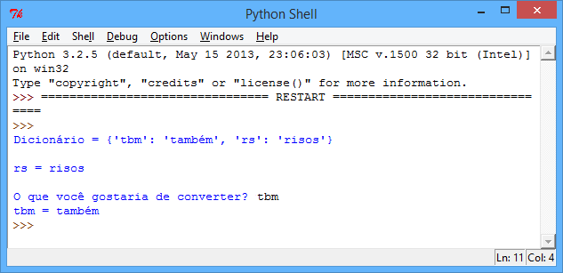
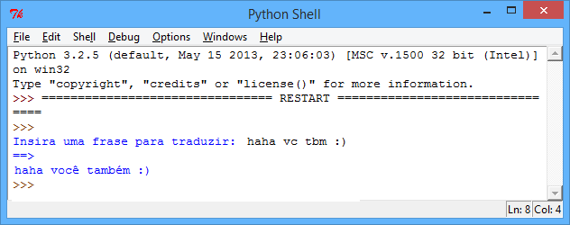
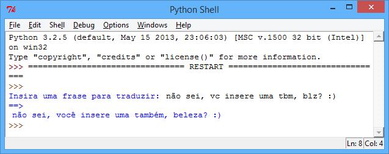
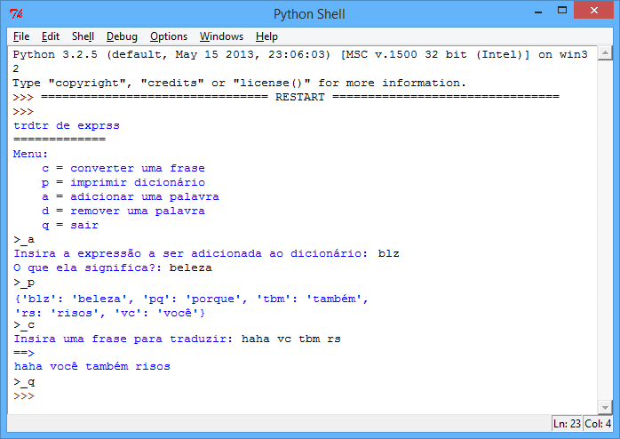
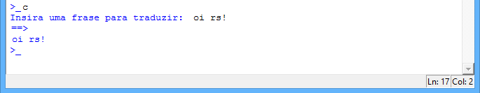
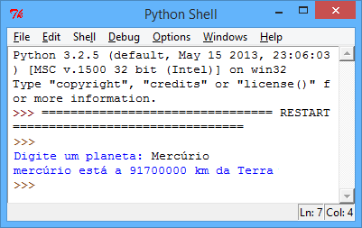
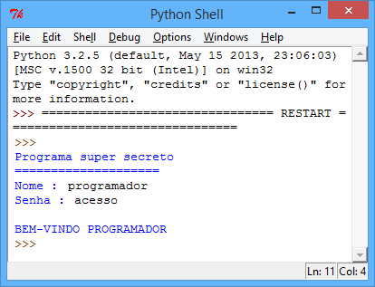

---
title: Text-speak Converter
level: Python 2
language: en
stylesheet: python
embeds: "*.png"
materials: ["Project Resources/*.*","Club Leader Resources/*.*"]
...

#Introduction:  { .intro}

In this project you'll learn how to make a program for translating text-speak into sentences.

#Step 1: Translating words { .activity}

Let's make a program to convert text-speak to English.

## Activity Checklist { .check}

+ As you probably already know, a dictionary allows you to look up a word, and see it's meaning. In Python, a dictionary is even more flexible that that - it allows you to map anything (called a _key_) to anything else! Here's a dictionary that links text-speak words to their meaning:

    ```python
    textSpeakDictionary = {
        "lol"   : "laugh out loud" ,
        "idk"   : "I don't know"
    }
    ```

    So, in the dictionary above, the key "lol" maps to the text "laugh out loud", and the key "idk" maps to the text "I don't know". You should use a colon (`:`) to map the text-speak keys to their meanings, and put a comma between each dictionary entry.

+ Getting information out of the dictionary is easy; you just need to add the key after the dictionary variable name, in square brackets. Here's a short program that shows how this works:

    ```python
    textSpeakDictionary = {
        "lol"   : "laugh out loud" ,
        "idk"   : "I don't know"
    }

    #print the entire dictionary
    print( "Dictionary =" , textSpeakDictionary )

    #print just the entry for "lol"
    print( "\nlol =" , textSpeakDictionary["lol"] )

    #the entry for the user's input
    key = input("\nWhat would you like to translate? : ")
    print( key , "=" , textSpeakDictionary[key] )
    ```

    

    This program prints 3 things: the entire dictionary, the dictionary entry for "lol" and finally the dictionary entry for whatever the user inputs.

## Save Your Project {.save}

#Step 2: Translating sentences { .activity}

Let's amend your program, so that you can translate whole sentences instead of just single words.

## Activity Checklist { .check}

+ Run this program, which splits up a sentence into individual words, and then translates each word (if it exists in the dictionary):

    ```python
    textSpeakDictionary = {
        "lol"   : "laugh out loud" ,
        "idk"   : "I don't know"
    }

    #get the sentence to translate
    sentence = input("Enter a sentence to translate: ").lower()

    #this splits up the sentence into a list of words
    wordsToTranslate = sentence.split()

    translatedSentence = ""

    #loop through each word in the list
    for word in wordsToTranslate:

    	#add the translated word if it exists in the dictionary
        if word in textSpeakDictionary:

            translatedSentence += textSpeakDictionary[word] + " "

        #just keep the original word if there's no translation
        else:

            translatedSentence += word + " "

    #print the translated sentence
    print("==>")
    print(translatedSentence)
    ```

    

    Each word is taken in turn, and the program checks whether the word to translate is in the dictionary. If it is, then the translated text added to the `translatedSentence` variable, which is printed at the end of the program. If the word isn't in the dictionary, then just the original word is added to the `translatedSentence` variable.

    Notice that whenever a word is added to `translatedSentence`, a space is also added (` + " "`). What do you think would happen if this space wasn't added?

## Challenge: Adding translations { .challenge}
+ Add some more translations to the program above. For example:
	
	+ "jk" = "just kidding"
	+ "bc" = "because"

You might need to research some text-speak if you don't know any.

+ Try out the program above, with a number of different sentences, to test that your program works.



+ Did you (or your friends) do anything to break your program? If so, can you fix any problems?

#Step 3: Adding and deleting translations { .activity}
## Activity Checklist { .check}

+ Just like with your 'compliment generator' program, it would be nice to allow the user to add and remove words from the dictionary. You can do this, by creating a menu system:

    ```python
    def displayMenu():
        print("txt spk cnvtr")
        print("=" * 13)
        print("Menu:")
        print("  c = convert a sentence")
        print("  p = print dictionary")
        print("  a = add a word")
        print("  d = delete a word")
        print("  q = quit")

    #-------------------------------------------------------

    def convertSentence():
        sentence = input("Enter a sentence to translate: ").lower()
        translatedSentence = ""

        #this splits up the sentence into a list of words
        listOfWords = sentence.split()

        for word in listOfWords:
            #add the translated word if it exists in the dictionary
            if word in textSpeakDictionary:

                translatedSentence += textSpeakDictionary[word] + " "

            #just keep the original word if there's no translation
            else:

                translatedSentence += word + " "

        #print the translated sentence
        print("==>")
        print(translatedSentence)  

    #-------------------------------------------------------

    def addDictionaryItem():
        txtToAdd = input("Enter the text-speak to add to the dictionary: ")
        meaning = input("What does this mean?: ")
        #add the new translation to the dictionary
        textSpeakDictionary[txtToAdd] = meaning

    #-------------------------------------------------------

    def deleteDictionaryItem():
        txtToDelete = input("Enter the text-speak to delete from the dictionary: ")
        #delete the translation from the dictionary
        del textSpeakDictionary[txtToDelete]

    #-------------------------------------------------------
    # main program starts here!
    #-------------------------------------------------------

    textSpeakDictionary = {
        "lol"  : "laugh out loud" ,
        "idk"  : "I don't know" ,
        "jk"   : "just kidding" ,
        "bc"   : "because"
    }

    running = True

    displayMenu()

    #repeat until the user inputs 'q' to quit
    while running == True:
        
        menuChoice = input(">_").lower()

        #c to convert
        if menuChoice == 'c':
            convertSentence()
            
        #p to print
        elif menuChoice == 'p':
            print(textSpeakDictionary)

        #a to add
        elif menuChoice == 'a':
            addDictionaryItem()

        #d to delete
        elif menuChoice == 'd':
            deleteDictionaryItem()

        #q to quit
        elif menuChoice == 'q':
            running = False

        else:
            print("Invalid menu choice!")
    ```

    

    Although this is a loooong program, you've seen most of this code before in other programs. The new bits are just the code to add an item to the dictionary:

    ```python
    txtToAdd = input("Enter the text-speak to add to the dictionary: ")
    meaning = input("What does this mean?: ")
    #add the new translation to the dictionary
    textSpeakDictionary[txtToAdd] = meaning
    ```

    ...and the code to remove an item:

    ```python
    txtToDelete = input("Enter the text-speak to delete from the dictionary: ")
    #delete the translation from the dictionary
    del textSpeakDictionary[txtToDelete]
    ```

    The code for each of the menu options is also in it's own function, to make the code much easier to read.

## Save Your Project {.save}

## Challenge: Testing your program { .challenge}
Run your program, and try to add a word that already exists in the dictionary. What happens? What happens when you try and remove something that isn't in the dictionary? Can you improve your program so that:

+ you can only add dictionary keys that don't already exist?

```python
if itemToAdd not in textSpeakDictionary:
	#Add your code here!
```

+ you can only delete keys if they already exist in the dictionary?

```python
if itemToDelete not in textSpeakDictionary:
	#Add your code here!
```

## Save Your Project {.save}

#Step 4: Fixing your program { .activity}
## Activity Checklist { .check}

+ You've already done lots of testing to improve your program, but there's one more thing that you can fix, to make your program even better. Look what happens when you test your program with the following sentence:

    

    It doesn't get translated properly. Try it out for yourself.

+ Why doesn't your program convert the 'lol' in this sentence? It's because your program splits up the sentence into words, like this:

    ```python
    words = [ "hello" , "lol!" ]
    ```

    It then looks up the key `"lol!"` in your dictionary (with the exclaimation mark), and can't find a translation for it, because `"lol!"` doesn't exist! One simple way to avoid this problem is to remove some punctuation from the sentence before it is translated. Add this code to your `convertSentence()` function:

    ```python
    def convertSentence():
        sentence = input("Enter a sentence to translate: ").lower()
        translatedSentence = ""

        #take out some punctuation from the sentence
        for char in '?!.,':
        	sentence = sentence.replace(char,'') 

        #this splits up the sentence into a list of words
        listOfWords = sentence.split()
        ...
    ```

    This extra code loops through each of the punctuation marks `?!.,` in turn, and replaces them in the sentence with... nothing! This removes the punctuation from the sentence.

+ After adding in this code to take out the punctuation, try translating `"hello, lol!"` again, to check whether you've solved the problem.

## Challenge: Distant planets { .challenge}
Make a program to give the user information about any topic you like. For example planets, and their distances from the Earth. You can store this data in a dictionary that links planets and distances. 



## Save Your Project {.save}

## Challenge: Password protection { .challenge}
Create a password-protection program, that asks the user for their name and password, and checks a dictionary to see if they've entered the correct details. 



Your program will need to check that the user's name exists in the dictionary, _and_ that the correct password for that user has been entered. You can use this code to help you:

```python
#check that the name exists, and that the password is correct
if name in passwordDictionary and password == passwordDictionary[name]:
	#add code here!
```

Make sure that your program works, by testing what happens when the user enters valid and invalid names and passwords.

If you feel like it, you could also:

+ add this login code to one of the programs you've already created, so that the program can only be used by your friends.

+ only allow the user 3 attempts to login..., adding 1 to `loginAttempts` whenever access is denied.

```python
loginAttempts = 0
while loginAttempts < 3:
    #login code goes here!
```

+ You could even use what you've learnt about dictionaries to create a program for storing your friend's email addresses, or translating text from one language to another. You could even password-protect this program to make it secure!

## Save Your Project {.save}
