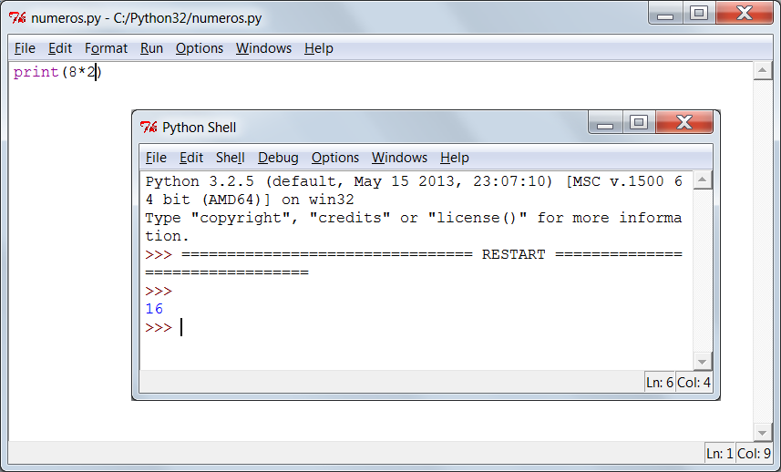
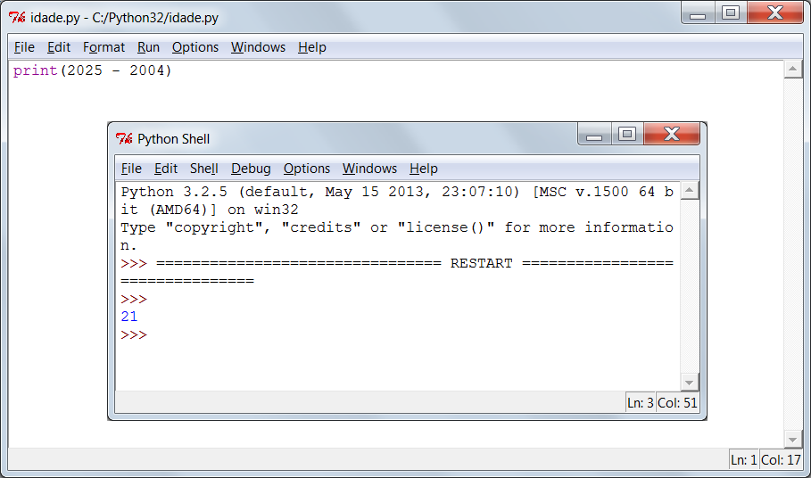
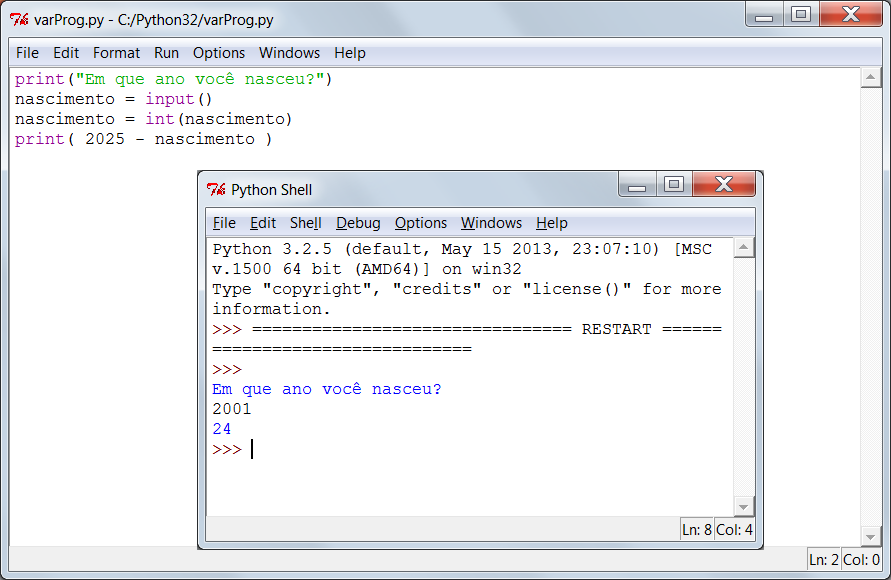
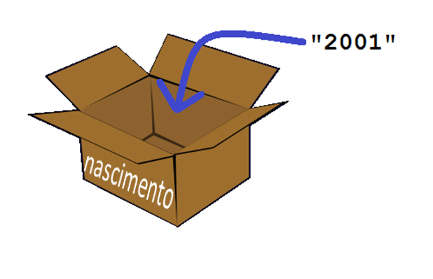
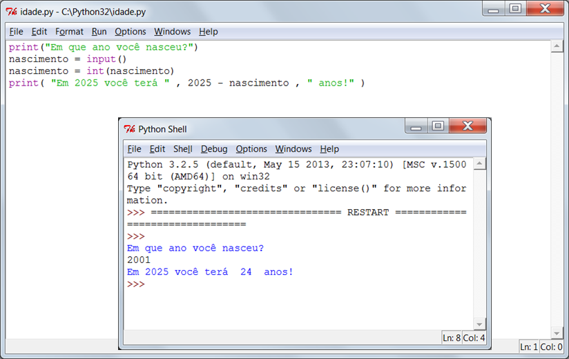
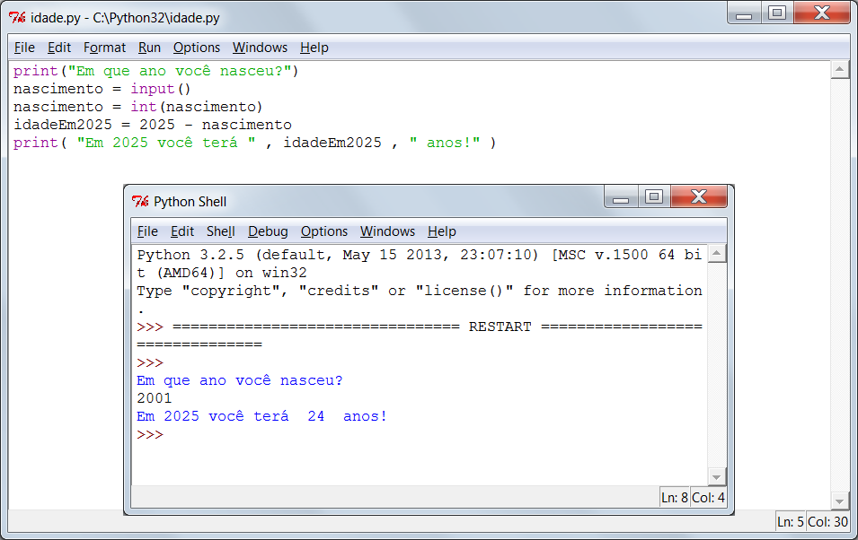
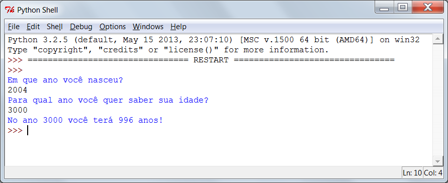
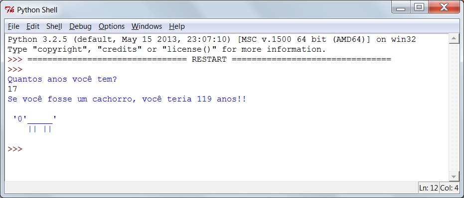

---
title: O Ano 2025
level: Python 1
language: pt-BR
stylesheet: python
embeds: "*.png"
materials: ["Recursos do Projeto/*.*"]
...

#Introdução:  { .intro}

Nesse projeto você vai aprender a escrever um programa que dirá quantos anos você vai ter em 2025!

#Passo 1: Quanto dinheiro? { .activity}
## Lista de Atividades { .check}

+ Em Python, é possível imprimir na tela não só textos, mas também números. Por exemplo, se 8 amigos seus dessem a você R$2,00 cada para que você parasse de contar piadas ruins, você poderia usar esse programa para ver o quanto ganharia:

	```python
	print(8*2)
	```

	A estrela (asterisco) `"*"` no programa acima é um símbolo de multiplicação. Então o programa deve imprimir o resultado da conta `8 x 2`.

+ Execute o programa acima e você verá a seguinte resposta:	

	

## Salve seu Projeto {.save}

## Desafio: Dinheiro no bolso { .challenge}
Escreva um programa em Python para calcular quanto dinheiro você ganharia se lavasse 12 carros e cobrasse R$12,50 por cada lavagem.

## Salve seu Projeto {.save}

#Passo 2: Quantos anos? { .activity}
## Lista de Atividades { .check}

+ Com tudo o que você aprendeu até agora, você deve conseguir escrever um programa para calcular que idade você terá no ano 2025. Seu programa em Python deve calcular sua idade dessa forma:

	

	Como você pode ver, se você nasceu em 2004, é possível calcular sua idade no ano 2025 fazendo a conta `2025 - 2004`. Então alguém nascido em 2004 terá 21 anos no ano 2025! Se você não nasceu em 2004, é só mudar esse número no programa.

## Salve seu Projeto {.save}

## Desafio: Mudando datas { .challenge}
Mude seu programa para descobrir quantos anos uma pessoa nascida em 1998 terá no ano 2025. Quantos anos uma pessoa nascida hoje terá no ano 2050?

## Salve seu Projeto {.save}

#Passo 3: Variáveis { .activity }

Ao completar o desafio acima, você teve de modificar os números no programa para pessoas com idades diferentes e para anos diferentes no futuro. Seria muito mais fácil se você pudesse perguntar para a pessoa em que ano ela nasceu e usar a resposta nos seus cálculos. É para isso que variáveis servem!

## Lista de Atividades { .check}

+ Execute este programa em Python:

	```python
	print("Em que ano voce nasceu?")
	nascimento = input()
	nascimento = int(nascimento)
	print( 2025 - nascimento )
	```

	Esse programa espera você digitar o ano em que nasceu e pressionar Enter em seguida. Você verá quantos anos terá no ano 2025.

	

	Esse programa usa a função `input()` para receber um número digitado no teclado e o guarda em uma variável chamada `nascimento`, para que você o use depois. Você pode imaginar que uma variável é como uma caixa, que pode ser usada para guardar informação importante.

	

	Note que a variável (a caixa) foi nomeada "nascimento", porque isso ajuda a lembrar o que está sendo guardado dentro dela!

	A linha...

	```python
	print( 2025 - nascimento )
	```

	...subtrai qualquer número que tenha sido guardado na variável `nascimento` do número 2025.

	Tudo que é digitado pelo teclado no programa é sempre armazenado como texto, então você deve usar a função `int()` para transformar o que o usuário digitou em um número (o que em programação é chamado de _inteiro_, ou _integer_ em inglês).

+ Você pode tornar seu programa mais fácil de entender ao adicionar uma mensagem ao usuário, para que ele saiba o que seu programa está mostrando. Modifique a última linha do seu programa para:

	```python
	print( "Em 2025 voce tera " , 2025 - born , " anos!" )
	```

+ Execute seu programa novamente para ver como essa modificação vai aparecer. 	

	

+ Mas por que parar por aqui? Você pode ainda usar outra variável para guardar a resposta antes de imprimi-la para o usuário. Tente rodar o programa abaixo:

	

## Salve seu Projeto {.save}

## Desafio: O ano 3000! { .challenge}
Seu programa até agora só diz às pessoas quantos anos elas terão no ano 2025. E se alguém quiser saber quantos anos terá no ano 2050? Ou no ano 3000? Adicione outra variável no seu programa, de modo que o usuário consiga saber quantos anos ele terá em qualquer ano que ele escolher.



## Salve seu Projeto {.save}

## Desafio: Sua idade em anos de cachorro { .challenge}
Escreva um programa que pergunta ao usuário quantos anos ele tem e, em seguida, diz a sua idade em anos de cachorro! Você pode calcular a idade da pessoa em anos de cachorro ao multiplicar sua idade por 7.

